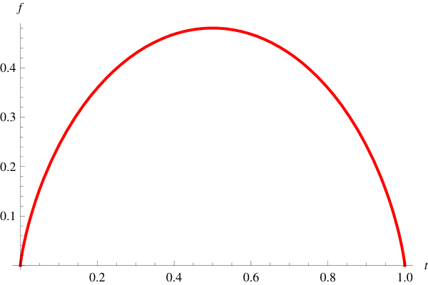
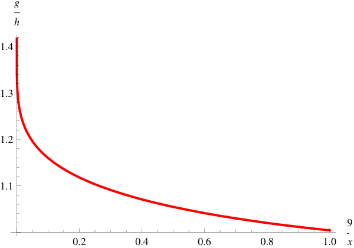

# Maximizing the number of q-colorings

## Abstract

Let $P_{G}(q)$ denote the number of proper $q$-colorings of a graph $G$. This function, called the chromatic polynomial of $G$, was introduced by Birkhoff in 1912, who sought to attack the famous four-color problem by minimizing $P_{G}(4)$ over all planar graphs $G$. Since then, motivated by a variety of applications, much research was done on minimizing or maximizing $P_{G}(q)$ over various families of graphs.

In this paper, we study an old problem of Linial and Wilf, to find the graphs with $n$ vertices and $m$ edges which maximize the number of $q$-colorings. We provide the first approach which enables one to solve this problem for many nontrivial ranges of parameters. Using our machinery, we show that for each $q\geq 4$ and sufficiently large $m<\kappa_{q}n^{2}$ where $\kappa_{q}\approx 1/(q\log q)$, the extremal graphs are complete bipartite graphs minus the edges of a star, plus isolated vertices. Moreover, for $q=3$, we establish the structure of optimal graphs for all large $m\leq n^{2}/4$, confirming (in a stronger form) a conjecture of Lazebnik from 1989.

## 1 Introduction

The fundamental combinatorial problem of graph coloring is as ancient as the cartographer’s task of coloring a map without using the same color on neighboring regions. In the context of general graphs, we say that an assignment of a color to every vertex is a proper coloring if no two adjacent vertices receive the same color, and we say that a graph is $q$-colorable it has a proper coloring using only at most $q$ different colors.

The problem of counting the number $P_{G}(q)$ of $q$-colorings of a given graph $G$ has been the focus of much research over the past century. Although it is already NP-hard even to determine whether this number is nonzero, the function $P_{G}(q)$ itself has very interesting properties. $P_{G}(q)$ was first introduced by Birkhoff [7], who proved that it is always a polynomial in $q$. It is now called the chromatic polynomial of $G$. Although $P_{G}(q)$ has been studied for its own sake (e.g., Whitney [36] expressed its coefficients in terms of graph theoretic parameters), perhaps more interestingly there is a long history of diverse applications which has led researchers to minimize or maximize $P_{G}(q)$ over various families of graphs. In fact, Birkhoff’s original motivation for investigating the chromatic polynomial was to use it to attack the famous four-color theorem. Indeed, one way to show that every planar graph is 4-colorable is to minimize $P_{G}(4)$ over all planar $G$, and show that the minimum is nonzero. In this direction Birkhoff [8] proved the tight lower bound $P_{G}(q)\geq q(q-1)(q-2)(q-3)^{n-3}$ for all $n$-vertex planar graphs $G$ when $q\geq 5$, later conjecturing with Lewis in [9] that it extended to $q=4$ as well.

Linial [23] arrived at the problem of minimizing the chromatic polynomial from a completely different motivation. The worst-case computational complexity of determining whether a particular function $f:V(G)\rightarrow\mathbb{R}$ is a proper coloring (i.e., satisfies $f(x)\neq f(y)$ for every pair of adjacent vertices $x$ and $y$) is closely related to the number of acylic orientations of a graph, which equals $|P_{G}(-1)|$, obtained by substituting $q=-1$ into the formal polynomial expression of $P_{G}(q)$. Lower bounding the worst-case complexity therefore corresponds to minimizing $|P_{G}(-1)|$ over the family $\mathcal{F}_{n,m}$ of graphs with $n$ vertices and $m$ edges. Linial showed that that surprisingly, for any $n,m$ there is a graph which simultaneously minimizes each $|P_{G}(q)|$ over $\mathcal{F}_{n,m}$, for every integer $q$. This graph is simply a clique $K_{k}$ with an additional vertex adjacent to $l$ vertices of the $K_{k}$, plus $n-k-1$ isolated vertices, where $k,l$ are the unique integers satisfying $m={k\choose 2}+l$ with $k>l\geq 0$. At the end of his paper, Linial posed the problem of maximizing $P_{G}(q)$ over all graphs in $\mathcal{F}_{n,m}$.

Around the same time, Wilf arrived at exactly that maximization problem while analyzing the backtrack algorithm for finding a proper $q$-coloring of a graph (see [6, 37]). Although this generated much interest in the problem, it was only solved in sporadic cases. The special case $q=2$ was completely solved for all $m,n$, by Lazebnik in [19]. For $q\geq 3$, the only pairs $m,n$ for which extremal graphs were known corresponded to the number of vertices and edges in the Turán graph $T_{r}(n)$, which is the complete $r$-partite graph on $n$ vertices with all parts of size either $\lfloor n/r\rfloor$ or $\lceil n/r\rceil$. In this vein, Lazebnik [21] proved that $T_{r}(n)$ is optimal for very large $q=\Omega(n^{6})$, and proved with Pikhurko and Woldar [22] that $T_{2}(2k)$ is optimal when $q=3$ and asymptotically optimal when $q=4$.

Outside these isolated cases, very little was known for general $m,n$. Although many upper and lower bounds for $P_{G}(q)$ were proved by various researchers [11, 19, 20, 24], these bounds were widely separated. Even the $q=3$ case resisted solution: twenty years ago, Lazebnik [19] conjectured that when $m\leq n^{2}/4$, the $n$-vertex graphs with $m$ edges which maximized the number of 3-colorings were complete bipartite graphs minus the edges of a star, plus isolated vertices. Only very recently, Simonelli [26] managed to make some progress on this conjecture, verifying it under the additional very strong assumption that all optimal graphs are already bipartite.

Perhaps part of the difficulty for general $m,n,q$ stems from the fact that the maximal graphs are substantially more complicated than the minimal graphs that Linial found. For number-theoretic reasons, it is essentially impossible to explicitly construct maximal graphs for general $m,n$. Furthermore, even their coarse structure depends on the density $\frac{m}{n^{2}}$. For example, when $\frac{m}{n^{2}}$ is small, the maximal graphs are roughly complete bipartite graphs, but after $\frac{m}{n^{2}}>\frac{1}{4}$, the maximal graphs become tripartite. At the most extreme density, when $m,n$ correspond to the Turán graph $T_{q}(n)$, the unique maximal graph is obviously the complete $q$-partite graph. Therefore, in order to tackle the general case of this problem, one must devise a unified approach that can handle all of the outcomes.

In this paper, we propose such an approach, developing the machinery that one might be able to use to determine the maximal graphs in many nontrivial ranges of $m,n$. Our methodology can be roughly outlined as follows. We show, via Szemerédi’s Regularity Lemma, that the asymptotic solution to the problem reduces to a certain quadratically-constrained linear program in $2^{q}$ variables. For any given $q$, this task can in principle be automated by a computer code that symbolically solves the optimization problem, although a more sophisticated approach was required to solve this for all $q$. Our solutions to the optimization problem then give us the approximate structure of the maximal graphs. Finally, we use various local arguments, such as the so-called “stability” approach introduced by Simonovits [27], to refine their structure into precise results.

We successfully applied our machinery to solve the Linial-Wilf problem for many nontrivial ranges of $m,n$, and $q\geq 3$. In particular, for $q=3$, our results confirm a stronger form of Lazebnik’s conjecture when $m$ is large. In addition, for each $q\geq 4$ we show that for all densities $\frac{m}{n^{2}}$ up to approximately $\frac{1}{q\log q}$, the extremal graphs are also complete bipartite graphs minus a star. In order to state our results precisely, we need the following definition.

### Definition 1.1.

Let $a\leq b$ be positive integers. We say that $G$ is a semi-complete subgraph of $\boldsymbol{K_{a,b}}$ if the number of missing edges $E(K_{a,b})\setminus E(G)$ is less than $a$, and they form a star (i.e., they share a common endpoint $v$ which we call the center). If $v$ belongs to the larger side of $K_{a,b}$, then we also say that $G$ is correctly oriented.

Define the constant $\kappa_{q}=\left(\sqrt{\frac{\log(q/(q-1))}{\log q}}+\sqrt{\frac{\log q}{\log(q/(q-1))}}\right)^{-2}\approx\frac{1}{q\log q}$. All logarithms here and in the rest of the paper are in base $e\approx 2.718$. In the following theorems, we write $o(1)$ to represent a quantity that tends to zero as $m,n\rightarrow\infty$.

### Theorem 1.2.

For every fixed integer $q\geq 3$, and any $\kappa<\kappa_{q}$, the following holds for all sufficiently large $m\leq\kappa n^{2}$. Every $n$-vertex graph with $m$ edges which maximizes the number of $q$-colorings is a semi-complete subgraph (correctly oriented if $q\geq 4$) of some $K_{a,b}$, plus isolated vertices, where $a=(1+o(1))\sqrt{m\cdot\log\frac{q}{q-1}/\log q}$ and $b=(1+o(1))\sqrt{m\cdot\log q/\log\frac{q}{q-1}}$. The corresponding number of $q$-colorings is $q^{n}e^{(-c+o(1))\sqrt{m}}$, where $c=2\sqrt{\log\frac{q}{q-1}\log q}$.

Remark. The part sizes of the maximal graphs above all have the ratio roughly $\log q/\log\frac{q}{q-1}$. The constant $\kappa_{q}$ corresponds to the density $m/n^{2}$ at which the number of isolated vertices becomes $o(n)$ in the optimal construction.

For 3 colors, we can push our argument further, beyond the density $\kappa_{3}$. Now, due to the absence of isolated vertices, a rare exception occurs, which requires us to include an additional possibility. Here, a “pendant edge” means that a new vertex is added, along with a single edge between it and any other vertex in the graph. Proposition B.1 shows that this outcome is in fact necessary.

### Theorem 1.3.

The following holds for all sufficiently large $m\leq n^{2}/4$. Every $n$-vertex graph with $m$ edges and the maximum number of 3-colorings is either (i) a semi-complete subgraph of some $K_{a,b}$, plus isolated vertices if necessary, or (ii) a complete bipartite graph $K_{a,b}$ plus a pendant edge. Furthermore:

- If $m\leq\kappa_{3}n^{2}$, then $a=(1+o(1))\sqrt{m\cdot\frac{\log 3/2}{\log 3}}$ and $b=(1+o(1))\sqrt{m\cdot\frac{\log 3}{\log 3/2}}$. The corresponding number of colorings is $3^{n}e^{-(c+o(1))\sqrt{m}}$, where $c=2\sqrt{\log\frac{3}{2}\cdot\log 3}$.
- If $\kappa_{3}n^{2}\leq m\leq\frac{1}{4}n^{2}$, then $a=(1+o(1))\frac{n-\sqrt{n^{2}-4m}}{2}$ and $b=(1+o(1))\frac{n+\sqrt{n^{2}-4m}}{2}$. The corresponding number of colorings is $2^{b+o(n)}$.

We also considered another conjecture of Lazebnik (see, e.g., [22]), that the Turán graphs $T_{r}(n)$ are always extremal when $r\leq q$. Building upon the techniques in [22] that answered the $r=2,q=3$ case, we confirmed this conjecture for large $n$ and $r=q-1$.

### Theorem 1.4.

Fix an integer $q\geq 4$. For all sufficiently large $n$, the Turán graph $T_{q-1}(n)$ has more $q$-colorings than any other graph with the same number of vertices and edges.

We close by mentioning some related work. Tomescu [28, 29, 30, 31, 32, 33, 34, 35] and Dohmen [12, 13] considered the problem of maximizing or minimizing the number of $q$-colorings of $G$ given some other parameters, such as chromatic number, connectedness, planarity, and girth. Wright [38] asymptotically determined the total number of $q$-colored labeled $n$-vertex graphs with $m$ edges, for the entire range of $m$; this immediately gives an asymptotic approximation for the average value of $P_{G}(q)$ over all labeled $n$-vertex graphs with $m$ edges.

Graph coloring is also a special case of a homomorphism problem, and as we will discuss in our concluding remarks, our approach easily extends to that more general setting. Recall that a graph homomorphism $\phi:G\rightarrow H$ is a map from the vertices of $G$ to those of $H$, such that adjacent vertices in $G$ are mapped to adjacent vertices in $H$. Thus, the number of $q$-colorings of $G$ is precisely the number of homomorphisms from $G$ to $K_{q}$. Another interesting target graph $H$ is the two-vertex graph consisting of a single edge, plus a loop at one vertex. Then, the number of homomorphisms is precisely the number of independent sets in $G$, and the problem of estimating that number given some partial information about $G$ is motivated by various questions in statistical physics and the theory of partially ordered sets. Alon [1] studied the maximum number of independent sets that a $k$-regular graph of order $n$ can have, and Kahn [17, 18] considered this problem under the additional assumption that the $k$-regular graph is bipartite. Galvin and Tetali [16] generalized the main result from [17] to arbitrary target graphs $H$.

Another direction of related research was initiated by the question of Erdős and Rothschild (see Erdős [14, 15], Yuster [39], Alon, Balogh, Keevash, and Sudakov [2], Balogh [3], and others), about the maximum over all $n$-vertex graphs of the number of $q$-edge-colorings (not necessarily proper) that do not contain a monochromatic $K_{r}$-subgraph. Our method is somewhat similar to that in [2], and these two problems may be more deeply related than just a similarity in their formulations.

The rest of this paper is organized as follows. The next section contains some definitions, and a formulation of the Szemerédi Regularity Lemma. In Section 3, we prove Theorems 3.2 and 3.3, which (asymptotically) reduce the general case of the problem to a quadratically constrained linear program. Then, in the next section we solve the relevant instances of the optimization problem to give approximate versions of our main theorems. Sections 5 and 6 refine these into the precise forms of Theorems 1.2 and 1.3. We prove Theorem 1.4 in Section 7. The final section contains some concluding remarks and open problems.

## 2 Preliminaries

The following (standard) asymptotic notation will be utilized extensively. For two functions $f(n)$ and $g(n)$, we write $f(n)=o(g(n))$ if $\lim_{n\rightarrow\infty}f(n)/g(n)=0$, and $f(n)=O(g(n))$ or $g(n)=\Omega(f(n))$ if there exists a constant $M$ such that $|f(n)|\leq M|g(n)|$ for all sufficiently large $n$. We also write $f(n)=\Theta(g(n))$ if both $f(n)=O(g(n))$ and $f(n)=\Omega(g(n))$ are satisfied.

We will use $[q]$ to denote the set $\{1,2,\ldots,q\}$, and $2^{[q]}$ to denote the collection of all of its subsets. As mentioned in the introduction, the Turán graph $T_{q}(n)$ is the complete $r$-partite graph on $n$ vertices with all parts of size either $\lfloor n/r\rfloor$ or $\lceil n/r\rceil$.

Given two graphs with the same number of vertices, their edit distance is the minimum number of edges that need to be added or deleted from one graph to make it isomorphic to the other. We say that two graphs are $d$-close if their edit distance is at most $d$.

The rest of this section is devoted to formulating the celebrated Szemerédi Regularity Lemma. This theorem roughly states that every graph, no matter how large, can be approximated by an object of bounded complexity, which corresponds to a union of a bounded number of random-looking graphs. To measure the randomness of an edge distribution, we use the following definition. Let the edge density $d(A,B)$ be the fraction $\frac{e(A,B)}{|A||B|}$, where $e(A,B)$ is the number of edges between $A$ and $B$.

### Definition 2.1.

A pair $(X,Y)$ of disjoint subsets of a graph is $\epsilon$-regular if every pair of subsets $X^{\prime}\subset X$ and $Y^{\prime}\subset Y$ with $|X^{\prime}|\geq\epsilon|X|$ and $|Y^{\prime}|\geq\epsilon|Y|$ has $|d(X^{\prime},Y^{\prime})-d(X,Y)|<\epsilon$.

In this paper, we use the following convenient form of the Regularity Lemma, which is essentially Theorem IV.5.$29^{\prime}$ in the textbook [10].

### Theorem 2.2.

For every $\epsilon>0$, there is a natural number $M^{\prime}=M^{\prime}(\epsilon)$ such that every graph $G=(V,E)$ has a partition $V=\bigcup_{i=1}^{M}V_{i}$ with the following properties. The sizes of the vertex clusters $V_{i}$ are as equal as possible (differing by at most 1), their number is between $1/\epsilon\leq M\leq M^{\prime}$, and all but at most $\epsilon M^{2}$ of the pairs $(V_{i},V_{j})$ are $\epsilon$-regular.

## 3 Reduction to an optimization problem

In this section, we show that the solution of the following quadratically constrained linear1 Observe that the logarithms are merely constant multipliers for the variables $\alpha_{A}$. program answers our main problem asymptotically.

Optimization Problem 1. Fix an integer $q\geq 2$ and a real parameter $\gamma$. Consider the following objective and constraint functions:

$$ \text{\sc obj}({\boldsymbol{\alpha}}):=\sum\limits_{A\neq\emptyset}\alpha_{A}\log|A|\,;\quad\quad\quad\text{\sc v}({\boldsymbol{\alpha}}):=\sum\limits_{A\neq\emptyset}\alpha_{A},\quad\text{\sc e}({\boldsymbol{\alpha}}):=\sum\limits_{A\cap B=\emptyset}\alpha_{A}\alpha_{B}. $$

The vector ${\boldsymbol{\alpha}}$ has $2^{q}-1$ coordinates $\alpha_{A}\in\mathbb{R}$ indexed by the nonempty subsets $A\subset[q]$, and the sum in $\text{\sc e}({\boldsymbol{\alpha}})$ runs over unordered pairs of disjoint sets $\{A,B\}$. Let $\text{\sc Feas}(\gamma)$ be the feasible set of vectors defined by the constraints ${\boldsymbol{\alpha}}\geq 0$, $\text{\sc v}({\boldsymbol{\alpha}})=1$, and $\text{\sc e}({\boldsymbol{\alpha}})\geq\gamma$. We seek to maximize $\text{\sc obj}({\boldsymbol{\alpha}})$ over the set $\text{\sc Feas}(\gamma)$, and we define $\text{\sc opt}(\gamma)$ to be this maximum value, which exists by compactness. We will write that the vector ${\boldsymbol{\alpha}}$ solves $\text{\sc opt}(\gamma)$ when both ${\boldsymbol{\alpha}}\in\text{\sc Feas}(\gamma)$ and $\text{\sc obj}({\boldsymbol{\alpha}})=\text{\sc opt}(\gamma)$.

Construction 1: $\boldsymbol{G_{\alpha}(n)}$. Let $n$ and $m$ be the desired numbers of vertices and edges, and let ${\boldsymbol{\alpha}}\in\text{\sc Feas}(m/n^{2})$ be a feasible vector. Consider the following $n$-vertex graph, which we call $G_{\boldsymbol{\alpha}}(n)$. Partition the vertices into (possibly empty) clusters $V_{A}$ such that each $|V_{A}|$ differs from $n\alpha_{A}$ by less than 1. For every pair of clusters $(V_{A},V_{B})$ which is indexed by disjoint subsets, place a complete bipartite graph between the clusters.

Observe that any coloring that for each cluster $V_{A}$ uses only colors from $A$ is a proper coloring. Therefore, if all $n\alpha_{A}$ happened to be integers, then $G_{\boldsymbol{\alpha}}(n)$ would have at least $\prod_{A}|A|^{n\alpha_{A}}=e^{\text{\sc obj}({\boldsymbol{\alpha}})n}$ colorings, and also precisely $\text{\sc e}({\boldsymbol{\alpha}})n^{2}$ edges. But we cannot simply apply Construction 1 to the ${\boldsymbol{\alpha}}$ that solves $\text{\sc opt}(m/n^{2})$, because it may happen that $G_{\boldsymbol{\alpha}}(n)$ has fewer than $m$ edges if the entries of ${\boldsymbol{\alpha}}$ are not integer multiples of $1/n$. Fortunately, the shortfall cannot be substantial:

### Proposition 3.1.

The number of edges in any $G_{\boldsymbol{\alpha}}(n)$ differs from $\text{\sc e}({\boldsymbol{\alpha}})n^{2}$ by less than $2^{q}n$. Also, the edit-distance between any $G_{\boldsymbol{\alpha}}(n)$ and $G_{\boldsymbol{\nu}}(n)$ is at most $\|{\boldsymbol{\alpha}}-{\boldsymbol{\nu}}\|_{1}n^{2}+2^{q+1}n$, where $\parallel \cdot \parallel {}_{1}$ is the $L^{1}$-norm.

The proof is elementary and routine, so we will defer it to Section 3.4 so as not to interrupt this exposition. To recover from the $O(n)$ edge deficit, we extend the construction in the following way.

Construction 2: $\boldsymbol{G_{\boldsymbol{\alpha}}^{\prime}(n)}$. Let $n$ and $m$ be the desired numbers of vertices and edges, and let ${\boldsymbol{\alpha}}\in\text{\sc Feas}(m/n^{2})$ be a feasible vector. If $G_{\boldsymbol{\alpha}}(n)$ from Construction 1 already has at least $m$ edges, then set $G_{\boldsymbol{\alpha}}^{\prime}(n)=G_{\boldsymbol{\alpha}}(n)$.

Otherwise, $G_{\boldsymbol{\alpha}}(n)$ is short by, say, $k$ edges, and $k=O(n)$ by Proposition 3.1. Let $V_{A}$ be its largest cluster whose index $A$ is not a singleton. Suppose first that $|V_{A}|\geq 2\lceil\sqrt{k}\rceil$. So far $V_{A}$ does not span any edges, so we can add $k$ edges to $G_{\boldsymbol{\alpha}}(n)$ by selecting two disjoint subsets $U_{1},U_{2}\subset V_{A}$ of size $\lceil\sqrt{k}\rceil$, and putting a $k$-edge bipartite graph between them. Call the result $G_{\boldsymbol{\alpha}}^{\prime}(n)$.

The last case is $|V_{A}|<2\lceil\sqrt{k}\rceil$. We will later show that this only arises when the maximum number of colorings is only $2^{o(n)}$, and this is already achieved by the Turán graph $T_{q}(n)$. So, to clean up the statements of our theorems, we just define $G_{\boldsymbol{\alpha}}^{\prime}(n)=T_{q}(n)$ here.

### 3.1 Structure of asymptotic argument

We are now ready to state our theorem, which shows that solutions to Optimization Problem 1 produce graphs which asymptotically maximize the number of $q$-colorings.

#### Theorem 3.2.

For any $\epsilon>0$, the following holds for any sufficiently large $n$, and any $m$ less than or equal to the number of edges in the Turán graph $T_{q}(n)$.

(i)
Every $n$-vertex graph with $m$ edges has fewer than $e^{(\text{\sc opt}(m/n^{2})+\epsilon)n}$ proper $q$-colorings.
(ii)
Any ${\boldsymbol{\alpha}}$ which solves $\text{\sc opt}(m/n^{2})$ yields a graph $G_{\boldsymbol{\alpha}}^{\prime}(n)$ via Construction 2 which has at least $m$ edges and more than $e^{(\text{\sc opt}(m/n^{2})-\epsilon)n}$ proper $q$-colorings.

Remark. The number of colorings can only increase when edges are deleted, so one may take an arbitrary $m$-edge subgraph of $G_{\boldsymbol{\alpha}}^{\prime}(n)$ if one requires a graph with exactly $m$ edges.

The key ingredient in the proof of Theorem 3.2 is Szemerédi’s Regularity Lemma. Part (ii) is routine, and full details are given in Section 3.4. On the other hand, the argument for part (i) is more involved, so we highlight its structure here so that the reader does not get lost in the details. The proof breaks into the following claims.

Claim 1.
For any $\delta>0$, there exists $n_{0}$ such that the following holds for any graph $G=(V,E)$ with $n>n_{0}$ vertices and $m$ edges. The Regularity Lemma gives a special partition of the vertex set into $V_{1}$, …, $V_{M}$ of almost equal size, where $M$ is upper bounded by a constant depending only on $\delta$. Then, we may delete at most $\delta n^{2}$ edges of $G$ in such a way that the resulting graph $G^{\prime}$ has the following properties.
(i)
Each $G^{\prime}[V_{i}]$ spans no edges.
(ii)
If $G^{\prime}$ has any edges at all between two parts $V_{i}$ and $V_{j}$, then in fact it has an edge between every pair of subsets $U\subset V_{i}$, $W\subset V_{j}$ with $|U|\geq\delta|V_{i}|$ and $W\geq\delta|V_{j}|$.
Note that since $G^{\prime}$ is a subgraph of $G$, the number of $q$-colorings can only increase.
Claim 2.
Let $\mathcal{C}_{1}$ be the set of colorings of $G^{\prime}$. Then, if we keep only those colorings $\mathcal{C}_{2}\subset\mathcal{C}_{1}$ with the property that in each $V_{i}$, any color is used either zero times or at least $\delta|V_{i}|$ times, we will still have $|\mathcal{C}_{2}|\geq e^{-c_{\delta}n}|\mathcal{C}_{1}|$. Here, $c_{\delta}$ is a constant which tends to zero with $\delta$. Now each coloring in $\mathcal{C}_{2}$ has the special property that whenever the same color appears on two parts $V_{i}$ and $V_{j}$, then there cannot be any edges between those entire parts.
Claim 3.
By looking at which colors appear on each part $V_{i}$, we may associate each coloring with a map from $[M]\rightarrow 2^{[q]}$. Let $\phi:[M]\rightarrow 2^{[q]}$ be a map which is associated with the maximum number of colorings in $\mathcal{C}_{2}$. Then, if we keep only those colorings $\mathcal{C}_{3}\subset\mathcal{C}_{2}$ which give $\phi$, we still have $|\mathcal{C}_{3}|\geq 2^{-qM}|\mathcal{C}_{2}|$.
Claim 4.
For every $A\subset[q]$, let $V_{A}$ be the union of those parts $V_{i}$ for which $\phi(i)=A$. (These are the parts that in all colorings in $\mathcal{C}_{3}$ are colored using exactly colors from $A$.) Define the vector ${\boldsymbol{\alpha}}$ by setting each $\alpha_{A}=|V_{A}|/n$. Then $G^{\prime}\subset G_{\boldsymbol{\alpha}}(n)$, and since $G^{\prime}$ only differs from our original $G$ by at most $\delta n^{2}$ edges, we also have ${\boldsymbol{\alpha}}\in\text{\sc Feas}(m/n^{2}-\delta)$. Thus:
$$ |\mathcal{C}_{3}|\ \leq\ \prod_{A\subset[q]}|A|^{|V_{A}|}\ =\ e^{\text{\sc obj}({\boldsymbol{\alpha}})n}\ \leq\ e^{\text{\sc opt}(m/n^{2}-\delta)n}\,. $$
Claim 5.
The function opt is uniformly continuous. Thus, for an appropriate (sufficiently small) choice of $\delta>0$, we have for all sufficiently large $n$ that
$$ P_{G}(q)\ \leq\ P_{G^{\prime}}(q)\ \leq\ e^{c_{\delta}n}\cdot 2^{qM}\cdot e^{\text{\sc opt}(m/n^{2}-\delta)n}\ <\ e^{(\text{\sc opt}(m/n^{2})+\epsilon)n}\,, $$
as desired. (Recall that $P_{G}(q)$ is the number of $q$-colorings of $G$.)

By combining these five claims with an elementary analysis argument, we also obtain a stability result, which roughly states that if a graph has “close” to the optimal number of colorings, then it must resemble a graph from Construction 1. A stability result is very useful, because the approximate structure later allows us to apply combinatorial arguments to refine our asymptotic results into exact results. We quantify this in terms of the edit-distance, which we defined in Section 2. Recall that we say two graphs are $d$-close when their edit distance is at most $d$. We prove the following theorem in Section 3.5.

#### Theorem 3.3.

For any $\epsilon,\kappa>0$, the following holds for all sufficiently large $n$. Let $G$ be an $n$-vertex, graph with $m\leq\kappa n^{2}$ edges, which maximizes the number of $q$-colorings. Then $G$ is $\epsilon n^{2}$-close to some $G_{\boldsymbol{\alpha}}(n)$ from Construction 1, for an ${\boldsymbol{\alpha}}$ which solves $\text{\sc opt}(\gamma)$ for some $|\gamma-m/n^{2}|\leq\epsilon$ with $\gamma\leq\kappa$.

Remark. This theorem is only useful if the resulting $\gamma$ falls within the range of densities for which the solution of opt is known. The technical parameter $\kappa$ is used to keep $\gamma$ within this range.

### 3.2 Finer resolution in the sparse case

The Regularity Lemma is nontrivial only for graphs with positive edge density (i.e., quadratic number of edges). This typically presents a serious and often insurmountable obstacle when trying to extend Regularity-based results to situations involving sparse graphs. Although much work has been done to develop sparse variants of the Regularity Lemma, the resulting analogues are weaker and much more difficult to apply.

Let us illustrate the issue by attempting to apply Theorem 3.2 when $m=o(n^{2})$. Then, we find that the maximum number of $q$-colorings of any $n$-vertex graph with $m$ edges is $e^{cn+o(n)}$, where $c=\text{\sc opt}(0)$ is a constant entirely determined by $q$. Note that the final asymptotic is independent of $m$, even if $m$ grows extremely slowly compared to $n^{2}$. This is because the key parameter was the density $m/n^{2}$, which already vanished once $m=o(n^{2})$. Thus, the interesting question in the sparse case is to distinguish between sparse graphs and very sparse graphs, by looking inside the $o(n)$ error term in the exponent.

We are able to circumvent these difficulties by making the following key observation which allows us to pass to a dense subgraph. As it turns out, every sparse graph which maximizes the number of $q$-colorings has a nice structure: most of the vertices are isolated, and all of the edges are contained in a subgraph which is dense, but not too dense. Section 3.6 contains the following lemma’s short proof, which basically boils down to a comparison against the smallest Turán graph with at least $m$ edges.

#### Lemma 3.4.

Fix an integer $q\geq 2$ and a threshold $\kappa>0$. Given any positive integer $m$, there exists an $n_{0}=\Theta(\sqrt{m})$ with $m/n_{0}^{2}\leq\kappa$ such that the following holds for any $n\geq n_{0}$. In every $n$-vertex graph $G$ with $m$ edges, which maximizes the number of $q$-colorings, there is a set of $n_{0}$ vertices which spans all of the edges.

The fact that our graph is sparse becomes a benefit rather than a drawback, because it allows us to limit the edge density from above by any fixed threshold. This is useful, because it turns out that we can completely solve the optimization problem for all densities below $\kappa_{q}=\left(\sqrt{\frac{\log q/(q-1)}{\log q}}+\sqrt{\frac{\log q}{\log q/(q-1)}}\right)^{-2}$. We will prove the following proposition in Section 4.1.

#### Proposition 3.5.

Fix an integer $q\geq 3$. For any $0\leq\gamma\leq\kappa_{q}$, the unique solution (up to a permutation of the ground set $[q]$) to $\text{\sc opt}(\gamma)$ has the following form.

$$ \alpha_{\{1\}}=\sqrt{\gamma\cdot\log\frac{q}{q-1}\,/\,\log q},\quad\quad\alpha_{\{2,\ldots q\}}=\frac{\gamma}{\alpha_{\{1\}}},\quad\quad\alpha_{[q]}=1-\alpha_{\{1\}}-\alpha_{\{2,\ldots q\}}, $$
(1)

with all other $\alpha_{A}=0$. This gives $\text{\sc opt}(\gamma)=\log q-2\sqrt{\gamma\cdot\log\frac{q}{q-1}\cdot\log q}$.

Since we have the complete solution of the relevant instance of the optimization problem, we can give explicit bounds when we transfer our asymptotic results from the previous section to the sparse case. We can also explicitly describe the graph that approximates any optimal graph, as follows. Let $t_{1}$ and $t_{2}$ be real numbers that satisfy $t_{1}/t_{2}=\log\frac{q}{q-1}/\log q$ and $t_{1}t_{2}=m$. Take a complete bipartite graph between two vertex clusters $V_{1}$ and $V_{2}$ with sizes $|V_{i}|=\lceil t_{i}\rceil$, and add enough isolated vertices to make the total number of vertices exactly $n$. Call the result $G_{n,m}$.

#### Proposition 3.6.

Fix an integer $q\geq 3$. The following hold for all sufficiently large $m\leq\kappa_{q}n^{2}$.

(i)
The maximum number of $q$-colorings of an $n$-vertex graph with $m$ edges is $q^{n}e^{(c+o(1))\sqrt{m}}$, where $c=-2\sqrt{\log\frac{q}{q-1}\log q}$. Here, the $o(1)$ term tends to zero as $m\rightarrow\infty$.
(ii)
For any $\epsilon>0$, as long as $m$ is sufficiently large, every $n$-vertex graph $G$ with $m$ edges, which maximizes the number of $q$-colorings, is $\epsilon m$-close to the graph $G_{n,m}$ which we described above.

We prove this proposition in Section 3.6. Note that part (i) is precisely the final claim of Theorem 1.2.

### 3.3 Proof of Theorem 3.2, part (i)

This section contains the proofs of the claims in Section 3.1, except for Claim 3, which is obvious. Together, these establish part (i) of Theorem 3.2, which gives the asymptotic upper bound for the number of $q$-colorings of an $n$-vertex graph with $m$ edges.

Proof of Claim 1. Apply Szemerédi’s Regularity Lemma (Theorem 2.2) with parameter $\epsilon=\delta/3$ to partition of $V$ into nearly-equal parts $V_{1}$, …, $V_{M}$. Then, all but $\epsilon M^{2}$ of the pairs $(V_{i},V_{j})$ are $\epsilon$-regular, and $M\geq 1/\epsilon$. Importantly, $M$ is also upper bounded by a constant independent of $n$. We clean up the graph in a way typical of many applications of the Regularity Lemma. Delete all edges in each induced subgraph $G[V_{i}]$, all edges between pairs $(V_{i},V_{j})$ which are not $\epsilon$-regular, and all edges between pairs $(V_{i},V_{j})$ whose edge density is at most $\epsilon$. Since all $|V_{i}|=(1+o(1))n/M$, the number of deleted edges is at most

$$ (1+o(1))\left[M{n/M\choose 2}+\epsilon M^{2}(n/M)^{2}+\epsilon{n\choose 2}\right]\ \leq\ (1+o(1))[\epsilon n^{2}/2+\epsilon n^{2}+\epsilon n^{2}/2], $$

which is indeed less than $\delta n^{2}$ when $n$ is sufficiently large.

It remains to show property (ii). The only edges remaining in $G^{\prime}$ are those between $\epsilon$-regular pairs $(V_{i},V_{j})$ with edge-density greater than $\epsilon$. By definition of $\epsilon$-regularity (and since $\delta>\epsilon)$, the edge density between every pair of sets $|U|\geq\delta|V_{i}|$, $|W|\geq\delta|V_{j}|$ must be positive. In particular, there must be at least one edge, which establishes property (ii). $\Box$

Proof of Claim 2. We show that $|\mathcal{C}_{2}|\geq e^{-c_{\delta}n}|\mathcal{C}_{1}|$, with $c_{\delta}=q\delta\log\frac{e^{2}}{\delta}$. It is a simple calculus exercise to verify that $c_{\delta}\rightarrow 0$ as $\delta\rightarrow 0$. We can obtain any coloring in $\mathcal{C}_{1}$ by starting with an appropriate coloring in $\mathcal{C}_{2}$ and modifying it as follows. For every color $c\in[q]$ and every $1\leq i\leq M$, select a subset of at most $\delta|V_{i}|$ vertices in $V_{i}$ and recolor them with $c$. Note that for each $c\in[q]$, we recolor a subset of $G$ of total size at most $\sum\limits_{i}\delta|V_{i}|=\delta n$. Using the bounds ${n\choose r}\leq(en/r)^{r}$ and $(1+x)\leq e^{x}$, we see that the number of such modifications is at most

$$ \left[\sum\limits_{r=0}^{\delta n}{n\choose r}\right]^{q}\ \leq\ \left[(1+\delta n){n\choose\delta n}\right]^{q}\ \leq\ \left[e^{\delta n}\left(\frac{en}{\delta n}\right)^{\delta n}\right]^{q}\ =\ e^{c_{\delta}n}, $$

which provides the desired upper bound on $|\mathcal{C}_{1}|/|\mathcal{C}_{2}|$.

The final part of this claim is a simple consequence of property (ii) of Claim 1. Indeed, suppose that some coloring in $\mathcal{C}_{2}$ assigns the same color $c$ to some vertices $U_{i}\subset V_{i}$ and $U_{j}\subset V_{j}$. Since this is a proper coloring, there cannot be any edges between $U_{i}$ and $U_{j}$. Yet $|U_{i}|\geq\delta|V_{i}|$ and $|U_{j}|\geq\delta|V_{j}|$ by definition of $\mathcal{C}_{2}$. Therefore, by property (ii) of Claim 1, there are no edges at all between $V_{i}$ and $V_{j}$, as claimed. $\Box$

Proof of Claim 4. Recall that $G_{\boldsymbol{\alpha}}(n)$ was obtained in Construction 1 by putting a complete bipartite graph between every pair ($V_{A},V_{B}$) indexed by disjoint subsets. The last part of Claim 2 implies that $G^{\prime}$ has no edges at all between parts $V_{i}$ and $V_{j}$ which receive overlapping color sets under $\mathcal{C}_{3}$. Furthermore, each $G^{\prime}[V_{i}]$ is empty by part (i) of Claim 1. So, $G^{\prime}$ has no edges in each $V_{A}$, and also has no edges between any $V_{A}$ and $V_{B}$ that are indexed by overlapping sets. Hence $G^{\prime}$ is indeed a subgraph of $G_{\boldsymbol{\alpha}}(n)$.

Furthermore, $G_{\boldsymbol{\alpha}}(n)$ has at least $m-\delta n^{2}$ edges, because $G^{\prime}$ differs from $G$ by at most $\delta n^{2}$ edges. Yet all $n\alpha_{A}$ are integers by construction, so $G_{\boldsymbol{\alpha}}(n)$ has precisely $\text{\sc e}({\boldsymbol{\alpha}})n^{2}$ edges. Therefore, ${\boldsymbol{\alpha}}\in\text{\sc Feas}(m/n^{2}-\delta)$, as claimed. The final inequality in Claim 4 follows from the fact that $\mathcal{C}_{3}$ only uses colors from $A$ to color each $V_{A}$, and the definitions of $\alpha_{A}=|V_{A}|/n$ and $\text{\sc obj}({\boldsymbol{\alpha}})=\sum\limits_{A}\alpha_{A}\log|A|$. $\Box$

Proof of Claim 5. The only nontrivial part of this claim is the continuity of opt on its domain, which is the set of $\gamma$ for which $\text{\sc Feas}(\gamma)\neq\emptyset$. This is easily recognized as the interval $\left(- \infty,\frac{q - 1}{2q} \right\rbrack$, where the upper endpoint, which corresponds to the $q$-partite Turán graph, equals $\text{\sc e}({\boldsymbol{\alpha}})$ for the vector ${\boldsymbol{\alpha}}$ with $\alpha_{A}=1/q$ for all singletons $A$. Note that the constraint ${\boldsymbol{\alpha}}\geq 0$ already guarantees that $\text{\sc e}({\boldsymbol{\alpha}})\geq 0$, so opt is constant on $(- \infty,0\rbrack$.

Fix an $\epsilon>0$. Since opt is monotonically decreasing by definition, and constant on $(- \infty,0\rbrack$, it suffices to show that any $0\leq\gamma<\gamma^{\prime}\leq\frac{q-1}{2q}$ with $|\gamma^{\prime}-\gamma|<\epsilon^{2}$ has $\text{\sc opt}(\gamma^{\prime})>\text{\sc opt}(\gamma)-2^{q+1}\epsilon\log q$. Select any ${\boldsymbol{\alpha}}$ which solves $\text{\sc opt}(\gamma)$. We will adjust ${\boldsymbol{\alpha}}$ to find an ${\boldsymbol{\alpha}}^{\prime}\in\text{\sc Feas}(\gamma^{\prime})$ with $\text{\sc obj}({\boldsymbol{\alpha}}^{\prime})>\text{\sc obj}({\boldsymbol{\alpha}})-2^{q+1}\epsilon\log q$, using essentially the same perturbation as in Construction 2.

If there is an $\alpha_{A}\geq 2\epsilon$ with $|A|\geq 2$, shift $\epsilon$ of $\alpha_{A}$’s value2 Formally, $\alpha_{A}$ falls by $2\epsilon$, and each of $\alpha_{\{i\}}$ and $\alpha_{\{j\}}$ increase by $\epsilon$. to each of $\alpha_{\{i\}}$ and $\alpha_{\{j\}}$ for distinct $i,j\in A$. This clearly keeps $\text{\sc v}({\boldsymbol{\alpha}})$ invariant, and it increases $\text{\sc e}({\boldsymbol{\alpha}})$ by at least $\epsilon^{2}$ because $\alpha_{\{i\}}\alpha_{\{j\}}$ is a summand of $\text{\sc e}({\boldsymbol{\alpha}})$. Yet it only reduces $\text{\sc obj}({\boldsymbol{\alpha}})$ by at most $2\epsilon\log|A|\leq 2\epsilon\log q$, so $\text{\sc obj}({\boldsymbol{\alpha}}^{\prime})\geq\text{\sc obj}({\boldsymbol{\alpha}})-2\epsilon\log q$, finishing this case.

On the other hand, if all non-singletons $A$ have $\alpha_{A}<2\epsilon$, then $\text{\sc obj}({\boldsymbol{\alpha}})$ is already less than $2^{q}\cdot 2\epsilon\log q$. Since opt is always nonnegative, we trivially have $\text{\sc opt}(\gamma^{\prime})\geq 0>\text{\sc opt}(\gamma)-2^{q+1}\epsilon\log q$, as desired. $\Box$

### 3.4 Proof of Theorem 3.2, part (ii)

In this section, we establish the asymptotic tightness of our upper bound, by showing that Construction 2 produces graphs that asymptotically maximize the number of $q$-colorings. We will need Proposition 3.1, so we prove it first.

Proof of Proposition 3.1. Define the variables $n_{A}=n\alpha_{A}$ (not necessarily integers), and call the expressions $\sum\limits_{A}n_{A}$ and $\sum\limits_{A\cap B=\emptyset}n_{A}n_{B}$ the numbers of fractional vertices and fractional edges, respectively. Initially, there are exactly $n$ fractional vertices and $\text{\sc e}({\boldsymbol{\alpha}})n^{2}$ fractional edges.

Recall that the construction rounds each $n_{A}$ either up or down to the next integer. Let us perform these individual roundings sequentially, finishing all of the downward roundings before the upward roundings. This ensures that the number of fractional vertices is kept $\leq n$ throughout the process. But each iteration changes the number of fractional edges by at most $\sum\limits_{A}n_{A}\leq n$, and there are at most $2^{q}$ iterations, so our final number of edges is indeed within $2^{q}n$ of $m$.

The second part of the proposition is proved similarly. We can apply the same iterative process to change each part size from $\alpha_{A}n$ to $\nu_{A}n$, in such a way that all downward adjustments are performed first. When updating the coordinate indexed by $A\subset[q]$, we affect at most $(|\alpha_{A}n-\nu_{A}n|+2)n$ edges, where the extra 2 comes from the fact that the part sizes were rounded off. Therefore, after the $\leq 2^{q}$ total iterations, the total number of edges we edit is indeed at most $\|{\boldsymbol{\alpha}}-{\boldsymbol{\nu}}\|_{1}n^{2}+2^{q+1}n$. $\Box$

Proof of Theorem 3.2(ii). Let $n$ and $m$ be given, with $m$ less than the number of edges in the Turán graph $T_{q}(n)$. Suppose we have a vector ${\boldsymbol{\alpha}}\in\text{\sc Feas}(m/n^{2})$ which achieves the maximum $\text{\sc obj}({\boldsymbol{\alpha}})=\text{\sc opt}(m/n^{2})$. Construction 2 produces a graph $G_{\boldsymbol{\alpha}}^{\prime}(n)$ with $n$ vertices and at least $m$ edges, which we will show has more than $e^{(\text{\sc opt}(m/n^{2})-\epsilon)n}$ proper $q$-colorings, as long as $n$ is sufficiently large.

If $G_{\boldsymbol{\alpha}}(n)$ already has at least $m$ edges, then we defined $G_{\boldsymbol{\alpha}}^{\prime}(n)=G_{\boldsymbol{\alpha}}(n)$, which has at least $\prod_{A}|A|^{\lfloor n\alpha_{A}\rfloor}\geq\prod_{A}|A|^{n\alpha_{A}-1}=e^{\text{\sc obj}({\boldsymbol{\alpha}})n}/\prod_{A}|A|=e^{\text{\sc obj}({\boldsymbol{\alpha}})n-O(1)}$ colorings, because all colorings that use only colors from $A$ for each $V_{A}$ are proper.

Otherwise, $G_{\boldsymbol{\alpha}}(n)$ is short by, say, $k$ edges, which is $\leq 2^{q}n$ by Proposition 3.1. If the largest $|V_{A}|$ indexed by a non-singleton is at least $2\lceil\sqrt{k}\rceil$, our construction places a $k$-edge bipartite graph between $U_{1},U_{2}\subset V_{A}$. Let $c_{1}$ and $c_{2}$ be two distinct colors in $A$. Even if we force every vertex in each $U_{i}$ to take the color $c_{i}$, we only lose at most a factor of $q^{2\lceil\sqrt{k}\rceil}=e^{o(n)}$ compared to the bound in the previous paragraph. This is because each of the $2\lceil\sqrt{k}\rceil$ vertices in $U_{1}\cup U_{2}$ had its number of color choices reduced from $|A|\leq q$ to 1. So, $G_{\boldsymbol{\alpha}}^{\prime}(n)$ still has at least $e^{\text{\sc obj}({\boldsymbol{\alpha}})n-o(n)}$ colorings.

The final case is when all parts $V_{A}$ indexed by non-singletons are smaller than $2\lceil\sqrt{k}\rceil$. Here, the construction simply defines $G_{\boldsymbol{\alpha}}^{\prime}(n)$ to be the Turán graph $T_{q}(n)$. Since $\log|A|=0$ for singletons $A$, the upper bound on $|V_{A}|$ implies that $\text{\sc obj}({\boldsymbol{\alpha}})\leq 2^{q}\cdot\frac{2\lceil\sqrt{k}\rceil}{n}\cdot\log q$. This is less than $\epsilon$ for sufficiently large $n$, because we had $k\leq 2^{q}n$. Then, $e^{(\text{\sc opt}(m/n^{2})-\epsilon)n}<1$, which is of course less than the number of $q$-colorings of the Turán graph $T_{q}(n)$. This completes our proof. $\Box$

### 3.5 Proof of Theorem 3.3

In this section, we prove that any $n$-vertex graph with $m$ edges, which maximizes the number of $q$-colorings, is in fact close (in edit-distance) to a graph $G_{\boldsymbol{\alpha}}(n)$ from Construction 1. In fact, we prove something slightly stronger: if a graph has “close” to the maximum number of $q$-colorings, then it must be “close” (in edit-distance) to an asymptotically optimal graph from Construction 1.

#### Lemma 3.7.

For any $\epsilon,\kappa>0$, there exists $\delta>0$ such that the following holds for all sufficiently large $n$. Let $G$ be an $n$-vertex graph with $m\leq\kappa n^{2}$ edges and at least $e^{(\text{\sc opt}(m/n^{2})-\delta)n}$ proper $q$-colorings. Then $G$ is $\epsilon n^{2}$-close to some $G_{\boldsymbol{\alpha}}(n)$ from Construction 1, for an ${\boldsymbol{\alpha}}$ which solves $\text{\sc opt}(\gamma)$ for some $|\gamma-m/n^{2}|\leq\epsilon$ with $\gamma\leq\kappa$.

Note that this lemma immediately implies Theorem 3.3, because Theorem 3.2 established that the maximum number of colorings of an $n$-vertex graph with $m$ edges was $e^{(\text{\sc opt}(m/n^{2})+o(1))n}$. Its proof is an elementary analysis exercise in compactness, which only requires the continuity of obj, opt, v, and e, the fact that ${\boldsymbol{\alpha}}$ and the edge densities $m/n^{2}$ reside in compact spaces, and the following consequence of Claims 1–4 of Section 3.1 (whose simple proof we omit):

#### Corollary 3.8.

For every $\delta>0$, the following holds for all sufficiently large $n$. Every $q$-colorable, $n$-vertex graph $G$ with $m$ edges is $\delta n^{2}$-close to a subgraph of some $G_{\boldsymbol{\alpha}}(n)$ with ${\boldsymbol{\alpha}}\in\text{\sc Feas}(m/n^{2}-\delta)$. Also, $G$ has at most $e^{(\text{\sc obj}({\boldsymbol{\alpha}})+\delta)n}$ proper $q$-colorings.

Proof of Lemma 3.7. We proceed by contradiction. Then, there is some fixed $\epsilon>0$, a sequence $\delta_{i}\rightarrow 0$, and a sequence of graphs $G_{i}$ with the following properties.

(i)
$G_{i}$ has at least as many vertices as required to apply Corollary 3.8 with parameter $\delta_{i}$.
(ii)
$G_{i}$ has at least $e^{(\text{\sc opt}(m_{i}/n_{i}^{2})-\delta_{i})n_{i}}$ colorings, where $n_{i}$ and $m_{i}$ are its numbers of vertices and edges, and $m_{i}\leq\kappa n_{i}^{2}$.
(iii)
$G_{i}$ is at least $\epsilon n_{i}^{2}$-far from $G_{\boldsymbol{\alpha}}(n_{i})$ for every ${\boldsymbol{\alpha}}$ that solves $\text{\sc opt}(\gamma)$ with $|\gamma-m_{i}/n_{i}^{2}|\leq\epsilon$.

Applying Corollary 3.8 to each $G_{i}$ with parameter $\delta_{i}$, we find that there are vectors ${\boldsymbol{\alpha}}_{i}\in\text{\sc Feas}(m_{i}/n_{i}^{2}-\delta_{i})$ such that $G_{i}$ is $\delta_{i}n_{i}^{2}$-close to some subgraph $G_{i}^{\prime}$ of $G_{{\boldsymbol{\alpha}}_{i}}(n_{i})$, and each $G_{i}$ has at most $e^{(\text{\sc obj}({\boldsymbol{\alpha}}_{i})+\delta_{i})n_{i}}$ proper $q$-colorings. Combining this with property (ii) above, we find that each $\text{\sc obj}({\boldsymbol{\alpha}}_{i})\geq\text{\sc opt}(m_{i}/n_{i}^{2})-2\delta_{i}$. The densities $m_{i}/n_{i}^{2}$ and the vectors ${\boldsymbol{\alpha}}_{i}$ live in bounded (hence compact) spaces. So, by passing to a subsequence, we may assume that $m_{i}/n_{i}^{2}\rightarrow\gamma\leq\kappa$ and ${\boldsymbol{\alpha}}_{i}\rightarrow{\boldsymbol{\alpha}}$ for some limit points $\gamma$ and ${\boldsymbol{\alpha}}$.

Observe that by continuity, both ${\boldsymbol{\alpha}}\in\text{\sc Feas}(\gamma)$ and $\text{\sc obj}({\boldsymbol{\alpha}})\geq\text{\sc opt}(\gamma)$. Therefore ${\boldsymbol{\alpha}}$ solves $\text{\sc opt}(\gamma)$, i.e., $\text{\sc obj}({\boldsymbol{\alpha}})=\text{\sc opt}(\gamma)$. Furthermore, although a priori we only knew that $\text{\sc e}({\boldsymbol{\alpha}})\geq\gamma$, maximality implies that in fact $\text{\sc e}({\boldsymbol{\alpha}})=\gamma$. Indeed, if not then one could shift more mass to $\alpha_{[q]}$ to increase $\text{\sc obj}({\boldsymbol{\alpha}})$ while staying within the feasible set. This would contradict that $\text{\sc obj}({\boldsymbol{\alpha}})=\text{\sc opt}(\gamma)$.

We finish by showing that eventually $G_{i}$ is $\epsilon n_{i}^{2}$-close to $G_{\boldsymbol{\alpha}}(n_{i})$, contradicting (iii). To do this, we show that all three of the edit-distances between $G_{i}\leftrightarrow G_{i}^{\prime}\leftrightarrow G_{{\boldsymbol{\alpha}}_{i}}(n_{i})\leftrightarrow G_{\boldsymbol{\alpha}}(n_{i})$ are $o(n_{i}^{2})$. The closeness of the first pair follows by construction since $\delta_{i}\rightarrow 0$, and the closeness of the last pair follows from Proposition 3.1 because ${\boldsymbol{\alpha}}_{i}\rightarrow{\boldsymbol{\alpha}}$.

For the central pair, recall that $G_{i}^{\prime}$ is actually contained in $G_{{\boldsymbol{\alpha}}_{i}}(n_{i})$, so we only need to compare their numbers of edges. In fact, since we already established $o(n_{i}^{2})$-closeness of the first and last pairs, it suffices to show that the difference between the number of edges in $G_{i}$ and $G_{\boldsymbol{\alpha}}(n_{i})$ is $o(n_{i}^{2})$. Recall from above that $\text{\sc e}({\boldsymbol{\alpha}})=\gamma$, and therefore by Proposition 3.1, $G_{\boldsymbol{\alpha}}(n_{i})$ has $\text{\sc e}({\boldsymbol{\alpha}})n_{i}^{2}+o(n_{i}^{2})=(\gamma+o(1))n_{i}^{2}$ edges. Yet $G_{i}$ also has $(\gamma+o(1))n_{i}^{2}$ edges, because $m_{i}/n_{i}^{2}\rightarrow\gamma$. This completes the proof. $\Box$

### 3.6 Proofs for the sparse case

In this section, we prove the statements which refine our results in the case when the graph is sparse, i.e., $m=o(n^{2})$. We begin with the lemma which shows that every sparse graph with the maximum number of colorings has a dense core which spans all of the edges.

Proof of Lemma 3.4. Let $n_{1}$ be the number of non-isolated vertices in $G$, and let $r$ be the number of connected components in the subgraph induced by the non-isolated vertices. Since all such vertices there have degree at least 1, we have $r\leq n_{1}/2$.

Any connected graph on $t$ vertices has at most $q(q-1)^{t-1}$ proper $q$-colorings, because we may iteratively color the vertices along a depth-first-search tree rooted at an arbitrary vertex; when we visit any vertex other than the root, there will only be at most $q-1$ colors left to choose from. So, $G$ has at most $q^{n-n_{1}}\cdot q^{r}\cdot(q-1)^{n_{1}-r}$ colorings, where the first factor comes from the fact that isolated vertices have a free choice over all $q$ colors. Using $r\leq n_{1}/2$, this bound is at most $q^{n-n_{1}/2}(q-1)^{n_{1}/2}$.

But since $G$ is optimal, it must have at least as many colorings as the Turán graph $T_{q}(n_{2})$ plus $n-n_{2}$ isolated vertices, where $n_{2}=\Theta(\sqrt{m})$ is the minimum number of vertices in a $q$-partite Turán graph with at least $m$ edges. The isolated vertices already give the latter graph at least $q^{n-n_{2}}$ colorings, so we must have $q^{n-n_{2}}\leq q^{n-n_{1}/2}(q-1)^{n_{1}/2}$, which implies that

$$ n_{1}\leq n_{2}\cdot(2\log q)/\left(\log\frac{q}{q-1}\right). $$
(2)

The expression on the right hand side is $\Theta(n_{2})=\Theta(\sqrt{m})$, so if we define the integer $n_{0}$ to be the maximum of right hand side in (2) and $\sqrt{m/\kappa}$ (rounding up to the next integer if necessary) then we indeed have $n_{1}\leq n_{0}=\Theta(n_{2})=\Theta(\sqrt{m})$. $\Box$

Next, we prove the first part of Proposition 3.6, which claims that the maximum number of $q$-colorings of an $n$-vertex graph with $m\leq\kappa_{q}n^{2}$ edges is asymptotically $q^{n}e^{(c+o(1))\sqrt{m}}$, where $\kappa_{q}=\left(\sqrt{\frac{\log q/(q-1)}{\log q}}+\sqrt{\frac{\log q}{\log q/(q-1)}}\right)^{-2}$ and $c=-2\sqrt{\log\frac{q}{q-1}\log q}$.

Proof of Proposition 3.6(i). Let $G$ be an $n$-vertex graph with $m$ edges, which maximizes the number of $q$-colorings. Let $n_{0}$ be the integer obtained by applying Lemma 3.4 with threshold $\kappa_{q}$. If $n\geq n_{0}$, the lemma gives a dense $n_{0}$-vertex subgraph $G^{\prime}\subset G$ which contains all of the edges. Otherwise, set $G^{\prime}=G$. In either case, we obtain a graph $G^{\prime}$ whose number of vertices $n^{\prime}$ is $\Theta(\sqrt{m})$, and $m/(n^{\prime})^{2}\leq\kappa_{q}$.

Since the vertices in $G\setminus G^{\prime}$ (if any) are isolated, the number of $q$-colorings of $G$ is precisely $q^{n-n^{\prime}}$ times the number of $q$-colorings of $G^{\prime}$. Therefore, $G^{\prime}$ must also have the maximum number of $q$-colorings over all $n^{\prime}$-vertex graphs with $m$ edges. Applying Theorem 3.2 to $G^{\prime}$, we find that $G^{\prime}$ has $e^{(\text{\sc opt}(m/(n^{\prime})^{2})+o(1))n^{\prime}}$ colorings. Proposition 3.5 gives us the precise answer $\text{\sc opt}(m/(n^{\prime})^{2})=\log q-2\sqrt{\frac{m}{(n^{\prime})^{2}}\cdot\log\frac{q}{q-1}\cdot\log q}$, so substituting that in gives us that the number of $q$-colorings of $G$ is:

$$ q^{n-n^{\prime}}\cdot e^{(\text{\sc opt}(m/(n^{\prime})^{2})+o(1))n^{\prime}}\ =\ q^{n-n^{\prime}}\cdot q^{n^{\prime}}e^{(c+o(1))\sqrt{m}}\ =\ q^{n}e^{(c+o(1))\sqrt{m}}, $$

where $c$ is indeed the same constant as claimed in the statement of this proposition. $\Box$

We finish this section by proving the stability result which shows that any optimal sparse graph is $\epsilon m$-close (in edit-distance) to the graph $G_{n,m}$ defined in Section 3.2.

Proof of Proposition 3.6(ii). Let $G$ be an $n$-vertex graph with $m$ edges, which maximizes the number of $q$-colorings. We will actually show the equivalent statement that $G$ is $O((\epsilon+\sqrt{\epsilon})m)$-close to $G_{n,m}$.

As in the proof of part (i) above, we find a dense $n^{\prime}$-vertex subgraph $G^{\prime}\subset G$ that spans all of the edges, which itself must maximize the number of $q$-colorings. Using the same parameters as above, we have $n^{\prime}=\Theta(\sqrt{m})$ and $m\leq\kappa_{q}(n^{\prime})^{2}$. By Theorem 3.3, $G^{\prime}$ must be $\epsilon(n^{\prime})^{2}$-close to a graph $G_{\boldsymbol{\alpha}}(n^{\prime})$ from Construction 1, for some ${\boldsymbol{\alpha}}$ that solves $\text{\sc opt}(\gamma)$ with $\gamma\leq\kappa_{q}$. Since $n^{\prime}=\Theta(\sqrt{m})$, the graphs are $O(\epsilon m)$-close. The $\gamma$ is within the range in which Proposition 3.5 solved Optimization Problem 1, so $G_{\boldsymbol{\alpha}}(n^{\prime})$ is a complete bipartite graph plus isolated vertices, which indeed resembles $G_{n,m}$.

Moreover, the ratio between the sizes of the sides of the complete bipartite graph in $G_{\boldsymbol{\alpha}}(n^{\prime})$ is correct, because it tends to the constant $\log\frac{q}{q-1}/\log q$ regardless of the value of $\gamma$. Also, their product, which equals the number of edges in $G_{\boldsymbol{\alpha}}(n^{\prime})$, is within $O(\epsilon m)$ of $m$ because $G_{\boldsymbol{\alpha}}(n^{\prime})$ is $O(\epsilon m)$-close to the $m$-edge graph $G^{\prime}$. Therefore, each of the sides of the complete bipartite graph in $G_{\boldsymbol{\alpha}}(n^{\prime})$ differs in size from its corresponding side in $G_{n,m}$ by at most $O(\sqrt{\epsilon m})$. Since each side of the bipartite graph in $G_{n,m}$ has size $\Theta(\sqrt{m})$, we can transform $G_{\boldsymbol{\alpha}}(n^{\prime})$ into $G_{n,m}$ by adding isolated vertices and editing at most $O(\sqrt{\epsilon}\cdot m)$ edges. Yet by construction of ${\boldsymbol{\alpha}}$, the graphs $G^{\prime}$ and $G_{\boldsymbol{\alpha}}(n^{\prime})$ were $O(\epsilon m)$-close, modulo isolated vertices. Therefore, $G$ and $G_{n,m}$ are indeed $O((\epsilon+\sqrt{\epsilon})m)$-close, as claimed. $\Box$

## 4 Solving the optimization problem

In this section, we solve the optimization problem for low densities, for all values of $q$. We also solve it for all densities in the case when $q=3$.

### 4.1 Sparse case

The key observation is that when the edge density is low, we can reduce the optimization problem to one with no edge density parameter and no vertex constraint. This turns out to be substantially easier to solve.

Optimization Problem 2. Fix an integer $q$, and consider the following objective and constraint functions:

$$ \text{\sc obj}^{*}({\boldsymbol{\alpha}}):=\sum\limits_{A}\alpha_{A}\log\frac{|A|}{q}\,;\quad\quad\quad\text{\sc e}({\boldsymbol{\alpha}}):=\sum\limits_{A\cap B=\emptyset}\alpha_{A}\alpha_{B}. $$

The vector ${\boldsymbol{\alpha}}$ has $2^{q}-2$ coordinates $\alpha_{A}\in\mathbb{R}$ indexed by the nonempty proper subsets $A\subset[q]$, and the sum in $\text{\sc e}({\boldsymbol{\alpha}})$ runs over unordered pairs of disjoint sets $\{A,B\}$. Let $\text{\sc Feas}^{*}$ be the feasible set of vectors defined by the constraints ${\boldsymbol{\alpha}}\geq 0$ and $\text{\sc e}({\boldsymbol{\alpha}})\geq 1$. We seek to maximize $\text{\sc obj}^{*}({\boldsymbol{\alpha}})$ over the set $\text{\sc Feas}^{*}$, and we define $\text{\sc opt}^{*}$ to be this maximum value, which we will show to exist in Section 4.1.1. We write that the vector ${\boldsymbol{\alpha}}$ solves $\text{\sc opt}^{*}$ when both ${\boldsymbol{\alpha}}\in\text{\sc Feas}^{*}$ and $\text{\sc obj}^{*}({\boldsymbol{\alpha}})=\text{\sc opt}^{*}$.

#### Proposition 4.1.

For any given $q\geq 3$, the unique solution (up to a permutation of the base set $[q]$) to Optimization Problem 2 is the vector ${\boldsymbol{\alpha}}^{*}$ with

$$ \alpha{}_{\{1\}}{}^{\ast} = \sqrt{{\log\frac{q}{q - 1}}/{\log q}},\alpha{}_{\{2,{\ldotsq}\}}{}^{\ast} = \frac{1}{\alpha_{\{1\}}^{\ast}},{\text{and all other~}{\alpha_{A}^{\ast} = 0}\text{.}} $$

This gives $\text{\sc obj}^{*}({\boldsymbol{\alpha}}^{*})=-2\sqrt{\log\frac{q}{q-1}\log q}$.

Let us show how Proposition 4.1 implies Proposition 3.5, which gave the solution to Optimization Problem 1 for sufficiently low edge densities $\gamma$.

Proof of Proposition 3.5. Let ${\boldsymbol{\alpha}}^{*}$ be the unique maximizer for Optimization Problem 2, and consider any number $t\geq\text{\sc v}({\boldsymbol{\alpha}}^{*})$. Then ${\boldsymbol{\alpha}}^{*}$ is still the unique maximizer of $\text{\sc obj}^{*}({\boldsymbol{\alpha}})$ when ${\boldsymbol{\alpha}}$ is required to satisfy the vacuous condition $\text{\sc v}({\boldsymbol{\alpha}})\leq t$ as well. Let $\overline{{\boldsymbol{\alpha}}}$ be the vector obtained by dividing every entry of ${\boldsymbol{\alpha}}^{*}$ by $t$, and adding a new entry $\overline{\alpha}_{[q]}$ so that $\text{\sc v}(\overline{{\boldsymbol{\alpha}}})=1$.

Then, $\overline{{\boldsymbol{\alpha}}}$ is the unique maximizer of $\text{\sc obj}^{*}({\boldsymbol{\alpha}})$ when ${\boldsymbol{\alpha}}$ is constrained by $\text{\sc v}({\boldsymbol{\alpha}})=1$ and $\text{\sc e}({\boldsymbol{\alpha}})\geq t^{-2}$. But when $\text{\sc v}({\boldsymbol{\alpha}})=1$ is one of the constraints, then $\text{\sc obj}^{*}({\boldsymbol{\alpha}})=\text{\sc obj}({\boldsymbol{\alpha}})-\log q$, so this implies that $\overline{{\boldsymbol{\alpha}}}$ is the unique solution to $\text{\sc opt}(t^{-2})$. Using the substitution $\gamma=t^{-2}$, we see that $\overline{{\boldsymbol{\alpha}}}$ is precisely the vector described in (1). Since $t\geq\text{\sc v}({\boldsymbol{\alpha}}^{*})$ was arbitrary, we conclude that this holds for all $\gamma$ below $\text{\sc v}({\boldsymbol{\alpha}}^{*})^{-2}=\left(\sqrt{\frac{\log q/(q-1)}{\log q}}+\sqrt{\frac{\log q}{\log q/(q-1)}}\right)^{-2}=\kappa_{q}$. $\Box$

#### 4.1.1 Observations for Optimization Problem 2

We begin by showing that $\text{\sc obj}^{*}$ attains its maximum on the feasible set $\text{\sc Feas}^{*}$. Since $\text{\sc Feas}^{*}$ is clearly nonempty, there is some finite $c\in\mathbb{R}$ for which $\text{\sc opt}^{*}\geq c$. In the formula for $\text{\sc obj}^{*}$, all coefficients $\log\frac{|A|}{q}$ of the $\alpha_{A}$ are negative, so we only need to consider the compact region bounded by $0\leq\alpha_{A}\leq c/\log\frac{|A|}{q}$ for each $A$. Therefore, by compactness, $\text{\sc obj}^{*}$ indeed attains its maximum on $\text{\sc Feas}^{*}$.

Now that we know the maximum is attained, we can use perturbation arguments to determine its location. The following definition will be convenient for our analysis.

##### Definition 4.2.

Let the support of a vector ${\boldsymbol{\alpha}}$ be the collection of $A$ for which $\alpha_{A}\neq 0$.

The following lemma will allow us to reduce to the case of considering optimal vectors whose supports are a partition of $[q]$.

##### Lemma 4.3.

One of the vectors ${\boldsymbol{\alpha}}$ which solves $\text{\sc opt}^{*}$ has support that is a partition3 A collection of disjoint sets whose union is $[q]$. of $[q]$. Furthermore, if the only partitions that support optimal vectors consist of a singleton plus a $(q-1)$-set, then in fact every vector which solves $\text{\sc opt}^{*}$ is supported by such a partition.

Proof. We begin with the first statement. Let ${\boldsymbol{\alpha}}$ be a vector which solves $\text{\sc opt}^{*}$, and suppose that its support contains two intersecting sets $A$ and $B$. We will perturb $\alpha_{A}$ and $\alpha_{B}$ while keeping all other $\alpha$’s fixed. Since $A$ and $B$ intersect, the polynomial $\text{\sc e}({\boldsymbol{\alpha}})$ has no products $\alpha_{A}\alpha_{B}$, i.e., it is of the form $x\alpha_{A}+y\alpha_{B}+z$, for some constants $x,y,z\geq 0$.

Furthermore, $x\neq 0$, or else we could reduce $\alpha_{A}$ to zero without affecting $\text{\sc e}({\boldsymbol{\alpha}})$, but this would strictly increase $\text{\sc obj}^{*}({\boldsymbol{\alpha}})$ because all coefficients $\log\frac{|A|}{q}$ in $\text{\sc obj}^{*}$ are negative. Similarly, $y\neq 0$. Therefore, we may perturb $\alpha_{A}$ by $+ty$ and $\alpha_{B}$ by $-tx$, while keeping $\text{\sc e}({\boldsymbol{\alpha}})$ fixed. Since we may use both positive and negative $t$ and $\text{\sc obj}^{*}$ itself is linear in $\alpha_{A}$ and $\alpha_{B}$, optimality implies that $\text{\sc obj}^{*}$ does not depend on $t$. Hence we may choose a $t$ which drives one of $\alpha_{A}$ or $\alpha_{B}$ to zero, and $\text{\sc obj}^{*}$ will remain unchanged.

Repeating this process, we eventually obtain a vector ${\boldsymbol{\alpha}}$ which is supported by disjoint sets. Their union must be the entire $[q]$, because otherwise we could simply grow one of the sets in the support by adding the unused elements of $[q]$. This would not affect $\text{\sc e}({\boldsymbol{\alpha}})$, but it would strictly increase $\text{\sc obj}^{*}$.

It remains to prove the second part of our lemma. Let ${\boldsymbol{\alpha}}$ be an optimal vector, and apply the above reduction process to simplify its support. At the end, we will have a vector supported by $|A|=1$ and $|B|=q-1$, by assumption. Each iteration of the reduction removes exactly one set from the support, so the second to last stage will have some ${\boldsymbol{\alpha}}^{\prime}$ supported by three distinct sets, two of which are the final $A$ and $B$, and the third which we call $C$.

In the reduction, when we consider two overlapping sets, we are free to select which one is removed. Therefore, we could choose to keep the third set $C$ and remove one of $A$ and $B$, and then continue reducing until the support is disjoint, while keeping $\text{\sc obj}^{*}$ unchanged. Yet no matter what $C$ was, it is impossible for this alternative reduction route to terminate in a partition of $[q]$, contradicting the above observation that any reduction must terminate in a partition. $\Box$

##### Definition 4.4.

Let ${\boldsymbol{\alpha}}$ be a fixed vector whose support is a partition of $[q]$. For each $A\subset[q]$, define the expressions:

$$ I_{A}\ =\ \alpha_{A}\sum\limits_{B\neq A}\alpha_{B}\quad\quad\quad J_{A}\ =\ \frac{1}{\text{\sc obj}^{*}({\boldsymbol{\alpha}})}\cdot\alpha_{A}\log\frac{|A|}{q}. $$

##### Lemma 4.5.

Let ${\boldsymbol{\alpha}}$ be a vector which solves $\text{\sc opt}^{*}$, whose support is a partition of $[q]$. Then:

(i)
For every $A\subset[q]$, we have $I_{A}=2J_{A}$.
(ii)
In particular, for each $A$ in the support, $I_{A}/\alpha_{A}=2J_{A}/\alpha_{A}$.
(iii)
Suppose $A$ and $B$ are both in the support, and $|A|=|B|$. Then $\alpha_{A}=\alpha_{B}$ as well.

Proof. We begin with part (i). Fix any $A\subset[q]$. Consider the following operation for small $\epsilon>0$. First, replace $\alpha_{A}$ by $(1+\epsilon)\alpha_{A}$. Observe that $I{}_{A} = \alpha{}_{A}\sum{}_{B:{{B \cap A} = \varnothing}}\alpha{}_{B}$ because the support of ${\boldsymbol{\alpha}}$ is a partition of $[q]$. Therefore we increase $\text{\sc e}({\boldsymbol{\alpha}})=\sum\limits_{A\cap B=\emptyset}\alpha_{A}\alpha_{B}$ by $\epsilon I_{A}$. Next, multiply all $\alpha$’s (including the one we just increased) by ${(1 + \epsilon I_{A})}^{- 1/2}$. Then $\text{\sc e}({\boldsymbol{\alpha}})$ is still at least 1 and our perturbed vector is in $\text{\sc Feas}^{*}$. Its new objective equals $\text{\sc obj}^{*}({\boldsymbol{\alpha}})\cdot\frac{1+\epsilon J_{A}}{\sqrt{1+\epsilon I_{A}}}$. Since ${\boldsymbol{\alpha}}$ maximized the objective (which is always negative), we must have $\frac{1+\epsilon J_{A}}{\sqrt{1+\epsilon I_{A}}}\geq 1$. Rearranging, this implies that $I_{A}\leq 2J_{A}+\epsilon J_{A}^{2}$. Sending $\epsilon\rightarrow 0$, we see that $I_{A}\leq 2J_{A}$. The opposite inequality follows from considering the replacement of $\alpha_{A}$ by $(1-\epsilon)\alpha_{A}$, and then multiplying $\alpha$’s by ${(1 - \epsilon I_{A})}^{- 1/2}$. This establishes part (i).

Part (ii) is obvious because $\alpha_{A}\neq 0$ for $A$ in the support.

For part (iii), let $S=\sum\limits_{C}\alpha_{C}$. Since the support of ${\boldsymbol{\alpha}}$ is a partition of $[q]$, $S-\alpha_{A}=I_{A}/\alpha_{A}$. By part (ii), this equals $2J_{A}/\alpha_{A}=\log\frac{|A|}{q}/\text{\sc obj}^{*}({\boldsymbol{\alpha}})$, which is determined by the cardinality of $A$. Therefore, $S-\alpha_{A}=S-\alpha_{B}$, which implies (iii). $\Box$

#### 4.1.2 Solution to Optimization Problem 2 for $\boldsymbol{q<9}$

In its original form, Optimization Problem 2 involves exponentially many variables, but Lemma 4.3 dramatically reduces their number by allowing us to consider only supports that are partitions of $[q]$. Therefore, we need to make one computation per partition of $[q]$, which can actually be done symbolically (hence exactly) by Mathematica. The running time of Mathematica’s symbolic maximization is double-exponential in the number of variables, so it was particularly helpful to reduce the number of variables.4 The entire computation for $q\in\{3,\ldots,8\}$ took less than an hour. The complete Mathematica program and output accompany the arXiv version of this paper.

Let us illustrate this process by showing what needs to be done for the partition $7=2+2+3$. This corresponds to maximizing $\alpha_{A}\log\frac{2}{7}+\alpha_{B}\log\frac{2}{7}+\alpha_{C}\log\frac{3}{7}$ subject to the constraints $\alpha_{A}\alpha_{B}+\alpha_{B}\alpha_{C}+\alpha_{C}\alpha_{A}\geq 1$ and ${\boldsymbol{\alpha}}\geq 0$. By Lemma 4.5(iii), we may assume $\alpha_{A}=\alpha_{B}$, so it suffices to maximize $2x\log\frac{2}{7}+y\log\frac{3}{7}$ subject to $x^{2}+2xy\geq 1$ and $x,y\geq 0$. This is achieved by Mathematica’s Maximize function:

Maximize[{2 x Log[2/7] + y Log[3/7], x^2 + 2 x y >= 1 && x >= 0 && y >= 0}, {x, y}]

Mathematica answers that the maximum value is $-\sqrt{-\big(\log\frac{7}{3}\big)^{2}+4\log\frac{7}{3}\log\frac{7}{2}}\approx-1.9$, which is indeed less than the claimed value $-2\sqrt{\log\frac{7}{7-1}\log 7}\approx-1.1$.

We performed one such computation per partition of each $q\in\{3,\ldots,8\}$. In every case except for the partition $q=1+(q-1)$, the maximum indeed fell short of the claimed value. That final partition is completely solved analytically (i.e., including the uniqueness result) by Lemma 4.6 in the next section. This completes the analysis for all $q<9$.

#### 4.1.3 Solution to Optimization Problem 2 for $\boldsymbol{q\geq 9}$

We begin by ruling out several extreme partitions that our general argument below will not handle. As one may expect, each of these special cases has a fairly pedestrian proof, so we postpone the proofs of the following two lemmas to the appendix.

##### Lemma 4.6.

Fix any integer $q\geq 3$, and let ${\boldsymbol{\alpha}}$ be a vector which solves $\text{\sc opt}^{*}$. If the support of ${\boldsymbol{\alpha}}$ is a partition of $[q]$ into exactly two sets, then (up to permutation of the ground set $[q]$) ${\boldsymbol{\alpha}}$ must be equal to the claimed unique optimal vector ${\boldsymbol{\alpha}}^{*}$ in Proposition 4.1.

##### Lemma 4.7.

Fix any integer $q\geq 4$, and let ${\boldsymbol{\alpha}}$ be a vector which solves $\text{\sc opt}^{*}$, whose support is a partition of $[q]$. Then that partition cannot have any of the following forms:

(i)
all singletons;
(ii)
all singletons, except for one 2-set;
(iii)
have a $(q-2)$-set as one of the parts.

The heart of the solution to the optimization problem is the following general case, which we will prove momentarily.

##### Lemma 4.8.

Fix any integer $q\geq 9$, and let ${\boldsymbol{\alpha}}$ be a vector which solves $\text{\sc opt}^{*}$, whose support is a partition of $[q]$. Then that partition must have a set of size at least $q-2$.

These collected results show that $\text{\sc opt}^{*}$ has the unique solution that we claimed at the beginning of this section.

Proof of Proposition 4.1 for $\boldsymbol{q\geq 9}$. Let ${\boldsymbol{\alpha}}$ be a vector which solves $\text{\sc opt}^{*}$. By Lemma 4.3, we may assume that its support is a partition of $[q]$. It cannot be a single set (of cardinality $q$), because then $\text{\sc e}({\boldsymbol{\alpha}})=0$, and by Lemmas 4.7(iii) and 4.8, the support cannot contain a set of size $\leq q-2$.

Thus, the support must contain a set of size $q-1$, and since it is a partition, the only other set is a singleton. Then Lemma 4.6 gives us that ${\boldsymbol{\alpha}}$ equals the claimed unique optimal vector ${\boldsymbol{\alpha}}^{*}$, up to a permutation of the ground set $[q]$. This completes the proof. $\Box$

In the remainder of this section, we prove the general case (Lemma 4.8). The following definition and fact are convenient, but the proof is a routine calculus exercise, so we postpone it to the appendix.

##### Lemma 4.9.

Define the function $F_{q}(x)=\log\frac{q}{q-x}\cdot\log\frac{q}{x}$.

(i)
For $q>0$, $F_{q}(x)$ strictly increases on $0<x<q/2$ and strictly decreases on $q/2<x<q$.
(ii)
For $q\geq 9$, we have the inequality $F_{q}(3)>2F_{q}(1)\cdot\frac{q-3}{q-2}$.

Proof of Lemma 4.8. Assume for the sake of contradiction that all sets in the support of the optimal ${\boldsymbol{\alpha}}$ have size at most $q-3$. In terms of the expressions $I$ and $J$ from Definition 4.4, we have the following equality, where the sums should be interpreted as only over sets in the support of ${\boldsymbol{\alpha}}$:

$$ \frac{2\log\frac{|A|}{q}}{\text{\sc obj}^{*}({\boldsymbol{\alpha}})}\ \ =\ \ \frac{2J_{A}}{\alpha_{A}}\ \ =\ \ \frac{I_{A}}{\alpha_{A}}\ \ =\ \ \sum\limits_{B\neq A}\alpha_{B}\ \ =\ \ \sum\limits_{B\neq A}\frac{J_{B}\cdot\text{\sc obj}^{*}({\boldsymbol{\alpha}})}{\log\frac{|B|}{q}}. $$

(The second equality is Lemma 4.5(i), and the other three equalities come from the definitions of $I$ and $J$.) Note that the above logarithms are always negative. It is cleaner to work with positive quantities, so we rewrite the above equality in the equivalent form:

$$ \frac{2\log\frac{q}{|A|}}{\text{\sc obj}^{*}({\boldsymbol{\alpha}})}=\sum\limits_{B\neq A}\frac{J_{B}\cdot\text{\sc obj}^{*}({\boldsymbol{\alpha}})}{\log\frac{q}{|B|}}. $$

Since every $B$ in the above sum is disjoint from $A$ and we assumed all sets in the support have size at most $q-3$, we have that every $B$ above has size $|B|\leq q-\max\{|A|,3\}$. This gives the upper bound:

$\displaystyle\frac{2\log\frac{q}{|A|}}{\text{\sc obj}^{*}({\boldsymbol{\alpha}})}$
$\displaystyle\leq$
$\displaystyle\sum\limits_{B\neq A}\frac{J_{B}\cdot\text{\sc obj}^{*}({\boldsymbol{\alpha}})}{\log\frac{q}{q-\max\{|A|,3\}}}$
$\displaystyle\frac{2\cdot\log\frac{q}{|A|}\cdot\log\frac{q}{q-\max\{|A|,3\}}}{\text{\sc obj}^{*}({\boldsymbol{\alpha}})^{2}}$
$\displaystyle\leq$
$\displaystyle\sum\limits_{B\neq A}J_{B}.$

Since $|A|\leq\max\{|A|,3\}$, the left hand side is at least $2F_{q}(\max\{|A|,3\})/\text{\sc obj}^{*}({\boldsymbol{\alpha}})^{2}$. Also, $F_{q}(x)$ is symmetric about $x=q/2$ and we assumed that $3\leq q/2$ and $|A|\leq q-3$, so Lemma 4.9(i) implies that this is in turn $\geq 2F_{q}(3)/\text{\sc obj}^{*}({\boldsymbol{\alpha}})^{2}$. Lemma 4.9(ii) bounds this in terms of $F_{q}(1)$, which ultimately gives us the following bound for $\sum\limits_{B\neq A}J_{B}$:

$$ \frac{q-3}{q-2}\ \ \leq\ \ \frac{\text{\sc obj}^{*}({\boldsymbol{\alpha}}^{*})^{2}}{\text{\sc obj}^{*}({\boldsymbol{\alpha}})^{2}}\cdot\frac{q-3}{q-2}\ \ =\ \ \frac{4F_{q}(1)}{\text{\sc obj}^{*}({\boldsymbol{\alpha}})^{2}}\cdot\frac{q-3}{q-2}\ \ <\ \ \frac{2F_{q}(3)}{\text{\sc obj}^{*}({\boldsymbol{\alpha}})^{2}}\ \ \leq\ \ \sum\limits_{B\neq A}J_{B}. $$
(3)

Here, ${\boldsymbol{\alpha}}^{*}$ is the claimed optimal vector in Proposition 4.1, and we recognize $4F_{q}(1)=\text{\sc obj}^{*}({\boldsymbol{\alpha}}^{*})^{2}$. The first inequality follows from the maximality of ${\boldsymbol{\alpha}}$, and its direction is reversed because $\text{\sc obj}^{*}$ is always negative.

Let $t$ be the number of sets in the support of ${\boldsymbol{\alpha}}$. Summing (3) over all sets $A$ in the support:

$$ t\cdot\frac{q-3}{q-2}\ \ <\ \ \sum\limits_{A}\sum\limits_{B\neq A}J_{B}\ \ =\ \ \sum\limits_{B}J_{B}(t-1). $$

Yet $\sum\limits_{B}J_{B}=1$ by definition, so this implies $\frac{t}{t-1}<\frac{q-2}{q-3}$, which forces $t>q-2$. Then, the support must be all singletons, except possibly for a single 2-set. This contradicts Lemma 4.7, and completes our proof. $\Box$

### 4.2 Solving the optimization problem for 3 colors

In this section, we provide the complete analytic solution to Optimization Problem 1, for the entire range of the edge density parameter $\gamma$ when the number of colors $q$ is exactly 3. To simplify notation, we will write $\alpha_{12}$ instead of $\alpha_{\{1,2\}}$, etc.

#### Proposition 4.10.

Define the constant $c=\left(\sqrt{\frac{\log 3/2}{\log 3}}+\sqrt{\frac{\log 3}{\log 3/2}}\right)^{-2}\approx 0.1969$. Then, the unique solution (up to a permutation of the index set $\{1,2,3\}$) of Optimization Problem 1 with edge density parameter $\gamma$ is the vector ${\boldsymbol{\alpha}}$ defined as follows. (All unspecified $\alpha_{A}$ below are zero.)

(i)
If $0\leq\gamma\leq c$, then $\alpha_{3}=\sqrt{\gamma\cdot\frac{\log 3/2}{\log 3}}$, $\alpha_{12}=\frac{\gamma}{\alpha_{3}}$, and $\alpha_{123}=1-\alpha_{12}-\alpha_{3}$. This gives $\text{\sc opt}(\gamma)=\log 3-2\sqrt{\gamma\cdot\log 3\cdot\log\frac{3}{2}}$.
(ii)
If $c\leq\gamma\leq\frac{1}{4}$, then $\alpha_{12}=\frac{1+\sqrt{1-4\gamma}}{2}$ and $\alpha_{3}=1-\alpha_{12}$, which gives $\text{\sc opt}(\gamma)=\frac{1+\sqrt{1-4\gamma}}{2}\cdot\log 2$.
(iii)
If $\frac{1}{4}\leq\gamma\leq\frac{1}{3}$, then $\alpha_{12}=\frac{1-\sqrt{12\gamma-3}}{2}$, $\alpha_{1}=\alpha_{2}=\frac{1-2\alpha_{12}}{3}$, and $\alpha_{3}=\frac{1+\alpha_{12}}{3}$, which gives $\text{\sc opt}(\gamma)=\frac{1-\sqrt{12\gamma-3}}{2}\cdot\log 2$.

This covers the entire range of admissible $\gamma$, because $\gamma=1/3$ corresponds to the density of the Turán graph $T_{3}(n)$, which is the densest 3-colorable graph.

#### 4.2.1 Outline of solution

The strategy of the solution is as follows. Suppose we have some ${\boldsymbol{\alpha}}$ that solves $\text{\sc opt}(\gamma)$. Since we may permute the index set, we may assume without loss of generality that $\alpha_{1}\leq\alpha_{2}\leq\alpha_{3}$. We then use perturbation arguments to pinpoint the location of ${\boldsymbol{\alpha}}$. Although the problem initially looks cumbersome (there are 7 nontrivially-related variables), the solution cleanly follows from 6 short steps.

Step 1.
By shifting mass5 Adjusting the values of the $\alpha_{A}$ while conserving their sum $\sum\limits_{A}\alpha_{A}=\text{\sc v}({\boldsymbol{\alpha}})$. between the $\alpha_{A}$ with $|A|=2$, we deduce that $\alpha_{23}$ and $\alpha_{13}$ are both zero.
Step 2.
By smoothing together $\alpha_{1}$ and $\alpha_{2}$, we deduce that $\alpha_{1}=\alpha_{2}$.
Step 3.
By shifting mass between the variables $\alpha_{A}$ with $|A|=1$, we reduce to one of the following two situations. Either $\alpha_{1}=\alpha_{2}=0$, or $0<\alpha_{1}=\alpha_{2}=\alpha_{3}-\alpha_{12}$.
Step 4.
We solve the first case resulting from Step 3, which is vastly simpler than the original problem. We find that the solution corresponds to outcomes (i) and (ii) of Proposition 4.10.
Step 5.
It remains to consider the second case resulting from Step 3. By taking mass away from both $\alpha_{123}$ and $\alpha_{1}$, and giving it to $\alpha_{12}$, we conclude that $\alpha_{123}=0$.
Step 6.
We are left with the situation where the only nonzero variables are $\alpha_{1}$, $\alpha_{2}$, $\alpha_{3}$, and $\alpha_{12}$, and they are related by the equation $\alpha_{1}=\alpha_{2}=\alpha_{3}-\alpha_{12}$. Again, this is vastly simpler than the original problem, and we find that its solution corresponds to outcome (iii) of Proposition 4.10.

#### 4.2.2 Details of solution

We begin by recording a simple result that we will use repeatedly in the solution.

##### Lemma 4.11.

Let ${\boldsymbol{\alpha}}$ be a vector that solves $\text{\sc opt}(\gamma)$. Then $\text{\sc e}({\boldsymbol{\alpha}})=\gamma$. Furthermore, if ${\boldsymbol{\alpha}}^{\prime}$ is obtained from ${\boldsymbol{\alpha}}$ by shifting mass from some $\alpha_{A}$ to another $\alpha_{B}$ with $|A|=|B|$, then $\text{\sc e}({\boldsymbol{\alpha}}^{\prime})\leq\text{\sc e}({\boldsymbol{\alpha}})$.

Proof. Suppose for contradiction that $\text{\sc e}({\boldsymbol{\alpha}})>\gamma$. The slack in the edge constraint lets us shift some more mass to $\alpha_{123}$ while keeping $\text{\sc e}({\boldsymbol{\alpha}})\geq\gamma$. But in the definition of obj, the coefficient ($\log 3$) of $\alpha_{123}$ is the largest, so this shift strictly increases obj, contradicting maximality of ${\boldsymbol{\alpha}}$.

For the second claim, observe that obj is invariant under the shift since $|A|=|B|$. Now suppose for contradiction that $\text{\sc e}({\boldsymbol{\alpha}}^{\prime})>\text{\sc e}({\boldsymbol{\alpha}})$. Then, as above, we could shift more mass to $\alpha_{123}$, which would strictly increase obj, again contradicting the maximality of ${\boldsymbol{\alpha}}$. $\Box$

Step 1. Consider shifting mass among $\{\alpha_{12},\alpha_{23},\alpha_{13}\}$. If we hold all other $\alpha_{A}$ constant, then $\text{\sc e}({\boldsymbol{\alpha}})=\alpha_{1}\alpha_{23}+\alpha_{2}\alpha_{13}+\alpha_{3}\alpha_{12}+\text{constant}$, which is linear in the three variables of interest.

Let us postpone the uniqueness claim for a moment. Since we ordered $\alpha_{1}\leq\alpha_{2}\leq\alpha_{3}$, shifting all of the mass from $\{\alpha_{13},\alpha_{23}\}$ to $\alpha_{12}$ will either strictly grow $\text{\sc e}({\boldsymbol{\alpha}})$ if $\alpha_{2}<\alpha_{3}$, or keep $\text{\sc e}({\boldsymbol{\alpha}})$ unchanged. Also, $\text{\sc obj}({\boldsymbol{\alpha}})$ will be invariant. Therefore, if we are only looking for an upper bound for $\text{\sc opt}(\gamma)$, we may perform this shift, and reduce to the case when $\alpha_{13}=0=\alpha_{23}$ without loss of generality.

We return to the topic of uniqueness. The next five steps of this solution will deduce that, conditioned on $\alpha_{13}=0=\alpha_{23}$, the unique optimal ${\boldsymbol{\alpha}}$ always has either $\alpha_{2}<\alpha_{3}$ or $\alpha_{12}=\alpha_{13}=\alpha_{23}=0$. We claim that this implies that our initial shift of mass to $\alpha_{12}$ never happened. Indeed, in the case with $\alpha_{2}<\alpha_{3}$, the previous paragraph shows that an initial shift would have strictly increased $\text{\sc e}({\boldsymbol{\alpha}})$, violating Lemma 4.11. And in the case with $\alpha_{12}=\alpha_{13}=\alpha_{23}=0$, there was not even any mass at all to shift. Therefore, this will imply the full uniqueness result.

Step 2. Consider shifting mass between $\alpha_{1}$ and $\alpha_{2}$ until they become equal. If we hold all other $\alpha_{A}$ constant, then $\text{\sc e}({\boldsymbol{\alpha}})=\alpha_{1}\alpha_{2}+(\alpha_{1}+\alpha_{2})\alpha_{3}+\text{constant}$. This “smoothing” operation strictly increases the first term, while keeping the other terms invariant. But Lemma 4.11 prohibits $\text{\sc e}({\boldsymbol{\alpha}})$ from increasing, so we conclude that we must have had $\alpha_{1}=\alpha_{2}$.

Step 3. Consider shifting mass among $\{\alpha_{1},\alpha_{2},\alpha_{3}\}$. That is, fix $S=\alpha_{1}+\alpha_{2}+\alpha_{3}$, and vary $t=\alpha_{3}$ in the range $0\leq t\leq S$. By Step 2, $\alpha_{1}=\alpha_{2}=\frac{S-t}{2}$. Step 1 gave $\alpha_{13}=\alpha_{23}=0$, so we have:

$\displaystyle\text{\sc e}({\boldsymbol{\alpha}})\ \ =\ \ \alpha_{1}\alpha_{2}+\alpha_{1}\alpha_{3}+\alpha_{2}\alpha_{3}+\alpha_{12}\alpha_{3}$
$\displaystyle=$
$\displaystyle\frac{(S-t)^{2}}{4}+2\cdot\frac{S-t}{2}\cdot t+\alpha_{12}t$
$\displaystyle=$
$\displaystyle-\frac{3}{4}t^{2}+\left(\frac{S}{2}+\alpha_{12}\right)t+\frac{S^{2}}{4}.$

By Lemma 4.11, $\alpha_{3}=t$ must maximize this downward-opening parabola in the range $0\leq t\leq S$. Recall that quadratics $f(x)=ax^{2}+bx+c$ reach their extreme value at $x=-\frac{b}{2a}$, which corresponds to $t = - \left(\frac{S}{2} + \alpha_{12} \right)/\left(2 \cdot \left(- \frac{3}{4} \right) \right) = \frac{S + {2\alpha_{12}}}{3}$ above. Thus, if $\frac{S+2\alpha_{12}}{3}<S$, then we must have $\alpha_{3}=\frac{S+2\alpha_{12}}{3}=\frac{\alpha_{1}+\alpha_{2}+\alpha_{3}+2\alpha_{12}}{3}$. Step 2 gave us $\alpha_{1}=\alpha_{2}$, which forces $0<\alpha_{1}=\alpha_{2}=\alpha_{3}-\alpha_{12}$. This is the second claimed outcome of this step.

On the other hand, if $\frac{S+2\alpha_{12}}{3}\geq S$, then the quadratic is strictly increasing on the interval $0\leq t\leq S$. Therefore, we must have $\alpha_{3}=S$, forcing $\alpha_{1}=\alpha_{2}=0$. This is the first claimed outcome of this step.

Step 4. In this case, only $\alpha_{3}$, $\alpha_{12}$, and $\alpha_{123}$ are nonzero. Then the edge constraint is simply $\text{\sc e}({\boldsymbol{\alpha}})=\alpha_{3}\alpha_{12}=\gamma$ (Lemma 4.11 forces equality). Note that since $\alpha_{3}+\alpha_{12}\leq\text{\sc v}({\boldsymbol{\alpha}})=1$, their product $\alpha_{3}\alpha_{12}$ is always at most $1/4$, so we can only be in this case when $\boldsymbol{\gamma\leq 1/4}$.

Now let $x=\alpha_{3}$ and $y=\alpha_{12}$. The vertex constraint forces $\alpha_{123}=1-x-y$, so we are left with the routine problem of maximizing $\text{\sc obj}=y\log 2+(1-x-y)\log 3=\log 3-x\log 3-y\log\frac{3}{2}$ subject to the constraints

$$ x,y\geq 0,\quad\quad x+y\leq 1,\quad\quad xy=\gamma. $$

These constraints specify a segment of a hyperbola (a convex function) in the first quadrant of the $xy$-plane, and the objective is linear in $x$ and $y$. Therefore, by convexity, the maximum would be at the global maximum of obj on the entire first quadrant branch of the hyperbola, unless that fell outside the segment, in which case it must be at an endpoint, forcing $x+y=1$.

The maximum over the entire branch of $xy=\gamma$ follows easily from the inequality of arithmetic and geometric means: $\text{\sc obj}\leq\log 3-2\sqrt{x\log 3\cdot y\log\frac{3}{2}}=\log 3-2\sqrt{\gamma\cdot\log 3\cdot\log\frac{3}{2}}$, with equality when $x\log 3=y\log\frac{3}{2}$. Using $xy=\gamma$ to solve for $x$ and $y$, we see that the unique global maximum is at $x=\sqrt{\gamma\cdot\frac{\log 3/2}{\log 3}}$ and $y=\sqrt{\gamma\cdot\frac{\log 3}{\log 3/2}}$. This lies on our segment (satisfies $x+y\leq 1$) precisely when $\gamma$ is below the constant $c\approx 0.1969$ in Proposition 4.10, and these values of $\alpha_{3}=x$ and $\alpha_{12}=y$ indeed match those claimed in that regime.

On the other hand, when $\gamma>c$, we are outside the segment, so by the above we must have $x+y=1$, and we may substitute $x=1-y$. We are left with the single-variable maximization of $\text{\sc obj}=y\log 2$ subject to $0\leq y\leq 1$ and $(1-y)y=\gamma$. By the quadratic formula, this is at $\alpha_{12}=y=\frac{1+\sqrt{1-4\gamma}}{2}\leq 1$, which produces $\alpha_{3}=x=1-y=1-\alpha_{12}$. This indeed matches outcome (ii) of our proposition.

Step 5. The remaining case is $0<\alpha_{1}=\alpha_{2}=\alpha_{3}-\alpha_{12}$, and we will show that this forces $\alpha_{123}=0$. Indeed, suppose for the sake of contradiction that $\alpha_{123}>0$. Shift mass to $\alpha_{12}$ by taking $\epsilon$ from $\alpha_{123}$ and $\epsilon^{\prime}=\epsilon\alpha_{3}/\alpha_{2}$ from $\alpha_{1}$. Since many $\alpha_{A}$ are zero, $\text{\sc e}({\boldsymbol{\alpha}})=\alpha_{1}(\alpha_{2}+\alpha_{3})+\alpha_{2}\alpha_{3}+\alpha_{12}\alpha_{3}$. Our perturbation decreases the first term by $\epsilon^{\prime}(\alpha_{2}+\alpha_{3})$, increases the third term by $(\epsilon+\epsilon^{\prime})\alpha_{3}$, and does not change the second term, so our choice of $\epsilon^{\prime}$ keeps $\text{\sc e}({\boldsymbol{\alpha}})$ invariant.

On the other hand, obj increases by $(\epsilon+\epsilon^{\prime})\log 2-\epsilon\log 3$. Since we know $\alpha_{2}=\alpha_{3}-\alpha_{12}$, in particular we always have $\alpha_{3}\geq\alpha_{2}$, which implies that $\epsilon^{\prime}\geq\epsilon$. Hence the increase in obj is $(\epsilon+\epsilon^{\prime})\log 2-\epsilon\log 3\geq(\epsilon+\epsilon)\log 2-\epsilon\log 3>0$, contradicting the maximality of ${\boldsymbol{\alpha}}$. Therefore, we must have had $\alpha_{123}=0$.

Step 6. Now only $\alpha_{1}$, $\alpha_{2}$, $\alpha_{3}$, and $\alpha_{12}$ remain. Let $t=\alpha_{3}$ and $r=\alpha_{12}$. Step 3 gives $\alpha_{1}=\alpha_{2}=\alpha_{3}-\alpha_{12}=t-r$. We use the vertex constraint to eliminate $t$: $1=\text{\sc v}({\boldsymbol{\alpha}})=2(t-r)+t+r$, so $t=\frac{1+r}{3}$. Substituting this for $t$, we are left with $\alpha_{1}=\alpha_{2}=\frac{1-2r}{3}$ and $\alpha_{3}=\frac{1+r}{3}$. Since we need all $\alpha_{A}\geq 0$, the range for $r$ is $0\leq r\leq 1/2$.

The above expressions give $\text{\sc e}({\boldsymbol{\alpha}})=\left(\frac{1-2r}{3}\right)^{2}+2\left(\frac{1-2r}{3}\right)\left(\frac{1+r}{3}\right)+\left(\frac{1+r}{3}\right)r=\frac{r^{2}-r+1}{3}$, and Lemma 4.11 forces $\text{\sc e}({\boldsymbol{\alpha}})=\gamma$. The quadratic formula gives the roots $r=\frac{1\pm\sqrt{12\gamma-3}}{2}$. These are only real when $12\gamma-3\geq 0$, so this case only occurs when $\boldsymbol{\gamma\geq 1/4}$. Furthermore, the only root within the interval $0\leq r\leq 1/2$ is $r=\frac{1-\sqrt{12\gamma-3}}{2}$. Plugging this value of $r$ into the expressions for the $\alpha_{A}$, we indeed obtain outcome (iii) of Proposition 4.10.

Conclusion. The only steps which proposed possible maxima were Steps 4 and 6. Conveniently, Step 4 also required that $\gamma\leq 1/4$, while Step 6 required $\gamma\geq 1/4$ (both deductions are bolded above), so we do not need to compare them except at $\gamma=1/4$, which is trivial. Finally, note that all extremal outcomes indeed have $\alpha_{2}<\alpha_{3}$, except at $\gamma=1/3$, in which case $\alpha_{12}=\alpha_{13}=\alpha_{23}=0$. This justifies the uniqueness argument that we used at the end of Step 1, and completes our proof of Proposition 4.10. $\Box$

## 5 Exact result for sparse graphs

In this section, we determine the precise structure of the sparse graphs that maximize the number of colorings, completing the proof of Theorem 1.2. Proposition 3.6(ii) showed that in this regime, the optimal graphs were close, in edit distance, to complete bipartite graphs. As a warm-up for the arguments that will follow in this section, let us begin by showing that the semi-complete subgraphs of Definition 1.1 are optimal among bipartite graphs. We will use this in the final stage of our proof of the exact result.

### Lemma 5.1.

Let $q\geq 3$ and $r<a\leq b$ be positive integers. Among all subgraphs of $K_{a,b}$ with $r$ missing edges, the ones which maximize the number of $q$-colorings are precisely:

(i)
both the correctly and incorrectly oriented semi-complete subgraphs, when $q=3$, and
(ii)
the correctly oriented semi-complete subgraph, when $q\geq 4$ and $\frac{b}{a}\geq\log q/\log\frac{q-2}{q-3}$ and $a$ is sufficiently large (i.e., $a>N_{q}$, where $N_{q}$ depends only on $q$).

Remark. The above result is not as clean when more than 3 colors are used, but is sufficient for our purposes. In the sparse case, we encounter only highly unbalanced bipartite graphs, all of which have part size ratio approximately $\log q/\log\frac{q}{q-1}$. Apparently out of sheer coincidence (and good fortune), this is just barely enough to satisfy the additional condition of the lemma. Nevertheless, it would be nice to remove that condition.

Proof of Lemma 5.1(ii). Let $A\cup B$ be the vertex partition of $K_{a,b}$, with $|A|=a$ and $|B|=b$. Let $F^{*}$ be the correctly oriented semi-complete subgraph of $K_{a,b}$ with exactly $r$ missing edges. Let $F$ be another non-isomorphic subgraph of $K_{a,b}$ with the same number of edges. We will show that $F$ has fewer colorings. Since $F$ and $F^{*}$ are both bipartite, they share every coloring that uses a different set of colors on each side of the bipartition. Discrepancies arise when the same color appears on both sides. Note, however, that whenever this occurs, every edge between same-colored vertices must be missing from the graph. This set of forced missing edges,6 In this lemma, missing edges refer only to those missing from the bipartite $K_{a,b}$, not the entire $K_{a+b}$. which we call the coloring’s footprint, is always a union of vertex-disjoint complete bipartite graphs, one per color that appears on both sides. For each subset $H$ of the missing edges of $F$, let $n_{H}$ be the number of colorings of $F$ with footprint $H$. Then, $\sum n_{H}$ is exactly the number of colorings of $F$. To give each $n_{H}$ a counterpart from $F^{*}$, fix an arbitrary bijection $\phi$ between the missing edges of $F$ and $F^{*}$, and let $n_{H}^{*}$ be the number of colorings of $F^{*}$ with footprint $\phi(H)$. Since $F^{*}$ has $\sum n_{H}^{*}$ colorings, it suffices to show that $n_{H}\leq n_{H}^{*}$ for all $H$, with strict inequality for at least one $H$.

Clearly, when $H$ is empty, or a star centered in $B$, then $n_{H}=n_{H}^{*}$. We observed that all footprints are unions $\Gamma_{1}\cup\cdots\cup\Gamma_{k}$ of vertex-disjoint complete bipartite graphs, so all $H$ not of that form automatically have $n_{H}=0<n_{H}^{*}$. It remains to consider $H$ that have this form, but are not stars centered in $B$. Colorings with this footprint are monochromatic on each $\Gamma_{i}$, and there are ${q\choose k}k!$ ways to choose a distinct color for each $\Gamma_{i}$. The remaining $q-k$ colors are partitioned into two sets, one for $A\setminus V(H)$ and one for $B\setminus V(H)$. Crucially, $|B\setminus V(H)|\leq b-2$ because $H$ is not a star centered in $B$. Thus,

$\displaystyle n_{H}$
$\displaystyle\leq$
$\displaystyle\left[{q\choose k}k!\right]\cdot\sum\limits_{i=1}^{q-k-1}{q-k\choose i}i^{|A\setminus V(H)|}(q-k-i)^{|B\setminus V(H)|}$
$\displaystyle\leq$
$\displaystyle q^{k}\cdot\sum\limits_{i=1}^{q-k-1}{q-k\choose i}i^{a}(q-k-i)^{b-2}.$

To see that the sum is dominated by the $i=1$ term, note that since we assumed that $\frac{b}{a}\geq\log q/\log\frac{q-2}{q-3}$, for sufficiently large $a$ we have

$$ \frac{b-2}{a}\geq\log(q-1)/\log\frac{q-2}{q-3}\geq\log(q-k)/\log\frac{q-k-1}{q-k-2}, $$

so we may apply Inequality B.2(ii). This gives $n_{H}\leq q^{k}\cdot 1.1(q-k)(q-k-1)^{b-2}$. Next, we claim that this bound is greatest when $k$ is smallest. Indeed, when $k$ increases by one, $q^{k}$ increases by the factor $q$, but $(q-k-1)^{b-2}$ decreases by a factor of at least $\big(\frac{q-2}{q-3}\big)^{b-2}\gg q$ for large $b$. Hence we have $n_{H}\leq 1.1q(q-1)(q-2)^{b-2}$.

On the other hand, $\phi(H)$ is always a star centered in $B$, so we can easily construct $q(q-1)(q-2)^{b-1}$ colorings of $F^{*}$. Indeed, choose one color for the vertices of the graph $\phi(H)$, a different color for the remainder of $A\setminus\phi(H)$, and allow each vertex left in $B\setminus\phi(H)$ to take any of the other $q-2$ colors. Since $\phi(H)$ intersects $B$ in exactly one vertex, $n_{H}^{*}\geq q(q-1)(q-2)^{b-1}$, as claimed. But $q-2\geq 2$, so we have the desired strict inequality $n_{H}^{*}\geq 2q(q-1)(q-2)^{b-2}>n_{H}$ for all remaining $H$. $\Box$

Part (i) is a consequence of the following more precise result, which we will also need later.

### Lemma 5.2.

Let $F$ be a subgraph of the complete bipartite graph $K_{a,b}$ with vertex partition $A\cup B$, and $r<\max\{a,b\}$ missing edges. Suppose $F$ has $x\in A$ and $y\in B$ with $x$ complete to $B$ and $y$ complete to $A$. Then its number of 3-colorings is precisely $3\cdot 2^{a}+3\cdot 2^{b}-6+6s$, where $s$ is the number of nonempty subsets of missing edges which form complete bipartite graphs. This is at most $3\cdot 2^{a}+3\cdot 2^{b}+6\cdot(2^{r}-2)$, with equality when the missing edges form a star.

Proof. As in the proof of Lemma 5.1(ii), let $n_{H}$ be the number of 3-colorings of $F$ with footprint $H$. The key observation is that for every nonempty $H$, $n_{H}=6$ when $H$ is a complete bipartite graph, and $n_{H}=0$ otherwise. Indeed, if $H$ is not a complete bipartite graph, then it cannot be a footprint of a 3-coloring, so $n_{H}=0$. Otherwise, there are 3 ways to choose a color for the vertices of $H$, and then by definition of footprint, the remaining two colors must be split between $A\setminus H$ and $B\setminus H$. Both of these sets are nonempty, because $A\setminus H$ must contain the given vertex $x$ and $B\setminus H$ must contain $y$, so the only way to split the two colors is to use one on all of $A\setminus H$ and the other on all of $B\setminus H$. There are 2 ways to decide how to do this. So, $n_{H}=3\cdot 2=6$, as claimed, and this produces the $6s$ in the formula.

The rest of the formula follows from $n_{\emptyset}=3\cdot 2^{a}+3\cdot 2^{b}-6$. Indeed, the terms correspond to the colorings that use a single color (for which there are three choices) on $B$ and allow the other two on $A$, those that use one on $A$ and allow the others on $B$, and those that use only one on each of $A$ and $B$ (hence were double-counted). The final claim in the statement comes from the fact that stars are the only $r$-edge graphs which have all $2^{r}-1$ of their nonempty subgraphs complete bipartite. $\Box$

Proof of Lemma 5.1(i). Since the number of missing edges $r$ is less than both $|A|$ and $|B|$, the vertices $x$ and $y$ of Lemma 5.2 must exist. Therefore, its equality condition implies that the optimal subgraphs are indeed semi-complete. $\Box$

### 5.1 Structure of proof

We will use several small constants with relative order of magnitude $\epsilon_{1}\ll\epsilon_{2}\ll\epsilon_{3}$, related by $\epsilon_{1}=\epsilon_{2}^{2}=\epsilon_{3}^{3}$. We do not send them to zero; rather, we show that there is an eventual choice of the $\epsilon_{i}$, determined by $q$ and $\kappa$, that makes our argument work. So, to avoid confusion, the $O$, $\Theta$, and $o$ notation that we employ in this proof will only mask constants depending on $q,\kappa$ alone. For example, we will write $X=O(\epsilon_{2}Y)$ when there is a constant $C_{q,\kappa}$ such that $X\leq C_{q,\kappa}\epsilon_{2}Y$ for sufficiently large $m$ and $n$. Occasionally, we will use phrases like “almost all colorings have property $P$” when $(1-o(1))$-fraction of all colorings have that property.

Proof of Theorem 1.2. Let $G=(V,E)$ be an optimal graph with $n$ vertices and $m\leq\kappa n^{2}$ edges. We begin with a convenient technical modification: if $G$ has an isolated edge $xy$, replace it with an edge between $x$ and another non-isolated vertex of minimal degree. Do this only once, even if $G$ had multiple isolated edges. The number of colorings stays the same because both graphs share the same partial colorings of $V\setminus\{x\}$, and each of those has exactly $q-1$ extensions (in each graph) to the degree-1 vertex $x$.

This adjustment will not compromise the uniqueness claim, because it cannot create one of the optimal graphs listed in Theorem 1.2. Indeed, if it did, then the degree-1 vertex $x$ would now have to be the center of the missing star of the semi-complete subgraph $H\subset K_{a,b}\subset G$. But we made $x$ adjacent to a vertex of minimal degree, so $x$ must be on the smaller side of $H$’s bipartition. Then the number of $K_{a,b}$-edges missing from the semi-complete $H$ is precisely $b-d(x)=b-1$. This exceeds $a$ for all optimal graphs listed in Theorem 1.2, but our definition of semi-completeness required that the number of missing edges was strictly less than the size of the smaller part. This contradiction shows that we may assume without loss of generality that if $G$ has an isolated edge $uv$, then it also contains a degree-1 vertex $x\not\in\{u,v\}$.

Define $u_{1}=\sqrt{m\cdot\log\frac{q}{q-1}/\log q}$ and $u_{2}=\sqrt{m\cdot\log q/\log\frac{q}{q-1}}$, and note that $\frac{u_{1}}{u_{2}}=\log\frac{q}{q-1}/\log q$ and $u_{1}u_{2}=m$. So, Proposition 3.6(ii) gives disjoint subsets $U_{1},U_{2}\subset V$ of size $|U_{i}|=\lceil u_{i}\rceil$, such that by editing at most $\epsilon_{1}m$ edges, we can transform $G$ into the complete bipartite graph between $U_{1}$ and $U_{2}$, with all other vertices isolated. Call that graph $G^{*}$.

Let $(V_{1},V_{2})$ be a max-cut partition of the non-isolated vertices of $G$, such that $V_{1}$ contains at least as many vertices of $U_{1}$ as $V_{2}$ does. We would like to show that this partition is very close to $(U_{1},U_{2})$, so we keep track of the $U_{i}$ by defining $U_{i}^{\prime}=U_{i}\cap V_{i}$ and $U_{i}^{\prime\prime}=U_{i}\cap V_{3-i}$ for each $i\in\{1,2\}$. To help us recognize vertices that are “mostly correct,” let $X_{i}\subset U_{i}^{\prime}$ be the vertices that are adjacent to all but at most $\epsilon_{2}\sqrt{m}$ vertices of $U_{3-i}^{\prime}$.

The following series of claims will complete the proof of Theorem 1.2, since Proposition 3.6(i) already determined the asymptotic maximum number of colorings.

Claim 1.
For each $i$, $|U_{i}^{\prime}|$ is within $O(\epsilon_{1}\sqrt{m})$ of $u_{i}$, $|X_{i}|$ is within $O(\epsilon_{2}\sqrt{m})$ of $u_{i}$, and $|U_{i}^{\prime\prime}|\leq O(\epsilon_{1}\sqrt{m})$.
Claim 2.
Almost all colorings of $G$ are $(X_{1},X_{2})$-regular, which means that they only use one color on $X_{1}$, and only use the other $q-1$ colors on $X_{2}$.
Claim 3.
At most one non-isolated vertex $v_{0}$ has degree $\leq 2\epsilon_{3}\sqrt{m}$. We use this to show that each $|V_{i}|$ is within $O(\epsilon_{2}\sqrt{m})$ of $u_{i}$. Let $V_{0}=\{v_{0}\}$ if it exists; otherwise, let $V_{0}=\emptyset$. Let $V_{i}^{*}=V_{i}\setminus V_{0}$.
Claim 4.
Almost all colorings are $(V_{1}^{*},V_{2}^{*})$-regular, i.e., use one color for $V_{1}^{*}$, and the rest for $V_{2}^{*}$.
Claim 5.
Each $V_{i}^{*}$ is an independent set, and $v_{0}$ (if it exists) has neighbors in only one of the $V_{i}^{*}$. Hence $G$ is a bipartite graph plus isolated vertices.
Claim 6.
$G$ is a semi-complete subgraph of $K_{|V_{1}|,|V_{2}|}$ plus isolated vertices, correctly oriented if $q\geq 4$.

### 5.2 Details of proof

Proof of Claim 1. We know that by editing at most $\epsilon_{1}m$ edges, $G$ can be transformed into $G^{*}$, the complete bipartite graph between $(U_{1},U_{2})$, plus isolated vertices. Since $|U_{i}|=\lceil u_{i}\rceil=\Theta(\sqrt{m})$, all vertices in the $U_{i}$ have degree $\Theta(\sqrt{m})$ in $G^{*}$. So, the number of $U_{i}$-vertices that are isolated in $G$ is at most $\frac{\epsilon_{1}m}{\Theta(\sqrt{m})}=O(\epsilon_{1}\sqrt{m})$, implying in particular that the number of $U_{1}$-vertices in $V_{1}\cup V_{2}$ is at least $|U_{1}|-O(\epsilon_{1}\sqrt{m})\geq\frac{2}{3}u_{1}$. (Recall that $(V_{1},V_{2})$ is a max-cut partition of the non-isolated vertices of $G$.) Since more $U_{1}$-vertices are in $V_{1}$ than in $V_{2}$, and $U_{1}^{\prime}=U_{1}\cap V_{1}$, we have $|U_{1}^{\prime}|\geq\frac{1}{3}u_{1}=\Theta(\sqrt{m})$.

Also, $G^{*}$ has at least $m$ edges crossing between $(U_{1},U_{2})$, so $G$ has at least $m-\epsilon_{1}m$ edges crossing between $(U_{1},U_{2})$, and at least that many between its max-cut $(V_{1},V_{2})$. As $G$ has only $m$ edges, this shows that each $G[V_{i}]$ spans at most $\epsilon_{1}m$ edges. But the sets $U_{1}^{\prime},U_{2}^{\prime\prime}\subset V_{1}$ are complete to each other in $G^{*}$, so among the $\leq\epsilon_{1}m$ edges of $G[V_{1}]$, at least $|U_{1}^{\prime}||U_{2}^{\prime\prime}|-\epsilon_{1}m$ of them must go between $U_{1}^{\prime}$ and $U_{2}^{\prime\prime}$. Combining this with the above result that $|U_{1}^{\prime}|\geq\Theta(\sqrt{m})$, we obtain the desired bound $|U_{2}^{\prime\prime}|\leq O(\epsilon_{1}\sqrt{m})$.

Then $U_{2}^{\prime}$, the set of $U_{2}$-vertices in $V_{2}$, has size at least $u_{2}-O(\epsilon_{1}\sqrt{m})\geq\Theta(\sqrt{m})$, because only $O(\epsilon_{1}\sqrt{m})$ of the $U_{2}$-vertices are isolated and $|U_{2}^{\prime\prime}|\leq O(\epsilon_{1}\sqrt{m})$ of them are in $V_{1}$. Repeating the previous paragraph’s argument with respect to $U_{2}^{\prime}$ and $U_{1}^{\prime\prime}$, we find that $|U_{1}^{\prime\prime}|\leq O(\epsilon_{1}\sqrt{m})$, which then implies that $|U_{1}^{\prime}|\geq u_{1}-O(\epsilon_{1}\sqrt{m})$.

It remains to control $X_{i}$, which we recall to be the vertices of $U_{i}^{\prime}$ which had at most $\epsilon_{2}\sqrt{m}$ non-neighbors in $U_{3-i}^{\prime}$. The $U_{i}^{\prime}$ are complete to each other in $G^{*}$, so each vertex not in $X_{i}$ contributes at least $\epsilon_{2}\sqrt{m}$ to the total edit distance of $\leq\epsilon_{1}m$. We set $\epsilon_{2}^{2}=\epsilon_{1}$, so this implies that all but at most $\epsilon_{2}\sqrt{m}$ vertices of $U_{i}^{\prime}$ belong to $X_{i}$. Since $|U_{i}^{\prime}|$ is within $O(\epsilon_{1}\sqrt{m})$ of $u_{i}$, this gives the desired result. $\Box$

Proof of Claim 2. We bound the number of colorings that are not $(X_{1},X_{2})$-regular. For each partition $[q]=C_{0}\cup C_{1}\cup C_{2}\cup C_{3}$, we count the colorings which use the colors $C_{1}$ in $X_{1}$ but not $X_{2}$, use $C_{2}$ in $X_{2}$ but not $X_{1}$, use $C_{3}$ in both $X_{1}$ and $X_{2}$, and do not use $C_{0}$ in either $X_{1}$ or $X_{2}$. Then we sum over all irregular partitions, which are all partitions except for those of the form $|C_{0}|=0$, $|C_{1}|=1$, $|C_{2}|=q-1$, $|C_{3}|=0$. It suffices to show that the result is of smaller order than the total number of colorings of $G$.

For any given partition with $|C_{i}|=c_{i}$, we claim that the corresponding number of colorings is at most $(|X_{1}||X_{2}|)^{c_{3}}\cdot c_{1}^{|X_{1}|-q\epsilon_{2}\sqrt{m}}\cdot c_{2}^{|X_{2}|-q\epsilon_{2}\sqrt{m}}\cdot q^{n-2c_{3}-(|X_{1}|-q\epsilon_{2}\sqrt{m})-(|X_{2}|-q\epsilon_{2}\sqrt{m})}$. The first factor comes from choosing $c_{3}$ pairs of vertices $x_{i}\in X_{1}$, $y_{i}\in X_{2}$ on which to use each color of $C_{3}$. Then, every vertex in the common neighborhood of $\{y_{i}\}$ must avoid $C_{3}$ in order to produce a proper coloring. By definition of $X_{2}$, the number of vertices of $U_{1}^{\prime}$ that are not in this common neighborhood is at most $|C_{3}|\epsilon_{2}\sqrt{m}\leq q\epsilon_{2}\sqrt{m}$. Thus all but at most $q\epsilon_{2}\sqrt{m}$ vertices of $X_{1}\subset U_{1}^{\prime}$ are adjacent to every $\{y_{i}\}$, and therefore restricted to colors in $C_{1}$. This produces the second factor in our bound, and the third factor is obtained analogously. Of course every vertex has at most $q$ color choices, and we use that trivial bound for all remaining vertices, producing our final factor. Using that each $|X_{i}|$ is within $O(\epsilon_{2}\sqrt{m})$ of $u_{i}=\Theta(\sqrt{m})$, we find that the sum $\Sigma_{1}$ of this bound over all $\leq 4^{q}$ irregular partitions is:

$\displaystyle\Sigma_{1}$
$\displaystyle=$
$\displaystyle\sum\limits_{\text{irregular}}(|X_{1}||X_{2}|)^{c_{3}}\cdot c_{1}^{|X_{1}|-q\epsilon_{2}\sqrt{m}}\cdot c_{2}^{|X_{2}|-q\epsilon_{2}\sqrt{m}}\cdot q^{n-2c_{3}-(|X_{1}|-q\epsilon_{2}\sqrt{m})-(|X_{2}|-q\epsilon_{2}\sqrt{m})}$
$\displaystyle\leq$
$\displaystyle e^{O(\epsilon_{2}\sqrt{m})}\sum\limits_{\text{irregular}}(\Theta(\sqrt{m})\cdot\Theta(\sqrt{m}))^{c_{3}}\cdot c_{1}^{u_{1}}\cdot c_{2}^{u_{2}}\cdot q^{n-u_{1}-u_{2}}$
$\displaystyle\leq$
$\displaystyle e^{O(\epsilon_{2}\sqrt{m})}\cdot 4^{q}\cdot O(m^{q})\cdot\max_{(c_{1},c_{2})\neq(1,q-1)}\left\{c_{1}^{u_{1}}c_{2}^{u_{2}}\right\}\cdot q^{n-u_{1}-u_{2}}.$

The maximum of $c_{1}^{u_{1}}c_{2}^{u_{2}}$ is obviously attained by a pair $(c_{1},c_{2})$ which sums to $q$. Since $\frac{u_{2}}{u_{1}}=\log q/\log\frac{q}{q-1}\geq\log q/\log\frac{q-1}{q-2}$, we may apply Inequality B.2(i), which gives

$$ \max\limits_{{(c_{1},c_{2})} \neq {(1,{q - 1})}}c_{1}^{u_{1}}c_{2}^{u_{2}} = 2^{u_{1}}{(q - 2)}^{u_{2}} \leq 1.5^{- u_{1}} \cdot 1^{u_{1}}{(q - 1)}^{u_{2}} = e^{- {\Theta{(\sqrt{m})}}} \cdot {(q - 1)}^{u_{2}}. $$

Thus for small $\epsilon_{2}$, we have $\Sigma_{1}\leq e^{-\Theta(\sqrt{m})}\cdot(q-1)^{u_{2}}\cdot q^{n-u_{1}-u_{2}}$.

On the other hand, Proposition 3.6(i) shows that the optimal graph has at least $\Sigma_{0}:=q^{n}e^{(c-\epsilon_{1})\sqrt{m}}$ colorings, where $c=-2\sqrt{\log\frac{q}{q-1}\log q}$. Since $u_{1}=\sqrt{m\cdot\log\frac{q}{q-1}/\log q}$ and $u_{2}=\sqrt{m\cdot\log q/\log\frac{q}{q-1}}$, routine algebra shows that $\Sigma_{0}$ is precisely $e^{-\epsilon_{1}\sqrt{m}}(q-1)^{u_{2}}q^{n-u_{1}-u_{2}}$. Therefore, for small $\epsilon_{1}$ we have $\Sigma_{1}/\Sigma_{0}\leq e^{-\Theta(\sqrt{m})}=o(1)$, i.e., almost all colorings of $G$ are $(X_{1},X_{2})$-regular. $\Box$

Before proving the next claim, it is convenient to establish the following lemma, which should be understood in the context of Claim 3.

#### Lemma 5.3.

Let $x,y$ be a pair of non-isolated vertices of $G$, such that $xy$ is not an isolated edge. Then $d(x)+d(y)\geq|X_{1}|-1$.

Proof. Suppose for contradiction that there is such a pair $x,y$ with $d(x)+d(y)\leq|X_{1}|-2$. Let $G^{\prime}$ be the graph obtained by deleting the $\leq|X_{1}|-2$ edges incident to $x$ or $y$, and adding back as many edges between $x$ and $X_{1}\setminus\{x,y\}$. In $G^{\prime}$, any $(X_{1}\setminus\{x,y\},X_{2}\setminus\{x,y\})$-regular partial coloring7 A proper coloring of the vertices $V\setminus\{x,y\}$, which uses only one color on $X_{1}\setminus\{x,y\}$, and avoids that color on $X_{2}\setminus\{x,y\}$. of $V\setminus\{x,y\}$ has exactly $q-1$ extensions to $x$ since only one color appears on $N_{G^{\prime}}(x)\subset X_{1}\setminus\{x,y\}$, and then exactly $q$ further extensions to the newly-isolated vertex $y$. On the other hand, since the edge $xy$ is not isolated in $G$, one of its endpoints, say $x$, has a neighbor in the rest of the graph. Therefore, in $G$ the same partial coloring has at most $q-1$ extensions to the vertex $x$, and then at most $q-1$ further extensions to the vertex $y$. Yet by Claim 2, almost all colorings of $G$ arise in this way, so for sufficiently large $m$, $G$ has fewer colorings than $G^{\prime}$, contradiction. $\Box$

Proof of Claim 3. Recall that our initial technical adjustment allows us to assume that if $G$ contains an isolated edge $uv$, then it also contains a degree-1 vertex $x\not\in\{u,v\}$. This would give $d(x)+d(u)=2\ll|X_{1}|-1$, contradicting Lemma 5.3 because $xu$ cannot be an isolated edge. Hence $G$ in fact has no isolated edges. But then the same lemma implies that at most one vertex $v_{0}$ has degree $\leq 2\epsilon_{3}\sqrt{m}$, since $|X_{1}|=\Theta(\sqrt{m})$ by Claim 1.

It remains to show that each $|V_{i}|$ is within $O(\epsilon_{2}\sqrt{m})$ of $u_{i}$. Recall that $U_{1}^{\prime}$ and $U_{2}^{\prime\prime}$ are the the $U_{1}$- and $U_{2}$-vertices that are in $V_{1}$. All other vertices of $V_{1}$ are isolated in the graph $G^{*}$ which is within edit-distance $\epsilon_{1}m$ of $G$. So by the previous paragraph, each of them (except $v_{0}$ if it exists) has degree at least $2\epsilon_{3}\sqrt{m}$, and thus contributes at least $2\epsilon_{3}\sqrt{m}$ to the edit distance between $G$ and $G^{*}$. Therefore, there are at most $1+\frac{\epsilon_{1}m}{2\epsilon_{3}\sqrt{m}}\ll\epsilon_{2}\sqrt{m}$ of them, where we used $\epsilon_{3}^{3}=\epsilon_{2}^{2}=\epsilon_{1}$. Claim 1 controls $|U_{i}^{\prime}|$ and $|U_{i}^{\prime\prime}|$, so we indeed find that $|V_{1}|$ is within $O(\epsilon_{2}\sqrt{m})$ of $u_{1}$. The analogous result for $V_{2}$ follows by a similar argument. $\Box$

Proof of Claim 4. We bound the $(X_{1},X_{2})$-regular colorings that (i) use a common color on both $V_{2}^{*}$ and $V_{1}^{*}$, or (ii) use at most $q-2$ colors on $V_{2}^{*}$. Since almost all colorings are $(X_{1},X_{2})$-regular, it suffices to show that these two types of colorings constitute $o(1)$-fraction of all colorings. The key observation is that every $v\in V_{2}^{*}$ has a neighbor in $X_{1}$. Indeed, $(V_{1},V_{2})$ is a max-cut, so at least half of the $\geq 2\epsilon_{3}\sqrt{m}$ neighbors of $v$ must be in $V_{1}$. These cannot all avoid $X_{1}$, because Claims 1 and 3 show that only $O(\epsilon_{2}\sqrt{m})$ vertices of $V_{1}$ are outside $X_{1}$, and $\epsilon_{2}\ll\epsilon_{3}$.

To bound the number of colorings of type (i) above, first choose a color $c_{1}$ for all $X_{1}$. By the key observation, $c_{1}$ cannot appear on $V_{2}^{*}$, so the shared color $c_{2}$ must be different. Hence we have $q-1$ choices for $c_{2}$, and must pick a pair of vertices $x\in V_{1}^{*}\setminus X_{1}$ and $y\in V_{2}^{*}$ to use it on. The $\geq\epsilon_{3}\sqrt{m}$ neighbors of $x$ in $V_{2}^{*}$ must avoid $c_{2}$ as well as $c_{1}$, so they each have at most $q-2$ color choices. Every other vertex of $V_{2}^{*}$ must still avoid $c_{1}$, so we use the bound of $\leq q-1$ color choices there. Using the trivial bound $\leq q$ for all other vertices, and the fact that $|X_{i}|$ and $|V_{i}^{*}|$ are within $O(\epsilon_{2}\sqrt{m})$ of $u_{i}=\Theta(\sqrt{m})$, we find that the number of type-(i) colorings is at most:

$\displaystyle\Sigma_{2}$
$\displaystyle:=$
$\displaystyle q\cdot(q-1)\cdot|V_{1}^{*}\setminus X_{1}||V_{2}^{*}|\cdot(q-2)^{\epsilon_{3}\sqrt{m}}\cdot(q-1)^{|V_{2}^{*}|-\epsilon_{3}\sqrt{m}}\cdot q^{n-|X_{1}|-|V_{2}^{*}|-1}$
$\displaystyle\leq$
$\displaystyle O(m)\cdot\left(\frac{q-2}{q-1}\right)^{\epsilon_{3}\sqrt{m}}\cdot(q-1)^{|V_{2}^{*}|}\cdot q^{n-|X_{1}|-|V_{2}^{*}|-1}$
$\displaystyle\leq$
$\displaystyle e^{O(\epsilon_{2}\sqrt{m})}\cdot\left(\frac{q-2}{q-1}\right)^{\epsilon_{3}\sqrt{m}}\cdot(q-1)^{u_{2}}\cdot q^{n-u_{1}-u_{2}}.$

On the other hand, we showed at the end of the proof of Claim 2 that $G$ had at least $\Sigma_{0}=e^{-\epsilon_{1}\sqrt{m}}(q-1)^{u_{2}}q^{n-u_{1}-u_{2}}$ colorings. Since $\epsilon_{1}\ll\epsilon_{2}\ll\epsilon_{3}$, we have $\Sigma_{2}/\Sigma_{0}\leq e^{-\Theta(\epsilon_{3}\sqrt{m})}=o(1)$, as desired.

The number of type-(ii) colorings is easily bounded by $\Sigma_{3}:=q\cdot(q-1)\cdot(q-2)^{|V_{2}^{*}|}\cdot q^{n-|X_{1}|-|V_{2}^{*}|}$. The four factors correspond to choosing a color for $X_{1}$, choosing another color to avoid on $V_{2}^{*}$, coloring $V_{2}^{*}$, and coloring all remaining vertices. Using that $|X_{i}|$ and $|V_{i}^{*}|$ are within $O(\epsilon_{2}\sqrt{m})$ of $u_{i}$, we obtain $\Sigma_{3}\leq e^{O(\epsilon_{2}\sqrt{m})}(q-2)^{u_{2}}q^{n-u_{1}-u_{2}}$, so $\Sigma_{3}/\Sigma_{0}\leq e^{O(\epsilon_{2}\sqrt{m})}\big(\frac{q-2}{q-1}\big)^{u_{2}}$. Since $u_{2}=\Theta(\sqrt{m})$, for small enough $\epsilon_{2}$ we indeed have $\Sigma_{3}/\Sigma_{0}\leq e^{-\Theta(\sqrt{m})}=o(1)$, as desired. $\Box$

Proof of Claim 5. Almost all colorings are $(V_{1}^{*},V_{2}^{*})$-regular, so $G[V_{1}^{*}]$ spans no edges. We turn our attention to $V_{2}^{*}$, and start by showing that all degrees within $G[V_{2}^{*}]$ are at most $\epsilon_{3}\sqrt{m}$. Indeed, suppose for contradiction that some $x\in V_{2}^{*}$ has at least $\epsilon_{3}\sqrt{m}$ neighbors in $V_{2}^{*}$. Then the number of $(V_{1}^{*},V_{2}^{*})$-regular colorings is at most $\Sigma_{4}:=q\cdot(q-1)\cdot(q-2)^{\epsilon_{3}\sqrt{m}}\cdot(q-1)^{|V_{2}^{*}|-\epsilon_{3}\sqrt{m}}\cdot q^{n-|V_{1}^{*}|-|V_{2}^{*}|}$. Here, the factors correspond to choosing a color $c_{1}$ for $|V_{1}^{*}|$, choosing a color $c_{2}$ for $x$, coloring $V_{2}^{*}\cap N(x)$ without $c_{1}$ or $c_{2}$, coloring the rest of $V_{2}^{*}$ without $c_{1}$, and coloring the remaining vertices. Using that each $|V_{i}^{*}|$ is within $O(\epsilon_{2}\sqrt{m})$ of $u_{i}$, we find that

$\displaystyle\Sigma_{4}$
$\displaystyle\leq$
$\displaystyle e^{O(\epsilon_{2}\sqrt{m})}\cdot q\cdot(q-1)\cdot(q-2)^{\epsilon_{3}\sqrt{m}}\cdot(q-1)^{u_{2}-\epsilon_{3}\sqrt{m}}\cdot q^{n-u_{1}-u_{2}}$
$\displaystyle\leq$
$\displaystyle e^{O(\epsilon_{2}\sqrt{m})}\cdot\left(\frac{q-2}{q-1}\right)^{\epsilon_{3}\sqrt{m}}\cdot(q-1)^{u_{2}}q^{n-u_{1}-u_{2}}.$

Yet we showed at the end of the proof of Claim 2 that $G$ had at least $\Sigma_{0}=e^{-\epsilon_{1}\sqrt{m}}(q-1)^{u_{2}}q^{n-u_{1}-u_{2}}$ colorings, so using $\epsilon_{1}\ll\epsilon_{2}\ll\epsilon_{3}$, we obtain $\Sigma_{4}/\Sigma_{0}\leq e^{-\Theta(\epsilon_{3}\sqrt{m})}$. This contradicts the fact that $\Sigma_{4}$ includes almost all colorings. Therefore, all degrees within $G[V_{2}^{*}]$ are indeed at most $\epsilon_{3}\sqrt{m}$.

We now use this intermediate bound to show that all such degrees are in fact zero. Suppose for contradiction that some $x\in V_{2}^{*}$ has neighbors within $V_{2}^{*}$. Let $G^{\prime}$ be the graph obtained by deleting all edges between $x$ and $V_{2}^{*}$ and all edges incident to $v_{0}$ (if it exists), and adding back as many edges between $V_{1}^{*}$ and some formerly isolated vertex $z$.8 Isolated vertices exist because Claim 3 shows that each $|V_{i}|$ is within $O(\epsilon_{2}\sqrt{m})$ of $u_{i}$, so the number of non-isolated vertices is $|V_{1}\cup V_{2}|\leq u_{1}+u_{2}+O(\epsilon_{2}\sqrt{m})$. This is strictly below $n$ for small $\epsilon_{2}$, because $u_{1}+u_{2}=\sqrt{m/\kappa_{q}}$, and we assumed that $m\leq\kappa n^{2}$ with $\kappa<\kappa_{q}$. This is possible because $d(v_{0})\leq 2\epsilon_{3}\sqrt{m}$ and $x$ has at most $\epsilon_{3}\sqrt{m}$ neighbors within $V_{2}^{*}$, while $|V_{1}^{*}|=\Theta(\sqrt{m})$. Observe that any $(V_{1}^{*},V_{2}^{*}\setminus\{x\})$-regular partial coloring of $V\setminus\{x,z,v_{0}\}$ has exactly $(q-1)^{2}q^{|V_{0}|}$ extensions to all of $G^{\prime}$, because $x$ and $z$ only need to avoid the single color which appears on $V_{1}^{*}$, and $v_{0}$ is now isolated, if it exists. On the other hand, we claim that the same partial coloring has at most $(q-2)q(q-1)^{|V_{0}|}$ extensions in $G$. Indeed, there are at most $q-2$ extensions to $x$ because $x$ must avoid the color of $V_{1}^{*}$ as well as some (different) color which appears on its neighbor in $V_{2}^{*}$. Then, there are $q$ ways to color the isolated vertex $z$, and finally at most $q-1$ further extensions to the non-isolated vertex $v_{0}$ if it exists. Yet by Claim 2, almost all colorings of $G$ arise in this way, so for sufficiently large $m$, $G$ has fewer colorings than $G^{\prime}$. This is impossible, so $V_{2}^{*}$ must indeed be an independent set.

It remains to show that $v_{0}$, if it exists, has neighbors in only one $V_{i}^{*}$. Suppose for contradiction that $v_{0}$ is adjacent to both $V_{i}^{*}$, and consider the graph $G^{\prime}$ obtained by deleting all edges incident to $v_{0}$, and replacing them with edges to $V_{1}^{*}$ only. This is possible because $d(v_{0})\leq 2\epsilon_{3}\sqrt{m}$ and $|V_{1}^{*}|=\Theta(\sqrt{m})$. Any partial $(V_{1}^{*},V_{2}^{*})$-regular coloring of $G\setminus\{v_{0}\}$ has at most $q-2$ extensions to $v_{0}$, because $v_{0}$’s neighbors in $V_{2}^{*}$ are colored differently from its neighbors in $V_{1}^{*}$. Yet the same partial coloring has exactly $q-1$ extensions with respect to $G^{\prime}$, since it uses the same color on all of $v_{0}$’s neighbors (now in $V_{1}^{*}$). So, for sufficiently large $m$, $G^{\prime}$ has more colorings than $G$, giving the required contradiction. $\Box$

Proof of Claim 6. First, consider the case when $V_{0}$ is empty. Then all non-isolated vertices are already in the bipartite graph $(V_{1}^{*},V_{2}^{*})$. If that subgraph is less than $|V_{1}^{*}|$ edges away from being complete bipartite, then Lemma 5.1 already implies9 $V_{1}^{*}$ is the smaller side of the bipartite graph $(V_{1}^{*},V_{2}^{*})$ because Claim 3 shows that $|V_{1}^{*}|$ is within $O(\epsilon_{2}\sqrt{m})$ of $u_{1}=\sqrt{m\cdot\log\frac{q}{q-1}/\log q}$ and $|V_{2}^{*}|$ is within $O(\epsilon_{2}\sqrt{m})$ of $u_{2}=\sqrt{m\cdot\log q/\log\frac{q}{q-1}}$. that $G[V_{1}^{*}\cup V_{2}^{*}]$ is semi-complete (and correctly oriented if $q\geq 4$), so we are done. On the other hand, if that subgraph has at least $|V_{1}^{*}|$ missing edges, then we can construct an $n$-vertex graph $G^{\prime}$ with at least $m$ edges by taking $K_{|V_{1}^{*}|,|V_{2}^{*}|-1}$ and adding enough isolated vertices. Then, $G^{\prime}$ has at least $q(q-1)^{|V_{2}^{*}|-1}q^{n-|V_{1}^{*}|-|V_{2}^{*}|+1}$ colorings because there are $q$ choices of a single color for the $|V_{1}^{*}|$-side, $q-1$ color choices for each vertex on the other side, and $q$ choices for each remaining (isolated) vertex. However, the same counting shows that $G$ has exactly $q(q-1)^{|V_{2}^{*}|}q^{n-|V_{1}^{*}|-|V_{2}^{*}|}$ colorings that are $(V_{1}^{*},V_{2}^{*})$-regular, which includes almost all colorings by Claim 4. Hence for sufficiently large $m$, $G^{\prime}$ has more colorings, and this contradiction completes the case when $V_{0}$ is empty.

Now suppose the vertex $v_{0}$ with degree $\leq 2\epsilon_{3}\sqrt{m}$ exists. By counting $(V_{1}^{*},V_{2}^{*})$-regular colorings, we find that $G$ has at most $\Sigma_{5}:=(1+o(1))q(q-1)^{|V_{2}^{*}|}(q-1)q^{n-|V_{1}^{*}|-|V_{2}^{*}|-1}$ colorings. Here, the factors correspond to choosing a color for $V_{1}^{*}$, coloring $V_{2}^{*}$, coloring the non-isolated vertex $v_{0}$ which must avoid a neighbor’s color, and coloring the remaining vertices. Observe that if there were at least $d(v_{0})$ edges missing between $V_{1}^{*}$ and $V_{2}^{*}$, then we could isolate $v_{0}$ by deleting its edges and adding back as many between $V_{1}^{*}$ and $V_{2}^{*}$. The resulting graph would have at least $q(q-1)^{|V_{2}^{*}|}q^{n-|V_{1}^{*}|-|V_{2}^{*}|}$ colorings, where the factors correspond to choosing a color for $V_{1}^{*}$, coloring $V_{2}^{*}$, and coloring the remaining (isolated) vertices. For sufficiently large $m$, this exceeds the number of colorings of $G$, which is impossible. Therefore, less than $d(v_{0})$ edges are missing between $(V_{1}^{*},V_{2}^{*})$.

By Claim 5, $v_{0}$ has neighbors in only one $V_{i}^{*}$. If it is $V_{1}^{*}$, we must have $V_{1}=V_{1}^{*}$ and $V_{2}=V_{2}^{*}\cup\{v_{0}\}$ because $(V_{1},V_{2})$ is a max-cut. The previous paragraph then implies that less than $|V_{1}|$ edges are missing between $(V_{1},V_{2})$, so Lemma 5.1 shows that $G$ is indeed semi-complete on its non-isolated vertices (and correctly oriented if $q\geq 4$).

The only remaining case is when $v_{0}$ has neighbors only in $V_{2}^{*}$, which we will show is impossible. This time, the max-cut gives $V_{1}=V_{1}^{*}\cup\{v_{0}\}$ and $V_{2}=V_{2}^{*}$. Since $d(v_{0})\leq 2\epsilon_{3}\sqrt{m}$, there are at least $|V_{2}|-2\epsilon_{3}\sqrt{m}$ missing edges between $(V_{1},V_{2})$. So, if we let $t=\big\lfloor\frac{|V_{2}|-2\epsilon_{3}\sqrt{m}}{|V_{1}|}\big\rfloor=\big\lfloor\frac{u_{2}}{u_{1}}-O(\epsilon_{3})\big\rfloor=\big\lfloor\log q/\log\frac{q}{q-1}-O(\epsilon_{3})\big\rfloor$, we can construct an $n$-vertex graph $G^{\prime}$ with at least $m$ edges by taking $K_{|V_{1}|,|V_{2}|-t}$ and adding enough isolated vertices. This graph has at least $\Sigma_{6}:=q(q-1)^{|V_{2}|-t}q^{n-|V_{1}|-|V_{2}|+t}$ colorings, by the same counting as earlier in this proof. Let us compare this with the number of colorings $\Sigma_{5}$ of $G$, which we calculated above. Since $|V_{1}^{*}|=|V_{1}|-1$ and $|V_{2}^{*}|=|V_{2}|$, we have $\Sigma_{6}/\Sigma_{5}\geq(1-o(1))\big(\frac{q}{q-1}\big)^{t}\cdot\frac{1}{q-1}$.

Crucially, $\log q/\log\frac{q}{q-1}$ is always irrational, because any positive integral solution to $q^{x}=\big(\frac{q}{q-1}\big)^{y}$ would require $q$ and $q-1$ to have a nontrivial common factor. So, by choosing our $\epsilon$’s sufficiently small in advance (based only on $q$), we may ensure that $t\geq\log q/\log\frac{q}{q-1}-1+c_{q}$ for some small positive constant $c_{q}$. Since $\big(\frac{q}{q-1}\big)^{\log q/\log\frac{q}{q-1}-1}\cdot\frac{1}{q-1}=1$, this gives $\Sigma_{6}/\Sigma_{5}\geq(1-o(1))\big(\frac{q}{q-1}\big)^{c_{q}}$, which exceeds 1 for large $m$, leaving $G^{\prime}$ with more colorings than $G$. This contradiction finishes our last case, and our entire proof. $\Box$

## 6 Exact result for 3 colors

Our arguments can be pushed further when only three colors are used. In this section, we complete the proof of Theorem 1.3, determining the precise structure of the graphs that maximize the number of 3-colorings, for edge densities up to $m\leq\frac{1}{4}n^{2}$ (i.e., up to the density of the complete bipartite graph). The structure of this proof closely resembles that of the previous section, so parts that are essentially the same are rewritten briefly.

We would, however, like to draw attention to a new piece of notation. Recall that, as defined in the previous section, a coloring is $(X,Y)$-regular if it uses only one color on $X$ and the other $q-1$ on $Y$. This time, we will also need a symmetric version of this concept, which we denote with square brackets. We will say that a coloring is $[X,Y]$-regular if one of $X$ or $Y$ is monochromatic, and the other uses only the other two colors.

Proof of Theorem 1.3. Theorem 1.2 already established our result for densities up to $m\leq\kappa n^{2}$ for some constant $\kappa$, so we may assume that $m=\Theta(n^{2})$. Routine algebra verifies that Proposition 4.10 and Theorem 3.2 establish the claimed numbers of colorings in this theorem. This leaves us to concentrate on the optimal graph structure. We use several constants $\epsilon_{1}\ll\epsilon_{2}\ll\epsilon_{3}$, related by $\epsilon_{1}=\epsilon_{2}^{2}=\epsilon_{3}^{3}$, and show that there is an eventual choice that makes our argument work. To avoid confusion, our $O$, $\Theta$, and $o$ notation will only mask constants determined by $q$ alone.

Let $G=(V,E)$ be an optimal graph whose density $m/n^{2}$ is between $\kappa$ and $1/4$. Let $u_{1}=\alpha_{3}n$ and $u_{2}=\alpha_{12}n$, where the $\alpha$’s are determined by Proposition 4.10 with density parameter $\gamma=m/n^{2}$. Note that since $\kappa\leq\gamma\leq\frac{1}{4}$, each $u_{i}=\Theta(n)$. Theorem 3.3 gives disjoint subsets $U_{1},U_{2}\subset V$ with $|U_{i}|\in\{\lfloor u_{i}\rfloor,\lceil u_{i}\rceil\}$, such that by editing at most $\epsilon_{1}n^{2}$ edges, we can transform $G$ into the complete bipartite graph between $U_{1}$ and $U_{2}$, plus isolated vertices. Call that graph $G^{*}$.

Let $(V_{1},V_{2})$ be a max-cut partition of the non-isolated vertices of $G$, such that $V_{1}$ contains at least as many vertices of $U_{1}$ as $V_{2}$ does. Define $U_{i}^{\prime}=U_{i}\cap V_{i}$ and $U_{i}^{\prime\prime}=U_{i}\cap V_{3-i}$, and let $X_{i}\subset U_{i}^{\prime}$ be the vertices that are adjacent to all but at most $\epsilon_{2}n$ vertices of $U_{3-i}^{\prime}$. The following series of claims will complete the proof of Theorem 1.3.

Claim 1.
For each $i$, $|U_{i}^{\prime}|$ is within $O(\epsilon_{1}n)$ of $u_{i}$, $|X_{i}|$ is within $O(\epsilon_{2}n)$ of $u_{i}$, and $|U_{i}^{\prime\prime}|\leq O(\epsilon_{1}n)$.
Claim 2.
Almost all colorings of $G$ are $[X_{1},X_{2}]$-regular, meaning that one $X_{i}$ is monochromatic, and the other $X_{3-i}$ uses the other 2 colors.
Claim 3.
All nonzero degrees are at least $2\epsilon_{3}n$, except possibly for either (i) only one isolated edge $w_{1}w_{2}$, or (ii) only one non-isolated vertex $v_{0}$. We use this to show that each $|V_{i}|$ is within $O(\epsilon_{2}n)$ of $u_{i}$. Let $V_{0}=\{w_{1},w_{2}\}$ if exception (i) occurs, let $V_{0}=\{v_{0}\}$ if (ii) occurs, and let $V_{0}=\emptyset$ otherwise. Let $V_{i}^{*}=V_{i}\setminus V_{0}$.
Claim 4.
Almost all colorings are $[V_{1}^{*},V_{2}^{*}]$-regular.
Claim 5.
Each $V_{i}^{*}$ is an independent set, and $v_{0}$ (if it exists) has neighbors in only one of the $V_{i}^{*}$. Hence $G$ is a bipartite graph plus isolated vertices.
Claim 6.
$G$ is either a semi-complete subgraph of $K_{|V_{1}|,|V_{2}|}$ plus isolated vertices, or a complete bipartite subgraph $K_{|V_{1}^{*}|,|V_{2}^{*}|}$ plus a pendant edge to $v_{0}$.

### 6.1 Supporting claims

Proof of Claim 1. The sets $|U_{i}|=\Theta(n)$ are complete to each other in $G^{*}$, so all $U_{i}$-vertices have degree $\Theta(n)$ in $G^{*}$. As $G$ is at most $\epsilon_{1}n^{2}$ edges away from $G^{*}$, the number of $U_{i}$-vertices that are isolated in $G$ is at most $\frac{\epsilon_{1}n^{2}}{\Theta(n)}=O(\epsilon_{1}n)$. Since $V_{1}$ received more non-isolated $U_{1}$-vertices than $V_{2}$ did, we must have $|U_{1}^{\prime}|\geq\frac{1}{3}u_{1}=\Theta(n)$. By Proposition 3.1, $G^{*}$ has at least $m-O(n)$ edges, all of which cross between $(U_{1},U_{2})$. So $G$ has at least $m-O(n)-\epsilon_{1}n^{2}$ edges there, and at least that many between its max-cut $(V_{1},V_{2})$. As $G$ has only $m$ edges, this shows that each $G[V_{i}]$ spans $O(\epsilon_{1}n^{2})$ edges. But the sets $U_{1}^{\prime},U_{2}^{\prime\prime}\subset V_{1}$ are complete to each other in $G^{*}$, so $|U_{1}^{\prime}||U_{2}^{\prime\prime}|-\epsilon_{1}n^{2}\leq e(G[V_{i}])\leq O(\epsilon_{1}n^{2})$. Using $|U_{1}^{\prime}|\geq\Theta(n)$, we indeed obtain $|U_{2}^{\prime\prime}|\leq O(\epsilon_{1}n)$.

Then $|U_{2}^{\prime}|\geq u_{2}-O(\epsilon_{1}n)\geq\Theta(n)$, because only $O(\epsilon_{1}n)$ of the $U_{2}$-vertices are isolated and $|U_{2}^{\prime\prime}|\leq O(\epsilon_{1}n)$ of them are in $V_{1}$. So, repeating the above with respect to $U_{2}^{\prime}$ and $U_{1}^{\prime\prime}$ instead of $U_{1}^{\prime}$ and $U_{2}^{\prime\prime}$, we find that $|U_{1}^{\prime\prime}|\leq O(\epsilon_{1}n)$, which then implies that $|U_{1}^{\prime}|\geq u_{1}-O(\epsilon_{1}n)$.

To control $X_{i}$, observe that since the $U_{i}^{\prime}$ are complete to each other in $G^{*}$, each vertex not in $X_{i}$ contributes at least $\epsilon_{2}n$ to the total edit distance of $\leq\epsilon_{1}n^{2}$ between $G$ and $G^{*}$. We set $\epsilon_{2}^{2}=\epsilon_{1}$, so all but at most $\epsilon_{2}n$ vertices of $U_{i}^{\prime}$ belong to $X_{i}$. Since $|U_{i}^{\prime}|$ is within $O(\epsilon_{1}n)$ of $u_{i}$, this gives the desired result. $\Box$

Proof of Claim 2. For each partition $\{1,2,3\}=C_{0}\cup C_{1}\cup C_{2}\cup C_{3}$, we count the colorings which use the colors $C_{1}$ in $X_{1}$ but not $X_{2}$, use $C_{2}$ in $X_{2}$ but not $X_{1}$, use $C_{3}$ in both $X_{1}$ and $X_{2}$, and do not use $C_{0}$ in either $X_{1}$ or $X_{2}$. Then we sum over all irregular partitions, which are all partitions with $|C_{3}|\geq 1$. Note that a coloring is $[X_{1},X_{2}]$-regular if and only if it does not use any color on both $X_{i}$, so this sum will include all other colorings.

For any given partition with $|C_{i}|=c_{i}$, the corresponding number of colorings is at most $(|X_{1}||X_{2}|)^{c_{3}}\cdot c_{1}^{|X_{1}|-3\epsilon_{2}n}\cdot c_{2}^{|X_{2}|-3\epsilon_{2}n}\cdot 3^{n-2c_{3}-(|X_{1}|-3\epsilon_{2}n)-(|X_{2}|-3\epsilon_{2}n)}$, by the calculation in Claim 2 of Section 5.2 with $q$ replaced by 3 and $\sqrt{m}$ replaced by $n$. Using that each $|X_{i}|$ is within $O(\epsilon_{2}n)$ of $u_{i}=\Theta(n)$ and all irregular colorings have $|C_{3}|\geq 1\Rightarrow c_{1}+c_{2}\leq 2$, we find that the sum $\Sigma_{1}$ of this bound over all $\leq 4^{3}$ irregular partitions is:

$\displaystyle\Sigma_{1}$
$\displaystyle=$
$\displaystyle\sum\limits_{\text{irregular}}(|X_{1}||X_{2}|)^{c_{3}}\cdot c_{1}^{|X_{1}|-3\epsilon_{2}n}\cdot c_{2}^{|X_{2}|-3\epsilon_{2}n}\cdot 3^{n-2c_{3}-(|X_{1}|-3\epsilon_{2}n)-(|X_{2}|-3\epsilon_{2}n)}$
$\displaystyle\leq$
$\displaystyle e^{O(\epsilon_{2}n)}\sum\limits_{\text{irregular}}(\Theta(n)\cdot\Theta(n))^{c_{3}}\cdot c_{1}^{u_{1}}\cdot c_{2}^{u_{2}}\cdot 3^{n-u_{1}-u_{2}}$
$\displaystyle\leq$
$\displaystyle e^{O(\epsilon_{2}n)}\cdot 4^{3}\cdot O(n^{6})\cdot\max_{c_{1}+c_{2}\leq 2}\left\{c_{1}^{u_{1}}c_{2}^{u_{2}}\right\}\cdot 3^{n-u_{1}-u_{2}}\ \ =\ \ e^{O(\epsilon_{2}n)}\cdot 3^{n-u_{1}-u_{2}}.$

On the other hand, Proposition 4.10, Theorem 3.2, and routine algebra show that just as in the sparse case, the optimal graph has at least $\Sigma_{0}:=e^{-\epsilon_{1}n}\cdot 2^{u_{2}}\cdot 3^{n-u_{1}-u_{2}}$ colorings. Using $u_{2}=\Theta(n)$, we find that $\Sigma_{1}/\Sigma_{0}\leq e^{-\Theta(n)}=o(1)$, i.e., almost all colorings of $G$ are $[X_{1},X_{2}]$-regular. $\Box$

Before proving the next claim, it is convenient to establish the following lemma, which should be understood in the context of Claim 3.

#### Lemma 6.1.

Let $x,y$ be a pair of non-isolated vertices of $G$, such that $xy$ is not an isolated edge. Then $d(x)+d(y)\geq\min\{|X_{1}|,|X_{2}|\}-1$.

Proof. Suppose for contradiction that there is such a pair $x,y$ with $d(x)+d(y)\leq\min\{|X_{1}|,|X_{2}|\}-2$. Also suppose that among the $[X_{1}\setminus\{x,y\},X_{2}\setminus\{x,y\}]$-regular partial colorings of $V\setminus\{x,y\}$, at least half of them have $X_{1}\setminus\{x,y\}$ monochromatic. (The case when at least half have $X_{2}\setminus\{x,y\}$ monochromatic follows by a similar argument.) Let $G^{\prime}$ be the graph obtained by deleting the $\leq|X_{1}|-2$ edges incident to $x$ or $y$, and adding back as many edges between $x$ and $X_{1}\setminus\{x,y\}$.

Consider any $[X_{1}\setminus\{x,y\},X_{2}\setminus\{x,y\}]$-regular partial coloring of $V\setminus\{x,y\}$. If is monochromatic in $X_{1}$, which happens at least half the time, then in $G^{\prime}$ it has exactly 2 extensions to $x$, followed by 3 further extensions to the newly-isolated vertex $y$. The rest of the time, the partial coloring is monochromatic in $X_{2}$ and uses at most 2 colors in $X_{1}$. Then, in $G^{\prime}$ it has at least 1 extension to $x$, followed by 3 further extensions to $y$.

On the other hand, since the edge $xy$ is not isolated in $G$, one of its endpoints, say $x$, has a neighbor in the rest of the graph. Therefore, in $G$ the same partial coloring has at most $2$ extensions to the vertex $x$, and then at most $2$ further extensions to the vertex $y$. Yet by Claim 2, almost all colorings of $G$ arise in this way, so the ratio of $G^{\prime}$ colorings to $G$ colorings is at least $\frac{1}{2}\big(\frac{2\cdot 3}{2\cdot 2}+\frac{1\cdot 3}{2\cdot 2}\big)-o(1)=\frac{9}{8}-o(1)>1$, contradiction. $\Box$

Proof of Claim 3. If there is an isolated edge $w_{1}w_{2}$, then Lemma 6.1 implies that any other vertex $x$ has $d(x)+1=d(x)+d(w_{1})\geq\min\{|X_{1}|,|X_{2}|\}-1=\Theta(n)$, giving exception (i). Otherwise, the same lemma implies there is at most one vertex $v_{0}$ of degree $\leq 2\epsilon_{3}n$, giving exception (ii). The rest of this claim, that each $|V_{i}|$ is within $O(\epsilon_{2}n)$ of $u_{i}$, follows by the same argument as in Claim 3 of Section 5.2, but with $\sqrt{m}$ replaced by $n$ throughout. $\Box$

Proof of Claim 4. Note that a coloring is $[V_{1}^{*},V_{2}^{*}]$-regular if and only if it does not use any color on both $V_{i}^{*}$. So, we bound the colorings that share a color on both $V_{i}^{*}$, but (i) use one color on $X_{1}$ and the other two on $X_{2}$, or (ii) one on $X_{2}$ and the other two on $X_{1}$. Since almost all colorings are $[X_{1},X_{2}]$-regular, it suffices to show that these two types of colorings constitute $o(1)$-fraction of all colorings. The same calculation as in Claim 4 of Section 5.2, with $q$ replaced by 3 and $\sqrt{m}$ replaced by $n$, shows that the number of type-(i) colorings is at most:

$\displaystyle\Sigma_{2}$
$\displaystyle:=$
$\displaystyle 3\cdot 2\cdot|V_{1}^{*}\setminus X_{1}||V_{2}^{*}|\cdot 1^{\epsilon_{3}n}\cdot 2^{|V_{2}^{*}|-\epsilon_{3}n}\cdot 3^{n-|X_{1}|-|V_{2}^{*}|-1}$
$\displaystyle\leq$
$\displaystyle e^{O(\epsilon_{2}n)}\cdot O(n^{2})\cdot 2^{-\epsilon_{3}n}\cdot 2^{u_{2}}\cdot 3^{n-u_{1}-u_{2}}.$

On the other hand, we showed at the end of the proof of Claim 2 that $G$ had at least $\Sigma_{0}=e^{-\epsilon_{1}n}\cdot 2^{u_{2}}\cdot 3^{n-u_{1}-u_{2}}$ colorings. Since $\epsilon_{1}\ll\epsilon_{2}\ll\epsilon_{3}$, we have $\Sigma_{2}/\Sigma_{0}\leq e^{-\Theta(\epsilon_{3}n)}=o(1)$, as desired. The analogous result for type-(ii) colorings follows by a similar argument. $\Box$

Proof of Claim 5. We first show that $v_{0}$ cannot have neighbors in both $V_{i}^{*}$. Suppose for contradiction that this is not the case. Almost all colorings are $[V_{1}^{*},V_{2}^{*}]$-regular by Claim 4, so there is $I\in\{1,2\}$ such that $V_{I}^{*}$ is monochromatic in at least $\big(\frac{1}{2}-o(1)\big)$-fraction of all colorings. Let $G^{\prime}$ be obtained by deleting the $\leq 2\epsilon_{3}n$ edges incident to $v_{0}$, and replacing them with edges to $|V_{I}^{*}|=\Theta(n)$ only. Consider any partial $[V_{1}^{*},V_{2}^{*}]$-regular coloring of $V\setminus\{v_{0}\}$. If it uses only one color on $V_{I}^{*}$ (which happens at least half the time), in $G^{\prime}$ it has exactly 2 extensions to $v_{0}$. The rest of the time, it still uses at most 2 colors on $V_{I}^{*}$, so there is at least 1 extension. On the other hand, in $G$ the same partial coloring always has at most 1 extension to $v_{0}$, because $v_{0}$’s neighbors in $V_{1}^{*}$ are colored differently from its neighbors in $V_{2}^{*}$. By Claim 2, almost all colorings of $G$ arise in this way, so the ratio of number of colorings of $G^{\prime}$ to $G$ is at least $\frac{1}{2}\cdot\big(\frac{2}{1}+\frac{1}{1}\big)-o(1)=\frac{3}{2}-o(1)$, contradiction. Therefore, $v_{0}$ cannot have neighbors in both $V_{i}^{*}$, as claimed.

It remains to show that both $G[V_{i}^{*}]$ are empty. Suppose for contradiction that some $x\in V_{2}^{*}$ has neighbors within $V_{2}^{*}$. (The analogous result for $V_{1}^{*}$ follows by a similar argument.) Almost every coloring is $[V_{1}^{*},V_{2}^{*}]$-regular, but $V_{2}^{*}$ can never be monochromatic because it contains edges. So, almost all colorings are in fact $(V_{1}^{*},V_{2}^{*})$-regular.10 Recall that round brackets denote “ordered” regularity, where $V_{1}^{*}$ is monochromatic, and $V_{2}^{*}$ has the other two colors. Therefore, the same argument as in Claim 5 of Section 5.2, with $q$ replaced by 3 and $\sqrt{m}$ replaced by $n$, shows that $x$ has at most $\epsilon_{3}n$ neighbors within $V_{2}^{*}$.

Case 1: there is some $z_{0}\in\boldsymbol{V_{0}}$. Let $G^{\prime}$ be obtained by deleting the $\leq\epsilon_{3}n$ edges between $x$ and $V_{2}^{*}$ and the $\leq 2\epsilon_{3}n$ edges incident to anything in $V_{0}$, and adding back as many edges between $z_{0}$ and $|V_{1}^{*}|=\Theta(n)$. Every $(V_{1}^{*},V_{2}^{*}\setminus\{x\})$-regular partial coloring of $V\setminus(V_{0}\cup\{x\})$ has exactly $2\cdot 2\cdot 3^{|V_{0}|-1}$ extensions to all of $G^{\prime}$, because $x$ and $z_{0}$ only need to avoid the single color which appears on $V_{1}^{*}$, and the rest of $V_{0}$ (if any) is now isolated. On the other hand, in $G$ the same partial coloring has at most 1 extension to $x$ because $x$ must avoid the color of $V_{1}^{*}$ as well as some (different) color which appears on its neighbor in $V_{2}^{*}$. Then, it has at most $3^{|V_{0}|-1}$ further extensions to $V_{0}\setminus\{z_{0}\}$ by the trivial bound, and at most 2 further extensions to the non-isolated vertex $z_{0}$. Note that all $(V_{1}^{*},V_{2}^{*})$-regular colorings of $G$ arise in this way, which is almost all of the total by our remark before we split into cases. Hence for sufficiently large $m$, $G$ has fewer colorings than $G^{\prime}$, contradiction.

Case 2: $\boldsymbol{V_{0}}=\emptyset$, but there is some isolated vertex $\boldsymbol{z}$. Define $G^{\prime}$ by deleting the $\leq\epsilon_{3}n$ edges between $x$ and $V_{2}^{*}$, and adding back as many edges between $z$ and $|V_{1}^{*}|=\Theta(n)$. By the same arguments as in Case 1, all $(V_{1}^{*},V_{2}^{*}\setminus\{x\})$-regular partial colorings of $V\setminus\{x,z\}$ have exactly $2\cdot 2$ extensions to $G^{\prime}$, but in $G$ they have at most 1 extension to $x$, followed by 3 further extensions to the isolated $z$. This produces almost all colorings of $G$, so $G^{\prime}$ has more colorings for large $m$, contradiction.

Case 3: $\boldsymbol{V_{1}^{*}\cup V_{2}^{*}=V}$. We observed that the edges in $V_{2}^{*}$ force almost all colorings to use only one color for $V_{1}^{*}$ and the other two on $V_{2}^{*}$ (hence $G[V_{2}^{*}]$ is bipartite). There are 3 color choices for $V_{1}^{*}$, so the number of colorings of $G$ is ${(3 + o{(1)})} \cdot \#{\{{\text{2-colorings of~}V_{2}^{\ast}}\}}$. Recall that the number of 2-colorings of any bipartite graph $F$ is precisely $2^{r}$, where $r$ is its number of connected components.

We claim that the bipartite $G[V_{2}^{*}]$ has at most $|V_{2}^{*}|-2\sqrt{t}+1$ components, where $t$ is the number of edges in $G[V_{2}^{*}]$. Indeed, for fixed $t$, the optimal configuration is to have all isolated vertices except for a single nontrivial (bipartite) component $C$. The sizes $a,b$ of the sides of that bipartite $C$ should minimize $a+b$ subject to the constraint $ab\geq t$, so by the inequality of the arithmetic and geometric means, we have $a+b\geq 2\sqrt{t}$, as desired. Therefore, $G$ has at most $(3+o(1))\cdot 2^{|V_{2}^{*}|-2\sqrt{t}+1}$ colorings.

Let $G^{\prime}$ be the complete bipartite graph with sides $s$ and $n-s$, such that $s$ is as large as possible subject to $s(n-s)\geq m$. Note that $|V_{1}^{*}|\cdot|V_{2}^{*}|\geq m-t$ because all but $t$ of $G$’s $m$ edges cross between the $V_{i}^{*}$, so Inequality B.3 routinely shows that $s\geq|V_{2}^{*}|-\lceil\sqrt{t}\rceil$. Since $G^{\prime}$ is complete bipartite, it has exactly $3\cdot 2^{s}+3\cdot 2^{n-s}-6$ colorings, and thus our bound on $s$ implies that $G^{\prime}$ has strictly more than $3\cdot 2^{s}\geq 3\cdot 2^{|V_{2}^{*}|-\lceil\sqrt{t}\rceil}$ colorings. Yet for $t\geq 3$, one may check that $-\lceil\sqrt{t}\rceil\geq(-2\sqrt{t}+1)+0.4$, giving $G^{\prime}$ more colorings than $G$, which is impossible.

We are left with the cases $t\in\{1,2\}$, but for these values there is always a vertex $y\in V_{2}^{*}$ with exactly 1 neighbor $z$ in $G[V_{2}^{*}]$. This forces all edges to be present between the $V_{i}^{*}$, because otherwise we could increase the number of $(V_{1}^{*},V_{2}^{*})$-regular colorings by a factor of 2 by deleting the edge $yz$ and adding one of the missing edges between the $V_{i}^{*}$. The presence of the complete bipartite graph forces every coloring of $G$ to use exactly two colors on $V_{2}^{*}$, and the other on $V_{1}^{*}$. Together with the observation that the maximum number of connected components of $G[V_{2}^{*}]$ is $|V_{2}^{*}|-t$ when $t\in\{1,2\}$, we find that $G$ has exactly $3\cdot 2^{r}\leq 3\cdot 2^{|V_{2}^{*}|-t}$ colorings. On the other hand, we showed above that $G^{\prime}$ had more than $3\cdot 2^{|V_{2}^{*}|-\lceil\sqrt{t}\rceil}$ colorings. Since $t=\lceil\sqrt{t}\rceil$ for $t\in\{1,2\}$, $G^{\prime}$ has more colorings than $G$, contradiction. $\Box$

Proof of Claim 6. Let $G_{0}=G[V_{1}\cup V_{2}]$ be the graph formed by the non-isolated vertices of $G$, and let $n_{0}=|V_{1}\cup V_{2}|$. Since the number of colorings of $G$ is precisely $3^{n-n_{0}}$ times the number of colorings of $G_{0}$, the optimality of $G$ implies that $G_{0}$ must also be optimal among $n_{0}$-vertex graphs with $m$ edges. Furthermore, Claim 4 also implies that almost all colorings of $G_{0}$ are $[V_{1}^{*},V_{2}^{*}]$-regular.

Case 1: $\boldsymbol{V_{0}}$ is empty. Let $\{a,b\}$ be the sizes of the $V_{i}^{*}$, with $a\leq b$. If there are less than $a$ missing edges between the $V_{i}^{*}$, then Lemma 5.1 shows that $G_{0}$ is semi-complete, so we are done. On the other hand, if there are at least $a$ missing edges, then $K_{a,b-1}$ plus one isolated vertex has $n_{0}$ vertices and at least $m$ edges, but also exactly $(3\cdot 2^{a}+3\cdot 2^{b-1}-6)\cdot 3$ colorings. Yet $G_{0}$ has no vertices outside $V_{1}^{*}\cup V_{2}^{*}$, and almost all colorings are $[V_{1}^{*},V_{2}^{*}]$-regular, so $G_{0}$ has at most $(1+o(1))\cdot(3\cdot 2^{a}+3\cdot 2^{b})$ colorings, which is fewer, contradiction. $\Box$

Case 2: $\boldsymbol{V_{0}}$ is the single edge $\boldsymbol{w_{1}w_{2}}$. We show that this is impossible. Let $\{a,b\}$ be the sizes of the $V_{i}^{*},$ with $a\leq b$. Since there are always exactly 6 ways to color the endpoints $\{w_{1},w_{2}\}$ of the isolated edge independently of the rest of $V$, and almost all colorings are $[V_{1}^{*},V_{2}^{*}]$-regular, $G_{0}$ has $(6+o(1))\cdot(3\cdot 2^{a}+3\cdot 2^{b})$ colorings. Let $G^{\prime}$ be the complete bipartite graph $K_{a-1,b+3}$, and let $G^{\prime\prime}$ be the complete bipartite graph $K_{a-1,b+2}$ plus one isolated vertex. Both graphs have the same number of vertices as $G_{0}$, so it suffices to show that at least one of them has more edges and more colorings than $G_{0}$.

Claim 3 gives $\frac{a}{b}\geq\frac{u_{1}}{u_{2}}-O(\epsilon_{2})$, and Proposition 4.10 implies that $\frac{u_{1}}{u_{2}}\geq\frac{\log 3/2}{\log 3}\approx 0.37$. So for small $\epsilon_{2}$ and large $n$, we have that $ab+3a-b-3>ab+1$, hence $G^{\prime}$ has more edges than $G_{0}$. Also, $G^{\prime}$ has $3\cdot 2^{b+3}=24\cdot 2^{b}$ colorings that use only one color on the $(a-1)$-side and the other two on the $(b+3)$-side. We claim that this already exceeds the number of colorings of $G_{0}$ whenever $b\geq a+2$. Indeed, then $2^{a}\leq\frac{1}{4}\cdot 2^{b}$, so the number of colorings of $G_{0}$ is at most:

$$ (6+o(1))\cdot(3\cdot 2^{a}+3\cdot 2^{b})\ \ \leq\ \ (6+o(1))\cdot\frac{5}{4}\cdot 3\cdot 2^{b}\ \ =\ \ (22.5+o(1))\cdot 2^{b}, $$

which is indeed less than the number of colorings of $G^{\prime}$.

It remains to consider $a\leq b\leq a+1$. Here, $G^{\prime\prime}$ has $ab+2a-b-2>ab+1$ edges, and exactly $(3\cdot 2^{a-1}+3\cdot 2^{b+2}-6)\cdot 3$ colorings. Using $a\geq b-1$, this is at least $(1-o(1))\cdot\frac{17}{16}\cdot 3\cdot 2^{b+2}\cdot 3=(38.25-o(1))\cdot 2^{b}$. On the other hand, using $a\leq b$, the number of colorings of $G_{0}$ is at most $(36+o(1))\cdot 2^{b}$, which is fewer. Therefore, $G^{\prime\prime}$ is superior on this range, and we are done. $\Box$

Case 3: $\boldsymbol{V_{0}}$ is the single vertex $\boldsymbol{v_{0}}$. Let $I$ be the index (unique by Claim 5) such that $V_{I}^{*}$ contains neighbors of $v_{0}$. Let $J=3-I$ be the other index, and let $a=|V_{I}^{*}|$, $b=|V_{J}^{*}|$. Note that $G_{0}$ is bipartite with partition $(V_{I}^{*},V_{J}^{*}\cup\{v_{0}\})$. If at least $d(v_{0})$ edges are missing between $V_{I}^{*}$ and $V_{J}^{*}$, then we can isolate $v_{0}$ while only adding edges between $V_{I}^{*}$ and $V_{J}^{*}$. This increases the number of $[V_{I}^{*},V_{J}^{*}]$-regular colorings by a factor of $3/2+o(1)$, which is impossible. So, less than $d(v_{0})$ edges are missing between $V_{I}^{*}$ and $V_{J}^{*}$, which implies that less than $a$ edges are missing between $V_{I}^{*}$ and $V_{J}^{*}\cup\{v_{0}\}$. Hence $G_{0}$ is a subgraph of $K_{a,b+1}$ with less than $a$ missing edges.

When $a\leq b+1$, Lemma 5.1 shows that $G_{0}$ is semi-complete, as desired. It remains to consider $a>b+1$. Some vertex of the set $V_{I}^{*}$ of size $a$ is complete to $V_{J}^{*}\cup\{v_{0}\}$, because less than $a$ edges are missing between $V_{I}^{*}$ and $V_{J}^{*}\cup\{v_{0}\}$. But we also showed that less than $d(v_{0})\leq 2\epsilon_{3}n\ll|V_{J}^{*}|$ edges are missing between $V_{I}^{*}$ and $V_{J}^{*}$, so some vertex of $V_{J}^{*}$ must be complete to $V_{I}^{*}$. Thus, Lemma 5.2 implies that since $G_{0}$ is an optimal graph, the missing edges $E(K_{a,b+1})\setminus E(G_{0})$ form a star, which must have center $v_{0}$ because $d(v_{0})\leq 2\epsilon_{3}n\ll\min\{a,b\}$. In particular, the number of missing edges is then exactly $a-d$, where $d=d(v_{0})$, and then the same lemma shows that $G_{0}$ has exactly $3\cdot 2^{a}+3\cdot 2^{b+1}+6\cdot(2^{a-d}-2)$ colorings.

Consider the graph $G^{\prime}$ obtained by removing a $(b-d)$-edge star from the complete bipartite graph $K_{a+1,b}$. This has as many vertices and edges as $G_{0}$, and $3\cdot 2^{a+1}+3\cdot 2^{b}+6\cdot(2^{b-d}-2)$ colorings by Lemma 5.2. The difference between the numbers of colorings of $G^{\prime}$ and $G_{0}$ is

$$ 3\cdot 2^{a}-3\cdot 2^{b}+6\cdot(2^{b-d}-2^{a-d})\ \ =\ \ \left(3-\frac{6}{2^{d}}\right)\cdot(2^{a}-2^{b}), $$

which exceeds zero for $d\geq 2$ because we are in the case $a>b+1$. Optimality of $G_{0}$ thus forces $d(v_{0})=1$.

We showed there were less than $d(v_{0})$ edges missing between the $V_{i}^{*}$, so now we know that the non-isolated vertices of $G$ form a complete bipartite subgraph $(V_{1}^{*},V_{2}^{*})$ plus a pendant edge to $v_{0}$. Finally, observe that $G$ cannot have any isolated vertex $z$, or else we could replace the pendant edge with the (isolated) edge $v_{0}z$, and this would not change the number of colorings because every partial coloring of $V\setminus\{v_{0}\}$ would still have exactly 2 extensions to the degree-1 vertex $v_{0}$. But the resulting graph is not optimal by the same argument as in Case 2 of this claim. Therefore, $G$ is only a complete bipartite subgraph plus a pendant edge, with no isolated vertices. This completes the final case of our final claim, and our entire proof. $\Box$

## 7 Exact result for Turán graphs

We now study the extremality of Turán graphs. As we mentioned in the introduction, Lazebnik conjectured that Turán graphs $T_{r}(n)$ were the unique graphs that maximized the number of $q$-colorings whenever $r\leq q$. Note that Theorem 1.3 implies this result for $q=3$ and $r=2$ when $n$ is large, because it shows that all optimal graphs are bipartite, and no other bipartite graph has as many edges as $T_{2}(n)$. In this section, we prove Theorem 1.4, which confirms (for large $n$) Lazebnik’s conjecture when $r=q-1$, for all remaining $q$. Our proof relies on the following special case of a result of Simonovits [27]. Let $t_{r}(n)$ denote the number of edges of the $r$-partite Turán graph $T_{r}(n)$ with $n$ vertices.

### Fact 7.1.

Let $F$ be a graph with chromatic number $r+1$. Suppose there is an edge whose deletion makes $F$ $r$-colorable. Then for all sufficiently large $n$, the Turán graph $T_{r}(n)$ is the unique $n$-vertex graph with at least $t_{r}(n)$ edges that does not contain a subgraph isomorphic to $F$.

We use this fact to prove the following lemma, which we will need later.

### Lemma 7.1.

Let $q\geq 4$ be fixed. The following holds for all sufficiently large $n$. Let $G\neq T_{q-1}(n)$ have $n$ vertices, and at least as many edges and $q$-colorings as $T_{q-1}(n)$. Let $\Delta$ be the difference between the number of edges of $G$ and $T_{q-1}(n)$, and let $n^{\prime}=n-(q-1)$. Then there is an $n^{\prime}$-vertex graph $H$ with at least $\Delta+1$ more edges than $T_{q-1}(n^{\prime})$, and at least half as many $q$-colorings as $G$.

Proof. We begin with a convenient technical adjustment. If $G$ has $k\geq 2$ connectivity components $C_{i}$ that are not isolated vertices, then choose vertices $v_{i}\in C_{i}$ and glue the components together by merging all of the $v_{i}$ into a single vertex $v$. Add $k-1$ isolated vertices $w_{1},\ldots,w_{k-1}$ to restore the vertex count, and let $G^{\prime}$ be the resulting graph. Clearly, $G^{\prime}$ has as many edges as $G$, and it also is not $T_{q-1}(n)$ because $G^{\prime}$ has a vertex whose deletion increases the number of components while $T_{q-1}(n)$ does not. Furthermore, we claim that $G$ and $G^{\prime}$ have the same number of colorings. Indeed, by symmetry, for an arbitrary color $c$, the total number of colorings of $G$ is precisely $q^{k}$ times the number of colorings of $G$ which use $c$ for every $v_{i}$. The obvious correspondence gives a bijection between these colorings and partial colorings of $G^{\prime}\setminus\{w_{1},\ldots,w_{k-1}\}$ which use $c$ on the merged vertex $v$. Yet the $w_{i}$ are isolated, so each of these partial colorings has exactly $q^{k-1}$ extensions to all of $G^{\prime}$. Again by symmetry, the total number of colorings of $G^{\prime}$ is precisely $q$ times the number that use $c$ on $v$. Putting everything together, we find that $G$ and $G^{\prime}$ indeed have the same number of colorings. Therefore, by replacing $G$ with $G^{\prime}$, we may assume without loss of generality that $G$ has only one nontrivial connectivity component.

Fact 7.1 implies that for large $n$, $G$ has a subgraph $F$ which is the complete $(q-1)$-partite graph on $V(F)=X_{1}\cup\ldots\cup X_{q-1}$ with each part $X_{i}=\{u_{i},w_{i}\}$ consisting of two vertices, plus an extra edge $u_{1}w_{1}$. Let $U$ and $W$ be the sets of the $\{u_{i}\}$ and $\{w_{i}\}$, respectively, and let $A=U\cup\{w_{1}\}$.

Let $\delta$ be the difference between the number of edges of $T_{q-1}(n)$ and $T_{q-1}(n^{\prime})$. We claim that if there is a set $Y$ of $q-1$ vertices of $A$ such that the sum of their degrees is at most $\delta+{q-1\choose 2}-1$, then $H=G-Y$ satisfies the lemma’s assertion. Clearly, $H$ has the correct number of vertices, and it has the correct number of edges because $Y\subset A$ induces a complete graph $K_{q-1}$, so the number of deleted edges is at most $\delta-1$. We now show that every $q$-coloring of $H$ extends to at most two $q$-colorings of $G$.

If $Y=U$, since $\{u_{1}\}\cup W$ induces a $K_{q}$-subgraph in $G$, every coloring of $H\supset W$ has at most 1 extension to $u_{1}$. Then, every other $u_{i}$ has at most 1 choice because $\{u_{1},u_{i}\}\cup(W\setminus\{w_{i}\})$ induces a $K_{q}$-subgraph in which $u_{i}$ is the only uncolored vertex. Thus when $Y=U$, every coloring of $H$ colors $W$ and hence has at most 1 extension to $G$. On the other hand, up to a symmetry of $F$, the only other case is when $Y=\{w_{1}\}\cup(U\setminus\{u_{q-1}\})$. As before, $\{u_{1}\}\cup W$ induces a $K_{q}$-subgraph in $G$, but this time $H$ contains neither $u_{1}$ nor $w_{1}$ (although it contains the rest). Any partial coloring of $q-2$ vertices of $K_{q}$ has only 2 completions, so there are at most 2 ways to extend any coloring of $H$ to include $u_{1}$ and $w_{1}$. But then every other $u_{i}$ has at most 1 choice because $\{u_{1},u_{i}\}\cup(W\setminus\{w_{i}\})$ induces a $K_{q}$-subgraph in which $u_{i}$ is the only uncolored vertex. Therefore, every coloring of $H$ has at most 2 extensions to $G$, as claimed.

It remains to consider the case when every set of $q-1$ vertices of $A$ has degrees summing to at least $\delta+{q-1\choose 2}$. We will show that then $G$ has fewer colorings than $T_{q-1}(n)$, which is impossible. Let $B=V(G)\setminus A$. By an averaging argument, the sum of degrees of $A$ is at least $\frac{q}{q-1}\big[\delta+{q-1\choose 2}\big]$. Since $|A|=q$, the number of edges between $A$ and $B$ is at least $\frac{q}{q-1}\big[\delta+{q-1\choose 2}\big]-2{q\choose 2}$.

Let $B_{0}$ be the set of isolated vertices of $G$, and for $2\leq i\leq q-1$, let $B_{i}$ be the set of vertices of $B$ that send $i$ edges to $A$. Note that no vertex can send $q=|A|$ edges to $A$ because that would create a $K_{q+1}$-subgraph, making $G$ not $q$-colorable. So, if we let $B_{1}=B\setminus(B_{0}\cup B_{2}\cup\cdots\cup B_{q-1})$, then every vertex of $B_{1}$ either sends exactly 1 edge to $A$, or it is a non-isolated vertex that sends no edges to $A$. Let $b_{i}=|B_{i}|$. By counting the number of edges between $A$ and $B$, we obtain:

$$ \sum\limits_{i=1}^{q-1}ib_{i}\ \ \geq\ \ \frac{q}{q-1}\left[\delta+{q-1\choose 2}\right]-2{q\choose 2}. $$
(4)

We now bound the number of $q$-colorings of $G$ in terms of the $b_{i}$. There are exactly $q!$ ways to color $A$ because it induces $K_{q}$. Then, there are exactly $q^{b_{0}}$ ways to extend this partial coloring to $B_{0}$ because each isolated vertex has a free choice of the $q$ colors. Next, for every $i\in\{2,\ldots,q-1\}$, each vertex in $B_{i}$ has at most $q-i$ color choices left because it is adjacent to $i$ vertices in $A$, all of which received different colors since $G[A]=K_{q}$. Finally, we color the vertices of $B_{1}$ by considering them in an order such that whenever we color a vertex, it always has a neighbor that we already colored. This is possible because our initial technical adjustment allows us to assume that $G$ has only one nontrivial connectivity component. Hence each vertex in $B_{1}$ will have at most $q-1$ choices. Putting this all together, we find that the number of $q$-colorings of $G$ is at most

$$ q!\cdot\prod_{i=0}^{q-1}(q-i)^{b_{i}}\ \ \leq\ \ q!\cdot\prod_{i=0}^{q-1}2^{(q-i-1)b_{i}}\ \ \leq\ \ q!\cdot 2^{(q-1)(n-q)}\cdot 2^{-\frac{q}{q-1}\left[\delta+{q-1\choose 2}\right]+2{q\choose 2}}, $$

where we used the inequality $x+1\leq 2^{x}$ for $x\in\mathbb{Z}$, the identity $\sum b_{i}=n-q$ (since $\cup B_{i}=V(G)\setminus A$), and the bound for $\sum ib_{i}$ from inequality (4). Inequality B.5 routinely verifies that this final bound is always strictly less than the number of colorings of $T_{q-1}(n)$, contradicting our assumption that $G$ had at least that many colorings. $\Box$

Proof of Theorem 1.4. Let $q\geq 4$ be fixed, and let $N$ be the corresponding minimum number of vertices for which Lemma 7.1 holds (it is valid only for sufficiently large $n$). We will show that Theorem 1.4 holds for all $n\geq q{N\choose 2}$. So, suppose for contradiction that $G\neq T_{q-1}(n)$ is an $n$-vertex graph with at least as many edges and $q$-colorings as $T_{q-1}(n)$.

Define a sequence of graphs as follows. Start with $G_{0}=G$. If $G_{i}$ is the current graph, stop if $G_{i}$ has fewer colorings than the $(q-1)$-partite Turán graph with $n-(q-1)i$ vertices. Otherwise, let $G_{i+1}$ be the graph $H$ obtained by applying Lemma 7.1 to $G_{i}$. We claim that this process terminates before the graph $G_{i}$ has fewer than $N$ vertices, so we will always be able to apply the lemma. Indeed, each $G_{i}$ has exactly $n-(q-1)i$ vertices, so it will take more than ${N\choose 2}$ iterations before $G_{i}$ has fewer than $N$ vertices. Yet if $\Delta\geq 0$ is the difference between the number of edges of $G$ and $T_{q-1}(n)$, then each $G_{i}$ has at least $\Delta+i$ more edges than the $(q-1)$-partite Turán graph with $n-(q-1)i$ vertices. So, after ${N\choose 2}$ iterations, $G_{i}$ would certainly have more than the maximum number of edges of an $N$-vertex graph, and we indeed can never reach a graph with fewer than $N$ vertices.

Therefore, we stop at some $G_{t}$, which has $n^{\prime}=n-(q-1)t$ vertices and fewer colorings than $T_{q-1}(n^{\prime})$, but at least $2^{-t}$ times as many colorings as $G$. Divide $n$ by $q-1$, so that $n=s(q-1)+r$ with $0\leq r<q-1$, and note that $n^{\prime}=(s-t)(q-1)+r$. Lemma B.4 calculates that $T_{q-1}(n^{\prime})$ has exactly $q!\cdot\big[(q-1+r)2^{s-t-1}-q+2\big]$ colorings, so $G$ has at most $2^{t}$ times that many, hence fewer than $q!\cdot\big[(q-1+r)2^{s-1}-q+2\big]$. Yet by the same lemma, that final bound equals the number of colorings of $T_{q-1}(n)$. Thus $G$ has fewer colorings than $T_{q-1}(n)$, contradiction. $\Box$

## 8 Concluding remarks

- We have developed an approach that we hope future researchers can use to determine the graphs that maximize the number of $q$-colorings. Theorems 3.2 and 3.3 reduce any instance of this problem to a quadratically-constrained linear program, which can be solved for any case of interest. Thus, thanks to modern computer algebra packages, these theorems imply that for any fixed $q$, approximately determining the extremal graphs amounts to a finite symbolic computation.
The remaining challenge is to find analytic arguments which solve the optimization problem for general $q$, and then refine the approximate structure into precise results. We accomplished this for low densities $m/n^{2}$, and the natural next step would be to extend the result to the range $\frac{m}{n^{2}}\leq\frac{1}{4}$. In this range, and for all $q$, we expect the solution to the optimization problem to correspond to a bipartite graph plus isolated vertices. This common form gives hope that perhaps one can find a solution which works across all $q$.
- For $q=3$, we also know the approximate form of the extremal graphs when $\frac{m}{n^{2}}>\frac{1}{4}$, since Proposition 4.10 solved the entire $q=3$ case of the optimization problem. However, we did not pursue the precise structure of the optimal graphs because it appears that their description is substantially more involved, and this paper was already quite long.
- Our methods in Section 3 can easily be adapted to maximize the number of graph homomorphisms to an arbitrary $H$ (not just $K_{q}$). The analogues of Theorems 3.2 and 3.3 show that for any fixed $H$, the asymptotic maximum number of homomorphisms from an $n$-vertex, $m$-edge graph to $H$ can be determined by solving a certain quadratically-constrained linear program. Although this can in principle be done, it appears that the computations become rather messy even for graphs $H$ of small order.
However, in the interesting case when $H$ is the two-vertex graph consisting of a single edge plus a loop, one can easily determine the extremal graphs via a direct argument. As we mentioned in the introduction, this corresponds to maximizing the number of independent sets. By considering the complement of the graph, this is equivalent to maximizing the number of cliques.
We claim that for any $n,m$, the same graph that Linial found to minimize the number of colorings also happens to maximize the number of cliques. This graph $G^{*}$ was a clique $K_{k}$ with an additional vertex adjacent to $l$ vertices of the $K_{k}$, plus $n-k-1$ isolated vertices, where $k,l$ are the unique integers satisfying $m={k\choose 2}+l$ with $k>l\geq 0$. We will show that for any $t$, every $n$-vertex graph $G$ with $m$ edges has at most as many $t$-cliques as $G^{*}$. The only nontrivial values of $t$ to check are $2\leq t\leq k$.
If $l+2\leq t\leq k$, then $G^{*}$ has exactly ${k\choose t}$ cliques of size $t$. Suppose for contradiction that $G$ has more $t$-cliques. Construct a $t$-uniform hypergraph with at least ${k\choose t}+1={k\choose t}+{t-1\choose t-1}$ hyperedges by defining a hyperedge for each $t$-clique. By the Kruskal-Katona theorem (see, e.g., the book [5]), the number of 2-sets that are contained in some hyperedge is at least ${k\choose 2}+{t-1\choose 1}\geq{k\choose 2}+(l+1)$, which exceeds the number of edges of $G$. This contradicts the definition of the hyperedges, because each of these 2-sets must be an edge of $G$.
On the other hand, if $2\leq t\leq l+1$, $G^{*}$ has exactly ${k\choose t}+{l\choose t-1}$ cliques of size $t$. A similar argument shows that if $G$ has at least ${k\choose t}+{l\choose t-1}+1={k\choose t}+{l\choose t-1}+{t-2\choose t-2}$ cliques of size $t$, then $G$ must have at least ${k\choose 2}+{l\choose 1}+{t-2\choose 0}\geq{k\choose 2}+l+1$ edges, contradiction.
Therefore, $G^{*}$ indeed maximizes the number of cliques. Our argument also shows that any other maximizer has as many $t$-cliques as $G^{*}$, for every $t$. It is not difficult to show that this implies the maximizer is unique unless $l=1$, in which case the extremal graphs are $K_{k}$ plus an arbitrary edge (not necessarily incident to the $K_{k}$).

## Appendix A Routine verifications for Optimization Problem 2

In this section, we present the postponed proofs of the results stated in Section 4.1.3. We begin by disposing of Lemma 4.9, which states some analytical facts about the function $F_{q}(x)=\log\frac{q}{q-x}\cdot\log\frac{q}{x}$.

Proof of Lemma 4.9. For part (i), observe that if we reparameterize with $t=x/q$, then we need to show that the function $f(t)=\log\frac{1}{1-t}\log\frac{1}{t}$ is strictly increasing on $0<t<1/2$ and strictly decreasing on $1/2<t<1$. Instead of presenting a tedious analytic proof (which is routine and not very interesting), we refer the reader to Mathematica’s plot of $f(t)$ in Figure 1(i).

For part (ii), define the functions $g(x)=F_{x}(3)=\log\frac{x}{x-3}\log\frac{x}{3}$ and $h(x)=2F_{x}(1)\cdot\frac{x-3}{x-2}=2\cdot\log\frac{x}{x-1}\log x\cdot\frac{x-3}{x-2}$. We need to show that $g(x)>h(x)$ for all $x\geq 9$. Direct substitution yields $g(9)\approx 0.4454$ and $h(9)\approx 0.4437$, so it is true at $x=9$.

Also, a quick estimate shows that asymptotically, as $x\rightarrow\infty$, $g(x)=\log\big(1+\frac{3}{x-3}\big)\cdot\log\frac{x}{3}=(1+o(1))\frac{3}{x}\cdot\log x$ and $h(x)=2\cdot\log\big(1+\frac{1}{x-1}\big)\cdot\log x\cdot\frac{x-3}{x-2}=(2+o(1))\frac{1}{x}\cdot\log x$. Therefore, the ratio $g(x)/h(x)$ tends to 1.5, which is indeed greater than 1.

Again, instead of writing a routine analytic proof to fill in the gap between 9 and infinity, we refer the reader to Figure 1(ii), which shows that the ratio $g/h$ steadily increases as $x$ grows from 9. Thus, $g(x)>h(x)$ for all $x\geq 9$, as required. $\Box$

**Figure 1.** Plot (i) displays the function $f(t)=\log\frac{1}{1-t}\log\frac{1}{t}$. Plot (ii) displays the ratio $g(x)/h(x)$, where $g$ and $h$ are as defined above, and the horizontal axis is parameterized by $9/x$.

The monotonicity of $F_{q}(x)$ on $0<x<q/2$, which we just established, is useful for our next proof. This is Lemma 4.6, which stated that if ${\boldsymbol{\alpha}}$ solves $\text{\sc opt}^{*}$ and is supported by a partition of $[q]$ consisting of exactly two sets, then ${\boldsymbol{\alpha}}$ must have the same form as ${\boldsymbol{\alpha}}^{*}$, the claimed optimal vector in Proposition 4.1.

Proof of Lemma 4.6. Let $A$ and $B$ denote the two sets in the support, with $|A|\leq|B|$. Write $a=|A|$. Flipping the fractions to make the logarithms positive, we have $\text{\sc obj}^{*}({\boldsymbol{\alpha}})=-\alpha_{A}\log\frac{q}{a}-\alpha_{B}\log\frac{q}{q-a}\leq-2\sqrt{\alpha_{A}\log\frac{q}{a}\cdot\alpha_{B}\log\frac{q}{q-a}}$ by the inequality of arithmetic and geometric means. Yet $\alpha_{A}\alpha_{B}=\text{\sc e}({\boldsymbol{\alpha}})\geq 1$ since ${\boldsymbol{\alpha}}$ is in the feasible set $\text{\sc Feas}^{*}$, so $\text{\sc obj}^{*}({\boldsymbol{\alpha}})\leq-2\sqrt{\log\frac{q}{a}\cdot\log\frac{q}{q-a}}=-2\sqrt{F_{q}(a)}$. Here, $F_{q}$ is the function which Lemma 4.9(i) claimed was strictly increasing between 0 and $q/2$. In particular, since $1\leq a\leq q/2$, the final bound is at most $-2\sqrt{F_{q}(1)}$, which we recognize as $\text{\sc obj}^{*}({\boldsymbol{\alpha}}^{*})$, where ${\boldsymbol{\alpha}}^{*}$ is the claimed unique optimal vector in Proposition 4.1.

Since ${\boldsymbol{\alpha}}$ was assumed to be maximal, we must have equality in all of the above inequalities. Checking the equality conditions, we find that ${\boldsymbol{\alpha}}$ must indeed have the unique form claimed in Proposition 4.1. $\Box$

The remaining lemma from Section 4.1.3 ruled out a handful of partitions as possible supports for optimal vectors. It turns out that each of those excluded partitions is a special case of the following result.

### Lemma A.1.

Fix any integer $q\geq 3$, and let ${\boldsymbol{\alpha}}$ be a vector which solves $\text{\sc opt}^{*}$, whose support is a partition of $[q]$. Then that partition cannot be $\{1,\ldots,t\}\cup\{t+1\}\cup\{t+2\}\cup\ldots\cup\{q\}$, where $1\leq t\leq q-2$.

Proof. Assume for the sake of contradiction that ${\boldsymbol{\alpha}}$ is supported by the above partition. Let $x=\alpha_{\{t+1\}}=\cdots=\alpha_{\{q\}}$, which are all equal by Lemma 4.5(iii). We assumed that ${\boldsymbol{\alpha}}$ was maximal, so in particular $\text{\sc obj}^{*}({\boldsymbol{\alpha}})\geq\text{\sc obj}^{*}({\boldsymbol{\alpha}}^{*})=-2\sqrt{\log\frac{q}{q-1}\log q}$, where ${\boldsymbol{\alpha}}^{*}$ is the feasible vector constructed in Proposition 4.1. Therefore,

$$ (q-t)x\log\frac{1}{q}\ \ >\ \ \alpha_{\{1,\ldots,t\}}\log\frac{t}{q}+(q-t)x\log\frac{1}{q}\ \ =\ \ \text{\sc obj}^{*}({\boldsymbol{\alpha}})\ \ \geq\ \ -2\sqrt{\log\frac{q}{q-1}\log q}, $$

and we conclude that $(q-t)x<2\sqrt{\log\frac{q}{q-1}/\log q}$. On the other hand, we also know by Lemma 4.5(ii) for the set $A=\{1,\ldots,t\}$ that $(q-t)x=I_{A}/\alpha_{A}=2J_{A}/\alpha_{A}=\big(2\log\frac{t}{q}\big)/\text{\sc obj}^{*}({\boldsymbol{\alpha}})$. Using the final bound for $(q-t)x$ above, this gives

$$ \text{\sc obj}^{*}({\boldsymbol{\alpha}})=\left(2\log\frac{t}{q}\right)/((q-t)x)\ \ <\ \ \log\frac{t}{q}\cdot\sqrt{(\log q)/\log\frac{q}{q-1}}. $$

(The inequality reversed because $\log\frac{t}{q}$ is negative.)

To get our contradiction, it remains to show that this is less than $\text{\sc obj}^{*}({\boldsymbol{\alpha}}^{*})=-2\sqrt{\log\frac{q}{q-1}\log q}$. Cancelling the common factor of $\sqrt{\log q}$ and rearranging terms, this reduces to showing that $\log\frac{q}{t}>2\log\frac{q}{q-1}$.

Since $t\leq q-2$ by definition, it suffices to show that $\log\frac{q}{q-2}>2\log\frac{q}{q-1}$. Removing the logarithms reduces us to showing that $\frac{q}{q-2}>\frac{q^{2}}{(q-1)^{2}}$. This is equivalent to $(q-1)^{2}>q(q-2)$, which is easily seen to be true by multiplying out each side. $\Box$

Proof of Lemma 4.7. Part (i), the partition of all singletons, is precisely the case of the previous lemma when $t=1$. Similarly, part (ii), the partition of all singletons except for a 2-set, corresponds to the $t=2$ case. For part (iii), which concerns partitions that include a $(q-2)$-set, first note that if the partition is a $(q-2)$-set plus two singletons, then it is precisely the $t=q-2$ case of the previous lemma. The only other possibility is that the partition is a $(q-2)$-set plus a 2-set, and this is excluded by Lemma 4.6. $\Box$

## Appendix B Routine verifications for exact results

### Proposition B.1.

Let $r$ be a sufficiently large positive integer. Then the complete bipartite graph $K_{r,2r}$ plus one pendant edge achieves the maximum number of colorings among all $(3r+1)$-vertex graphs with $2r^{2}+1$ edges.

Proof. Every 3-coloring of $K_{r,2r}$ has exactly 2 extensions to the pendant vertex, so Lemma 5.2 shows that the above graph has exactly $\big(3\cdot 2^{r}+3\cdot 2^{2r}-6\big)\cdot 2=(1+o(1))\cdot 3\cdot 2^{2r+1}$ colorings. Plugging $n=3r+1$ and $m=2r^{2}+1$ into the dense case of Theorem 1.3, we see that the only other graphs we need to consider are semi-complete subgraphs of some $K_{a,b}$ with $a=(1+o(1))r$ and $b=(2+o(1))r$, plus isolated vertices. Note that we must have $a\geq r$, because when $a\leq r-1$ and $a+b\leq 3r+1$, convexity implies that $ab\leq(r-1)(2r+2)=2r^{2}-2<2r^{2}+1$, and there would not be enough edges.

Let $G^{\prime}$ be one of the above graphs with $a=r+t$ for some $t\geq 0$. We must have $b\geq 2r-2t+1$, because $(r+t)(2r-2t)=2r^{2}-2t^{2}<2r^{2}+1$, so any smaller $b$ would not produce enough edges. This leaves $n-a-b\leq t$ isolated vertices. Observe that when $t=0$, this forces $G^{\prime}$ to be a semi-complete subgraph of $K_{r,2r+1}$ with exactly $r-1$ missing edges. Lemma 5.2 then shows that the number of colorings of $G^{\prime}$ is $3\cdot 2^{r}+3\cdot 2^{2r+1}+6\cdot\big(2^{r-1}-2\big)$, which is exactly the same as $G$.

It remains to consider $t>0$. By definition, any semi-complete subgraph of $K_{a,b}$ is missing at most $a-1$ edges, so Lemma 5.2 implies that the number of 3-colorings of $G^{\prime}$ is at most $3^{n-a-b}\cdot\big(3\cdot 2^{a}+3\cdot 2^{b}+6\cdot\big(2^{a-1}-2\big)\big)$. This expression is largest when $b$ is as small as possible, so using $b\geq 2r-2t+1$ and $n=3r+1$, we find that $G^{\prime}$ has at most $3^{t}\cdot\big(3\cdot 2^{a}+3\cdot 2^{2r-2t+1}+6\cdot\big(2^{a-1}-2\big)\big)$ colorings. Since $a=(1+o(1))r$, this is at most $\big(\big(\frac{3}{4}\big)^{t}+o(1)\big)\cdot 3\cdot 2^{2r+1}$, which is indeed less than the number of colorings of $G$ when $r$ is large. $\Box$

Remark. A similar argument shows that for any $c\in\{0,\pm 1,\pm 2\}$ and large $r$, $K_{r,2r+c}$ plus a pendant edge is optimal among graphs with $3r+c+1$ vertices and $r(2r+c)+1$ edges. Interestingly enough, it can also be shown that these values of $n,m$ are the only ones which produce optimal graphs that are not semi-complete plus isolated vertices, when $n,m$ are large.

### Inequality B.2.

Let $a,b,t$ be positive integers, with $t\geq 3$ and $\frac{b}{a}\geq\log t/\log\frac{t-1}{t-2}$. Then:

(i)
The product $i^{a}(t-i)^{b}$ falls by a factor of at least $1.5^{a}$ when $i$ increases by 1, for all $i\in\{1,\ldots,t-2\}$.
(ii)
If we further assume that $a$ is sufficiently large (depending only on $t$), then $\sum\limits_{i=1}^{t-1}{t\choose i}i^{a}(t-i)^{b}\leq 1.1\cdot t(t-1)^{b}$, i.e., the first summand dominates.

Proof. When $i\in\{1,\ldots,t-2\}$ increases by 1, $i$ grows by a factor of at most 2, but $t-i$ falls by at least $\frac{t-1}{t-2}$. Thus, the product $i^{a}(t-i)^{b}$ falls by a factor of at least $\big(\frac{1}{2}\big)^{a}\big(\frac{t-1}{t-2}\big)^{b}=\big(\frac{1}{2}\cdot\big(\frac{t-1}{t-2}\big)^{b/a}\big)^{a}\geq\big(\frac{1}{2}\cdot t\big)^{a}$. Since $t\geq 3$, this gives (i).

For part (ii), when $i$ increases by 1, the term ${t\choose i}$ in the summand grows by a factor of at most $t$, but by (i) the rest of the summand falls by a factor of at least $1.5^{a}$. Thus for sufficiently large $a$, each successive term of the sum falls by a factor of at least $1.4^{a}>20$. The result follows by bounding the sum by a geometric series, since $1+\frac{1}{20}+\frac{1}{20^{2}}+\cdots<1.1$. $\Box$

### Inequality B.3.

Let $m$, $n$, $t$, and $v_{1}$ be positive integers, with $m\leq n^{2}/4$ and $v_{1}(n-v_{1})\geq m-t$. Let $s$ be the largest integer that satisfies $s(n-s)\geq m$. Then $s\geq v_{1}-\sqrt{t}$.

Proof. The inequality for $s$ rearranges to $s^{2}-ns+m\leq 0$, so the quadratic formula implies that $s$ is precisely $\big\lfloor\frac{n+\sqrt{n^{2}-4m}}{2}\big\rfloor$. Similarly, the inequality for $v_{1}$ rearranges to $v_{1}^{2}-nv_{1}+(m-t)\leq 0$, so the quadratic formula implies that $v_{1}\leq\big\lfloor\frac{n+\sqrt{n^{2}-4m+4t}}{2}\big\rfloor$. Therefore,

$\displaystyle v_{1}-s$
$\displaystyle\leq$
$\displaystyle\left\lfloor\frac{n+\sqrt{n^{2}-4m+4t}}{2}\right\rfloor-\left\lfloor\frac{n+\sqrt{n^{2}-4m}}{2}\right\rfloor$
$\displaystyle\leq$
$\displaystyle\left\lceil\frac{n+\sqrt{n^{2}-4m+4t}}{2}-\frac{n+\sqrt{n^{2}-4m}}{2}\right\rceil\ \ =\ \ \left\lceil\frac{\sqrt{(n^{2}-4m)+4t}-\sqrt{n^{2}-4m}}{2}\right\rceil.$

Since the function $\sqrt{x}$ is concave and we assumed $n^{2}-4m\geq 0$, this final bound is largest when $n^{2}-4m=0$. Therefore, $v_{1}-s\leq\lceil\sqrt{t}\rceil$, which gives the claimed result. $\Box$

### Lemma B.4.

The number of $q$-colorings of the Turán graph $T_{q-1}(n)$ is exactly $q!\cdot\big[(q-1+r)2^{s-1}-q+2\big]$, where $s$ and $r$ are defined by $n=s(q-1)+r$ with $0\leq r<q-1$.

Proof. The complete $(q-1)$-partite graph $T_{q-1}(n)$ has $r$ parts of size $s+1$ and $q-1-r$ parts of size $s$, and any $q$-coloring must use different colors on each part. The number of $q$-colorings that use exactly one color on each part is exactly $q \cdot {(q - 1)}\cdots 2 = q!$. All other colorings use 2 colors on one part, and one color on each of the other parts. There are ${q\choose 2}$ ways to choose which two colors are paired. If the pair of colors is used on one of the $r$ parts of size $s+1$, then there are $2^{s+1}-2$ ways to color that part with exactly 2 colors, followed by $(q-2)!$ ways to choose which color goes to each of the remaining parts. Otherwise, if the pair of colors appears on one of the $q-1-r$ parts of size $s$, then there $(2^{s}-2)(q-2)!$ colorings of this form. Therefore, the number of $q$-colorings of $T_{q-1}(n)$ is exactly

$$ q!+{q\choose 2}\cdot\left[r\cdot(2^{s+1}-2)(q-2)!+(q-1-r)\cdot(2^{s}-2)(q-2)!\right]\ \ =\ \ q!\cdot\left[(q-1+r)2^{s-1}-q+2\right], $$

as claimed. $\Box$

### Inequality B.5.

Fix any $q\geq 4$. For all sufficiently large $n$, the number of $q$-colorings of the Turán graph $T_{q-1}(n)$ is strictly greater than

$$ q!\cdot 2^{(q-1)(n-q)}\cdot 2^{-\frac{q}{q-1}\left[\delta+{q-1\choose 2}\right]+2{q\choose 2}}, $$
(5)

where $\delta$ is the difference between the number of edges of $T_{q-1}(n)$ and $T_{q-1}(n-q+1)$.

Proof. Divide $n$ by $q-1$, so that $n=s(q-1)+r$ with $0\leq r<q-1$. Then $T_{q-1}(n)$ has exactly $r$ parts of size $s+1$ and $q-1-r$ parts of size $s$, and $T_{q-1}(n-q+1)$ is obtained by deleting one vertex per part. Each deleted vertex in a part of size $s+1$ had degree $n-s-1$, while each deleted vertex in a part of size $s$ had degree $n-s$. Thus, the number of deleted edges is $\delta=r(n-s-1)+(q-1-r)(n-s)-{q-1\choose 2}$, where we had to subtract the double-counted edges of the $K_{q-1}$ induced by the set of deleted vertices. Substituting this into (5) and using $n=s(q-1)+r$ to simplify the expression, we obtain:

$\displaystyle q!\cdot 2^{(q-1)(n-q)}\cdot 2^{-\frac{q}{q-1}\left[\delta+{q-1\choose 2}\right]+2{q\choose 2}}$
$\displaystyle=$
$\displaystyle q!\cdot 2^{(q-1)(n-q)}\cdot 2^{-\frac{q}{q-1}\left[r(n-s-1)+(q-1-r)(n-s)\right]+2{q\choose 2}}$
$\displaystyle=$
$\displaystyle q!\cdot 2^{s}\cdot 2^{\frac{r}{q-1}}.$

It remains to show that this is strictly less than the number of colorings of $T_{q-1}(n)$, which Lemma B.4 calculated to be $q!\cdot\big[(q-1+r)2^{s-1}-q+2\big]=(1-o(1))\cdot q!\cdot 2^{s}\cdot\frac{q-1+r}{2}$. Here, the $o(1)$ term tends to zero as $n$ grows (and $s=\big\lfloor\frac{n}{q-1}\big\rfloor$ grows). Recall that $0\leq r<q-1$, so when $r\geq 1$ and $q\geq 4$ we always have $2^{\frac{r}{q-1}}<2^{1}\leq\frac{q-1+r}{2}$, giving the desired result. On the other hand, when $r=0$, the result follows from $2^{\frac{r}{q-1}}=2^{0}<\frac{3}{2}\leq\frac{q-1+r}{2}$. $\Box$

## Supplementary Materials

- [solve-sparse-opt-check-small.nb](0811.2625v2_assets/solve-sparse-opt-check-small.nb)
- [solve-sparse-opt-check-small.pdf](0811.2625v2_assets/solve-sparse-opt-check-small.pdf)

## References (39 total, showing 39)

[1] N. Alon, Independent sets in regular graphs
and sum-free subsets of finite groups, Israel J. Math. 73 (1991), 247–256.
[2] N. Alon, J. Balogh, P. Keevash, and B. Sudakov, The
number of edge colorings with no monochromatic cliques, J. Lond. Math. Soc. 70 (2004), 273–288.
[3] J. Balogh, A remark on the number of edge colorings
of graphs, Europ. J. Combin. 27 (2006), 565–573.
[4] N. Alon and J. Spencer, The Probabilistic Method,
2nd ed., Wiley, New York, 2000.
[5] I. Anderson, Combinatorics of Finite
Sets, Oxford University Press, 1989.
[6] E. Bender and H. Wilf, A theoretical analysis of
backtracking in the graph coloring problem, Journal of
Algorithms 6 (1985), 275–282.
[7] G. Birkhoff, A determinant formula for the
number of ways of coloring a map, Annals of Mathematics 14 (1912), 42–46.
[8] G. Birkhoff, On the number of ways of
colouring a map, Proc. Edinburgh Math. Soc. (2) 2 (1930), 83–91.
[9] G. Birkhoff and D. Lewis, Chromatic
polynomials, Transactions of the American Mathematical
Society 60 (1946), 355–451.
[10] B. Bollobás, Modern graph theory.
[11] O. Byer, Some new bounds for the maximum number of
vertex colorings of a $(v,e)$ -graph, J. Graph Theory 28 (1998), 115–128.
[12] K. Dohmen, Lower bounds and upper bounds for
chromatic polynomials, J. Graph Theory 17 (1993),
75–80.
[13] K. Dohmen, Bounds to the chromatic polynomial of a
graph, Results Math. 33 (1998), 87–88.
[14] P. Erdős, Some new applications of
probability methods to combinatorial analysis and graph theory, Congres. Numer. 10 (1974), 39–51.
[15] P. Erdős, Some of my favourite problems in
various branches of combinatorics, Matematiche (Catania) 47 (1992), 231–240.
[16] D. Galvin and P. Tetali, On weighted graph
homomorphisms, in: Graphs, morphisms and statistical physics,
DIMACS Ser. Discrete Math. Theoret. Comput. Sci., vol. 63,
Amer. Math. Soc., Providence, RI, 2004, 97–104.
[17] J. Kahn, An entropy approach to the hard-core
model on bipartite graphs, Combin. Prob. Computing 10 (2001), 219–237.
[18] J. Kahn, Entropy, independent sets and
antichains: a new approach to Dedekind’s problem, Proc. Amer. Math. Soc. 130 (2002), 371–378.
[19] F. Lazebnik, On the greatest number of 2 and 3
colorings of a $(V,E)$ -graph, J. Graph Theory 13 (1989), 203–214.
[20] F. Lazebnik, New upper bounds for the
greatest number of proper colorings of a $(V,E)$ -graph, J. Graph Theory 14 (1990), 25–29.
[21] F. Lazebnik, Some corollaries of a theorem
of Whitney on the chromatic polynomial, Discrete Math. 87 (1991), 53–64.
[22] F. Lazebnik, O. Pikhurko, and A. Woldar, Maximum number
of colorings of $(2k,k^{2})$ -graphs, J. Graph Theory 56 (2007), 135–148.
[23] N. Linial, Legal coloring of graphs, Combinatorica 6 (1986), 49–54.
[24] R. Liu, On the greatest number of proper 3-colorings of
a graph, Math. Appl. 6 (1993), 88–91.
[25] R. Read, The number of $k$ -coloured graphs on labelled
nodes, Can. J. Math. 12 (1960), 409–413.
[26] I. Simonelli, Optimal graphs for chromatic
polynomials, Discrete Math. 308 (2008), 2228–2239.
[27] M. Simonovits, A method for solving extremal
problems in graph theory, stability problems, in: Theory of
Graphs (Proceedings of the Colloquium, Tihany, 1966),
eds. P. Erdős, G. Katona, Academic Press, New York (1968),
279–319.
[28] I. Tomescu, Le nombre maximal de colorations
d’un graphe, C. R. Acad. Sc. Paris 272 (1971),
1301–1303.
[29] I. Tomescu, Le nombre maximal de
3-colorations d’un graphe connexe, Discrete Math. 1 (1972), 351–356.
[30] I. Tomescu, Le nombre minimal de colorations
d’un graphe, C. R. Acad. Sc. Paris 274 (1972),
539–542.
[31] I. Tomescu, Problèmes extremaux concernant le
nombre des colorations des sommets d’un graphe fini, in: Combinatorial programming: methods and applications
(Proc. NATO Advanced Study Inst., Versailles, 1974), NATO
Advanced Study Inst. Ser., Ser. C: Math. and Phys. Sci., vol. 19,
Reidel, Dordrecht, 1975, 327–336.
[32] I. Tomescu, Le nombre maximal de
colorations d’un graphe hamiltonien, Discrete Math. 16 (1976), 353–359.
[33] I. Tomescu, Maximal chromatic
polynomials of connected planar graphs, J. Graph Theory 14 (1990), 101–110.
[34] I. Tomescu, Maximum chromatic polynomials of
2-connected graphs, J. Graph Theory 18 (1994),
329–336.
[35] I. Tomescu, Maximum chromatic polynomial of
3-chromatic blocks, Discrete Math. 172 (1997),
131–139.
[36] H. Whitney, A logical expansion in mathematics Bull. Amer. Math. Soc. 38 (1932), 572–579.
[37] H. Wilf, Backtrack: an $O(1)$ expected time algorithm
for the graph coloring problem, Information Processing
Letters 18 (1984), 119–121.
[38] E. Wright, Counting coloured graphs III, Can. J. Math. 24 (1972), 82–89.
[39] R. Yuster, The number of edge colorings with no
monochromatic triangle, J. Graph Theory 21 (1996),
441–452.
