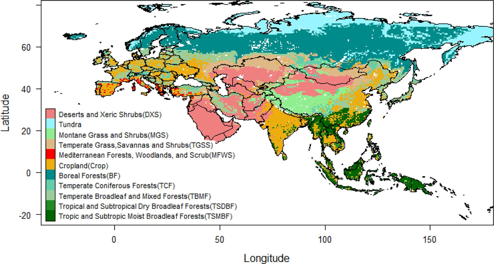
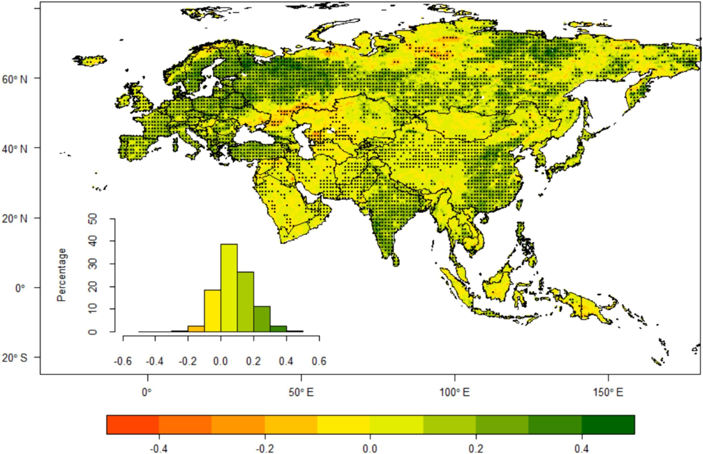
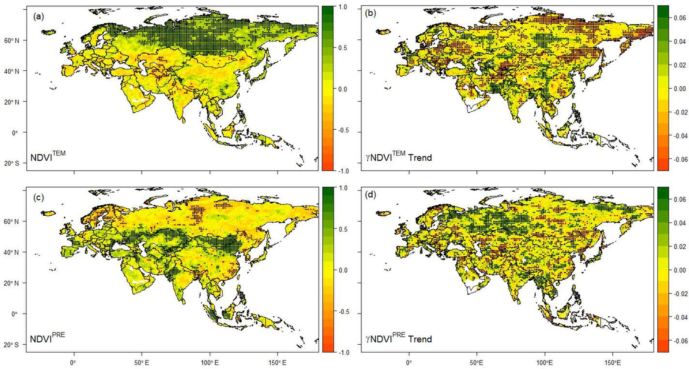
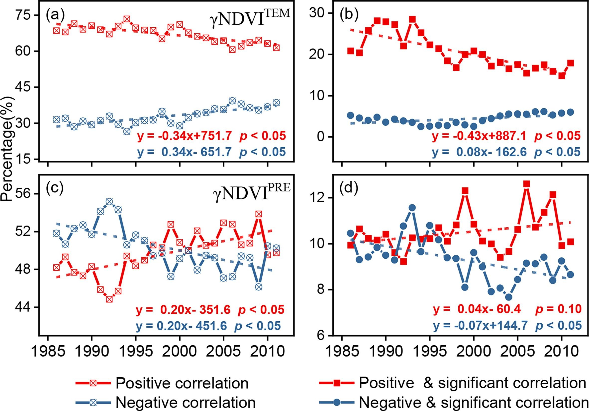
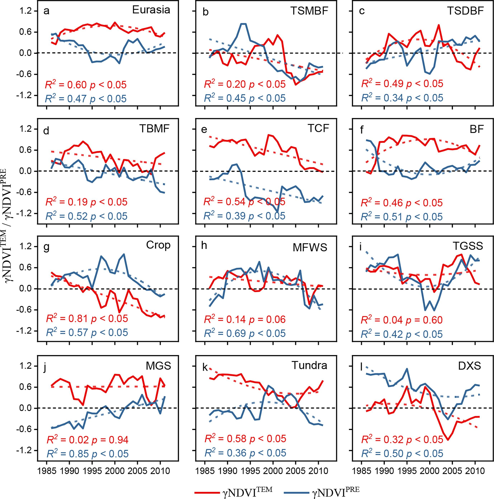
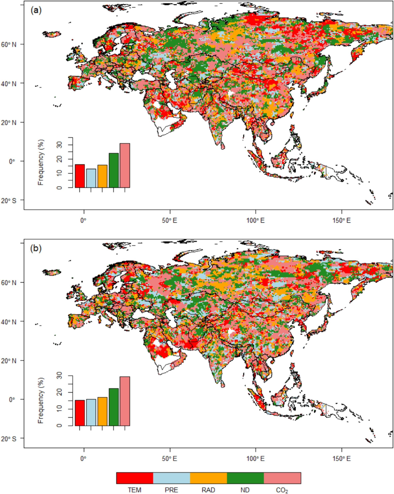
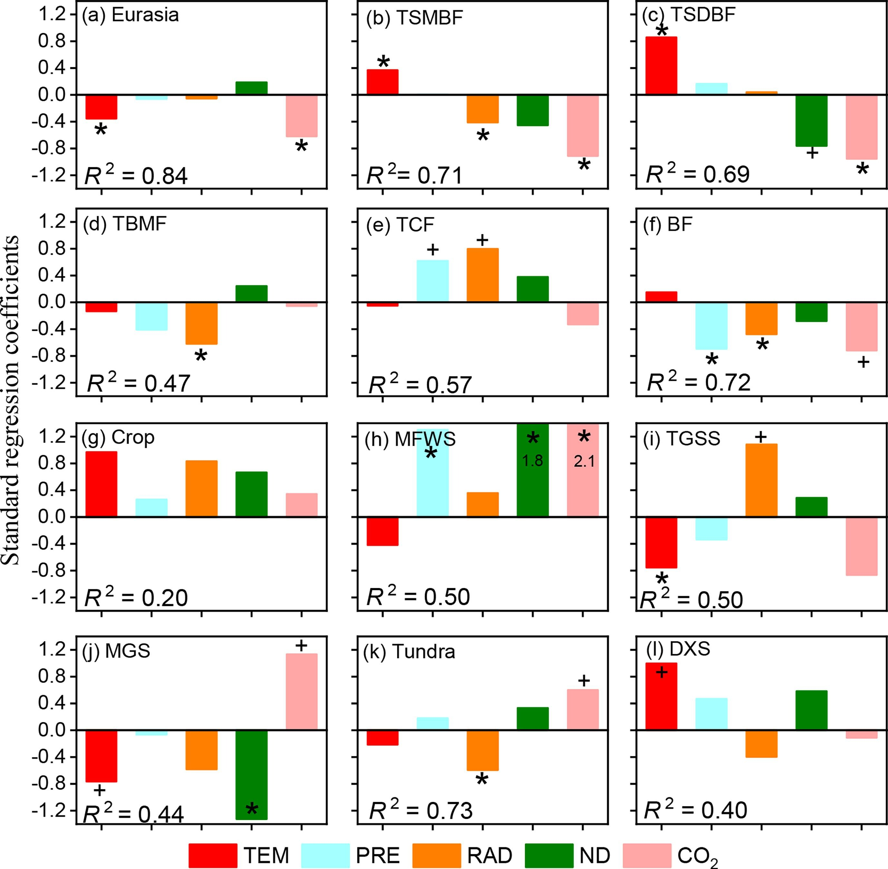
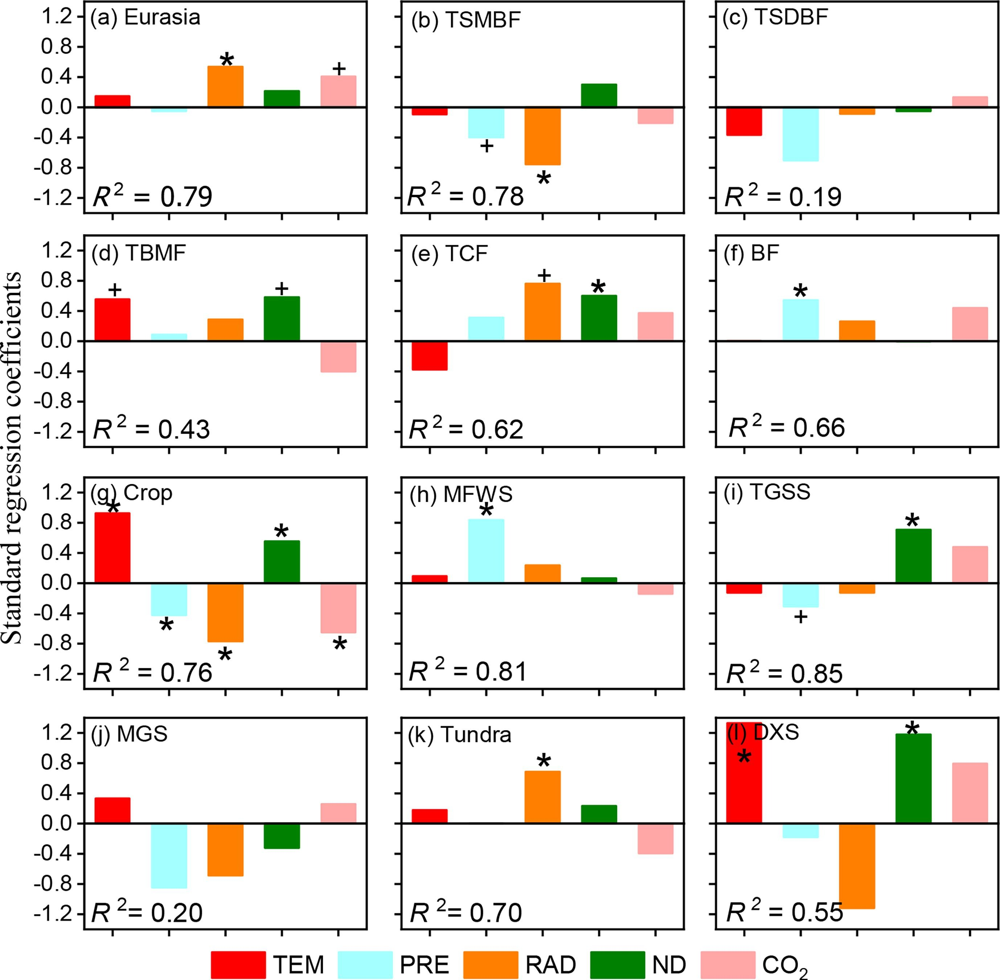

# The variability in sensitivity of vegetation greenness to climate change across Eurasia

## Abstract

Climate change is one of dominators driving the greening of vegetation worldwide, which is expected to enhance land carbon sink and mitigate global warming. The sensitivity of vegetation greenness to climate change is fluctuant and regulated by other environmental factors. However, the drivers and mechanisms behind remain unclear so far. Here, we hired long-term satellite-based vegetation index (NDVI), climatic variables, nitrogen deposition, and atmospheric CO2 records to investigate variations of greenness climatic sensitivity and its drivers across Eurasia. To obtain the timeseries of temperature (γNDVITEM) and precipitation sensitivity (γNDVIPRE), we applied multi-regression models and regressed temperature and precipitation on NDVI in each 9-year moving windows. The results showed that the area of vegetation greenness limited by low temperatures substantially shrunk, while the area of vegetation greenness limited by precipitation deficit increased during 1982–2015. Specifically, significantly decreasing γNDVITEM and γNDVIPRE accounted for 29.8% and 20.1%, respectively, while remarkably increasing γNDVITEM and γNDVIPRE accounted for about 18.2% and 24.5%, respectively, of the vegetated lands across Eurasia. Declining γNDVITEM was widely observed in most biomes, including tropical and subtropical moist broadleaf forests, temperate broadleaf and mixed forests, temperate coniferous forests, croplands, and deserts and xeric shrublands. Substantially increasing γNDVIPRE was merely found in montane grasslands and shrublands, and tropical and subtropical dry broadleaf forests, while decreasing γNDVIPRE and nonlinear regimes was widely proved in other biome types. Spatially, rather than elevated CO2 and nitrogen deposition, climate factors (temperature, precipitation, and radiation) jointly dominated γNDVITEM and γNDVIPRE variations across nearly 45% and 48% of Eurasia respectively. Our results uncovered the apparent pattern of greenness climate sensitivity changes across Eurasia and highlighted the necessity to unfold the underlying mechanisms based on plant physiology and traits.

## Introduction

Terrestrial greening, as indicated by increased vegetation indices, has been widely observed since at least the 1980s and is expected to persist in the future (Chen et al., 2019; Myers-Smith et al., 2020; Piao et al., 2020; Zhu et al., 2016). It is predicted to enhance vegetation photosynthesis, increase terrestrial carbon sink, and play feedback to climate change (Forzieri et al., 2017; Sitch et al., 2015; Yu et al., 2021; Zeng et al., 2018; Zeng et al., 2017). At the global scale, terrestrial greening has caused a 0.09 ± 0.02 ℃ of decrease in land surface air temperature and a 12.1 ± 2.7 mm yr−1 of increase in precipitation during the period 1982–2011 (Zeng et al., 2018; Zeng et al., 2017). Although the apparent greening is the response of vegetation to environmental change, the greening magnitude is heterogeneous across space and time (Ren et al., 2023). In addition to the amplitude of environmental variations, the intrinsic adaptability of plants, also termed sensitivity to environmental change, is also a key factor affecting the direction and magnitude of vegetation greening, which is essential but has not been fully evaluated so far.

Climate change, increasing atmospheric CO2, nitrogen deposition and land-use change are thought the four main processes triggering land surface greenness change and concerns are provided widely to quantify the relative contributions of these drivers on terrestrial greening (Chen et al., 2019; Piao et al., 2015; Schimel et al., 2015; Wang et al., 2020; Zhu et al., 2016). For example, Zhu et al. (2016) used ten global ecosystem models to quantify the contribution of these drivers on land greening, and they suggested that the CO2 fertilization effect primarily regulates vegetation greening globally since the 1980s. While contributions from other drivers are notable on regional scale and has increased remarkably in recent decades. For instance, climate change dominated greening of the mid-to-high latitudes across Eurasia and the Tibetan Plateau (Jiao et al., 2021; Zhu et al., 2016). Meanwhile, since the 2000s, land-use management has contributed largely to global greening, especially the forest and cropland coverage increase in China and India, respectively (Chen et al., 2019). These evaluations have delivered insightful understandings in terrestrial greening and its drivers, as well as the complexity.

However, strong interactions make it difficult to completely disentangle the relative contribution of each greenness-driving factor. For example, increasing atmospheric CO2 concentrations directly accelerate photosynthesis, greenness, and vegetation productivity (Schimel et al., 2015; Wang et al., 2020; Zhu et al., 2016). On the other hand, elevated CO2 also reduces the stomatal conductance, and relieves water stress meanwhile the water losses from soil, these processes jointly increase water-use efficiency and may alter the climatic sensitivity of vegetation growth and carbon uptake (Keenan et al., 2013; Lian et al., 2021). Recently, it is suggested that the CO2 fertilization effect on vegetation photosynthesis has declined across most terrestrial ecosystems since the 1980s, likely due to changes in nutrient concentration and water availability (Wang et al., 2020). Novelty, studies subsequently found water constraints on vegetation growth significantly increased across the extratropical Northern Hemisphere and globe in the same period (Denissen et al., 2022; Feng et al., 2021; Jiao et al., 2021). Whereas, in a recent evaluation, evidences conversely suggest that precipitation sensitivity of vegetation productivity has generally declined globally over the past two decades (Zeng et al., 2022). Comprehensions on interactions between environmental factors in regulating vegetation growth is relatively insufficient so far, though it is vital for modeling and predicting vegetation change in the future.

Climate change is the dominant factor that stimulate vegetation greening across most parts of the globe (Piao et al., 2014; Zeng et al., 2022; Zhu et al., 2016). While the climatic sensitivity of vegetation growth may change due to biotic and abiotic factors. For example, it is reported that the temperature sensitivity of the northern vegetation growth, especially in temperate and arctic ecosystems, has declined substantially since the 1980s (Piao et al., 2014). And drought-induced water deficit is proved to be the key constraint for vegetation greening and productivity at continental or global scales (Feng et al., 2021; Jiao et al., 2021), which may manifest an enhancement in the sensitivity of vegetation activities to water availability. Other factors, such as community alteration, CO2 increase, and nitrogen deposition, also affect the climatic sensitivity of vegetation growth, but there may be heterogeneity in space or between biomes (Jiao et al., 2021; Liu et al., 2022; Piao et al., 2014; Wang et al., 2020). In recent years, it has been highlighted that the vegetation sensitivity to environmental factors is changing, which may amplify or mitigate the threat of climate change to human through land–atmosphere feedback (Cong et al., 2017; Jiao et al., 2021; Zeng et al., 2022). However, among different regions and biomes, understandings in vegetation climatic sensitivity change and its complexity drivers remains insufficient.

Eurasia, with a total area of more than 50 million km2, is the largest continent in this world. With complex topography, it has a wide range of climate gradients and covers almost all vegetation types. According to the results from global evaluations, in the past three decades, climate change dominates vegetation greening across most of Eurasia rather than other factors such as the CO2 fertilization effect and nitrogen deposition (Piao et al., 2020; Zhu et al., 2016). However, changes in climatic sensitivity of vegetation greenness and its drivers in different regions remain unclear across Eurasia. Therefore, in this study, we intend to enclose the vegetation greenness change patterns, secondly analyze the variations of vegetation climatic sensitivity, and lastly identify its drivers across Eurasia in the past three decades.

## Materials and methods

### Study area

With Eurasia as the target region, we used the Terrestrial Ecoregions of the World (TEOW) to distinguish different biomes across Eurasia. It provides 14 different biome classifications, including Tropical and Subtropical Moist Broadleaf Forests (TSMBF), Tropical and Subtropical Dry Broadleaf Forests (TSDBF), Tropical and Subtropical Coniferous Forests (TSCF), Temperate Broadleaf and Mixed Forests (TBMF), Temperate Coniferous Forests (TCF), Boreal Forests/Taiga (BF), Tropical and Subtropical Grasslands, Savannas and Shrublands (TSGSS), Temperate Grasslands, Savannas and Shrublands (TGSS), Flooded Grasslands and Savannas (FGS), Montane Grasslands and Shrublands (MGS), Tundra, Mediterranean Forests, Woodlands and Scrub (MFWS), Deserts and Xeric Shrublands (DXS), and Mangroves (Ma) (Olson et al., 2001). In addition, we also collected the satellite-based land cover classification product (MCD12C1) from the National Aeronautics and Space Administration (NASA, https://search.earthdata.nasa.gov/). The MCD12C1 product is derived from the Moderate Resolution Imaging Spectroradiometer (MODIS) boarded on Terra and Aqua, and supplies yearly global land classifications at 0.05°×0.05° spatial resolution.

In this study, we excluded biome types with a small proportion of area and retained 10 types in Eurasia from the TEOW (Fig. 1 ). The sensitivity of crops to climate change is strongly influenced by human activities, which can be different from natural vegetation. The TEOW classification does not have a clear division in croplands, which may affect our cognition. Therefore, we superimposed layers of TEOW and satellite-based landcover classification (MCD12C1) in 2001 to isolate the distribution of farmland in Eurasia. The croplands layer under the International Geosphere-Biosphere Program (IGBP) classification scheme within the MCD12C1 were selected to overlay the TEOW-biomes classification. Finally, the repainted biome domains at 0.05°×0.05° spatial resolution were aggregated to 0.5°×0.5° with majority filter (modal) method, and the procedure was achieved through ‘aggregate’ function in ‘raster’ package in R4.2.2 software.

Spatial distribution of different biomes across Eurasia.

### Data sources

The third-generation bi-weekly Normalized Difference Vegetation Index (NDVI), widely used as a proxy for vegetation growth, was derived from the Advanced Very High-Resolution Radiometer (AVHRR) and produced with the Global Inventory Monitoring and Modeling System (GIMMS) (https://ecocast.arc.nasa.gov/). The GIMMS NDVI3g covers the period 1982–2015 and is at 1/12 × 1/12 degree spatial resolution. We acquired the monthly air temperature and total precipitation datasets, with a spatial resolution of 0.5°×0.5°, from the Climate Research Unit (CRU) at the University of East Anglia (CRU TS v4.06) (https://crudata.uea.ac.uk/cru/data/). The monthly mean surface shortwave radiation data, with 0.25°×0.25° spatial resolution, was retrieved from the fifth-generation ECMWF (European Centre for Medium-Range Weather Forecasts) reanalysis assimilation product (ERA5) (Hersbach et al., 2019) (https://www.ecmwf.int).

In this study, we averaged the bi-weekly NDVI of the growing season (April–October) (hereafter NDVI) to indicate annual vegetation activity while partly avoiding the confounding effects from soil background. Based on the monthly climate data, we calculated the mean growing season air temperature (TEM), total precipitation (PRE), and mean surface shortwave radiation (RAD). To match the spatial resolution of these climate data, all NDVI and radiation grid layers across Eurasia were aggregated to 0.5°×0.5° spatial resolution through ‘mean’ method embedded in ‘aggregate’ function in ‘raster’ package in R4.2.2 software. The in-situ atmospheric CO2 concentration records from the Mauna Loa Observatory were obtained from the Scripps Institution of Oceanography (the Scripps CO2 program) (https://scrippsco2.ucsd.edu/). The historical atmospheric nitrogen decomposition dataset was retrieved from the Inter-Sectoral Impact Model Intercomparison Project (ISIMIP) and the simulation round ISIMIP2a was selected in this study (https://data.isimip.org/). The data, including reduced nitrogen and oxidized nitrogen depositions, is in 0.5°×0.5° spatial resolution and covers the period 1860–2016. And we simply summed the two parts as the totally atmospheric nitrogen deposition.

### Trend and sensitivity analysis

We hired Sen’s slope estimator (Sen, 1968) to obtain the change trend of variables and applied the nonparametric Mann-Kendall test (Kendall, 1975; Mann, 1945) to examine the significance of the trend. These approaches were implemented with the ‘trend’ package in R software. Multiple linear regression analysis was used to quantify the effect of different independent variables on dependent variables, and the standard regression coefficients were defined as the sensitivity of dependent variables to independent variables, respectively. For example, when we use interannual variations of TEM and PRE regress NDVI variations during 1982–2015, the standardized regression coefficients of TEM (NDVITEM) and PRE (NDVIPRE) were chosen to indicate the sensitivity of NDVI to TEM and PRE, respectively. This flexible and interpretable method is widely used in the relevant studies (Jiao et al., 2021; Li et al., 2024; Zeng et al., 2022).

To examine the change in NDVI sensitivity to TEM and PRE over the past three decades, starting in 1982, we used TEM and PRE regress NDVI under each 9-year moving window, and two time series (centered to 1986–2011) of NDVI sensitivity to TEM (γNDVITEM) and PRE (γNDVIPRE) can be obtained. Based on the time series, we can statistically analyze its changes and triggers. The reason for setting a moving window of 9 years, rather than shorter period (e.g., 5 years) or a longer one (e.g., 15 years), is twofold. On one hand, a shorter window may result in an unstable regression relationship. On the other hand, a window longer than 10 years may retain the decadal signal in the time series, even when a detrending method is applied. In atmospheric and meteorological studies, a 9-year moving window is commonly employed to separate the components of interdecadal and interannual variations (Lu et al., 2020).

To verify the dominant factor regulating γNDVITEM and γNDVIPRE temporal variability grid by grid, we used the Lindeman, Merenda and Gold (lmg) method (Groemping, 2006) to evaluate the relative importance of the climatic factors, and atmospheric CO2 concentration and nitrogen deposition in explaining the variances of the γNDVITEM and γNDVIPRE. The method was based on variance decomposition for multiple linear regression models, and the relative importance of each factor can be quantified with a percentage. The sum of the relative weights of all independent variables is 100 %, and the factor with the highest relative importance value is defined as the dominant driver. These procedures were performed with the “relaimpo” package in R4.2.2 (Groemping, 2006).

At biome scale, we hired multiple regression model and regressed γNDVITEM and γNDVIPRE with climate (including TEM, PRE, and RAD), atmospheric nitrogen deposition (ND), and atmospheric CO2 concentration (CO2) records filtered by 9-year running mean. And the corresponding standardized regression coefficients were retrieved to indicate the sensitivity of γNDVITEM and γNDVIPRE to each environmental factor.

## Results

### Greenness change pattern across Eurasia

For the period 1982–2015, over half (51.80 %) of Eurasia became greening and less than 5 % of NDVI browning significantly (Mann-Kendall test, *p* < 0.05). Spatially, there are several clusters with high NDVI increase rates, including China, India, Europe, and the Siberian Plateau (Fig. 2 ). The NDVI overall Eurasia increased noticeably at a linear rate of 2 % per decade.

Spatial pattern of NDVI trend (Sen’s slope, ×10−1/decade) across Eurasia during 1982–2015. The inset panel shows the frequency distribution of NDVI trends, and regions labelled with black dots indicate the NDVI trend is statistically significant (Mann-Kendall test; *p* < 0.05).

### Spatial patterns of greenness climatic sensitivity and its changes

Generally, the variation in vegetation greenness was positively and significantly (*p* < 0.05) correlated with growing season temperature in the northern lands (>50°N) (Fig. 3 a), accounting for 29.9 % of Eurasia. The relationship between NDVI and growing season precipitation was not significant statistically (*p* > 0.05) for most lands. However, in the middle latitudes, which account for nearly 21.8 % of Eurasia, NDVI variations are remarkably constrained by precipitation (Fig. 3c).

Vegetation greenness climatic sensitivity and its change trend in the past three decades. The NDVITEM and NDVIPRE refer to the NDVI temperature and precipitation sensitivity detected by multiple regression models applied in 1982–2015, respectively. γNDVITEM and γNDVIPRE represent NDVI temperature and precipitation sensitivity detected in each 9-year moving window from 1982 to 2015. Lands labelled with black dots indicate the relationship is statistically significant (*p* < 0.05).

In the sub-period of 1982–2015, we found that both γNDVITEM and γNDVIPRE changed notably and heterogeneously across space (Fig. 3b and d). Specifically, γNDVITEM across the East Siberian Mountains, Central Europe, and the Pamir Plateau in central Asia significantly declined, which accounts for 29.8 % of the vegetated lands on Eurasia. While γNDVITEM across the Central Siberian Plateau, Northwest China, and Indian Peninsula, counting 18.2 % of Eurasia, showed a remarkably increasing trend (Fig. 3b). In nearly one-quarter (24.5 %) of Eurasia, γNDVIPRE increased significantly, mainly in the Eastern European Plain and the West Siberian Plain (Fig. 3d). Notably decreasing γNDVIPRE in the past three decades was mostly found within Asia, accounting for nearly one-fifth (20.9 %) of Eurasia (Fig. 3d).

In the past three decades, positive γNDVITEM showed a remarkable decrease in percentage areas in Eurasia, while the areas of negative γNDVITEM increase significantly (Fig. 4 a–b). It was novelty that vegetation greenness constrained by low temperature had decreased with a relatively highe rate (−4.3 %/decade) (Fig. 4b). Areas with positive and significantly positive (*p* < 0.05) γNDVIPRE had increased notably, while lands with negative and significantly negative (*p* < 0.05) γNDVIPRE declined significantly (Fig. 4c–d).

Temporal change of positive and negative γNDVITEM and γNDVIPRE in percentage areas. γNDVITEM and γNDVIPRE in labels represent NDVI temperature and precipitation sensitivity detected in each 9-year moving window since 1982. Red (blue) hollow and solid symbols in a–b (c–d) represent the proportion of positive γNDVITEM (γNDVIPRE) and significantly positive γNDVITEM (γNDVIPRE), respectively.

### Variations of greenness climatic sensitivity at biomes scale

Overall Eurasia, γNDVITEM showed stronger stability than γNDVIPRE, which firstly decreased, even fell below 0 in 1990–2005, and then recovered during the whole period (Fig. 5 a). At biome scale, variations of γNDVITEM and γNDVIPRE exhibited a variety of regimes. Sustained significant reductions in γNDVITEM were observed in TSMBF, TBMF, TCF, Crop, Tundra and DXS. Specifically, γNDVITEM had approached from positive to zero (Fig. 5d,e,k), while it had shifted from positive to negative for TSMBF, Crop and DXS (Fig. 5b,g,l). The γNDVITEM of MFWS, TGSS, and MGS decreased slightly throughout the period, but no statistical significance was found (Fig. 5h, i, j). The γNDVITEM of both TSDBF and BF showed a nonlinear regime, which increased first and then decreased (Fig. 5c,f).

Temporal variations of climatic sensitivity of NDVI (γNDVITEM and γNDVIPRE in blue line) across biomes in Eurasia. Panels labelled with a–l indicate γNDVITEM (red dotted line) and γNDVIPRE (blue dotted line) variations for Eurasia, TSMBF, TSDBF, TBMF, TCF, BF, Crop, MFWS, TGSS, MGS, Tundra, and DXS, respectively. And the corresponding *R2* and *p* values in red and blue colour within each panel show the coefficient of determination and statistical significance level of linear or polynomial fitting (coloured dotted lines), respectively.

The γNDVIPRE decreased significantly over TSMBF, TBMF, TCF and DXS. Specifically, for both TSMBF and TBMF vegetation, γNDVIPRE had shifted from positive to negative values before 2000 (Fig. 5b,d). While the negative γNDVIPRE over TCF had enhanced (Fig. 5e), which was contrary to the release for DXS (Fig. 5l). γNDVIPRE over TSDBF and MGS showed a remarkably continuous increasing trend, which had reversed from negative values to positive values in the past three decades (Fig. 5c,j). Regimes of γNDVIPRE over Crop, MFWS and Tundra exhibited a “first enlarged and then decreased” pattern (Fig. 5g,h,k), which was inversed to the pattern of γNDVIPRE for BF and TGSS (Fig. 5f,i).

### Environmental drivers regulating greenness climatic sensitivity

Considering changes in climate, carbon dioxide concentration (CO2), and nitrogen deposition (ND), we evaluated the dominant driver regulating γNDVITEM and γNDVIPRE variations at the local (grid cell) scale across Eurasia. Spatially, we found γNDVITEM variations driven by temperature account for 16.2 % of Eurasia, most of which were in north of the Central Siberian Plateau and the Eastern Siberian Mountains (Fig. 6 a). The area, where γNDVITEM variability was dominated by precipitation, account for merely 12.9 % in the percentage of vegetated lands in Eurasia (Fig. 6a). Lands exhibited radiation-driven in γNDVITEM were maintained in southern China and the Central Siberian Plateau, accounting for 15.7 % of lands in Eurasia (Fig. 6a). Nitrogen deposition-dominated γNDVITEM variations accounted for 24.2 % of the total area of Eurasia, mainly distributed in the Eastern European Plain, the northern part of the Western Siberian Plain and the Turan Plain (Southwest Kazakhstan, northwest of Uzbekistan and Turkmenistan) in Central Asia (Fig. 6a). The CO2-driven γNDVITEM variations appeared in 30.9 % of Eurasia and most of the lands spread in Asia (Fig. 6a). The relative importance of different variables in regulating γNDVITEM can be obtained in Fig. S1a–e.

Spatial patterns of dominant factor regulating γNDVITEM (a) and γNDVIPRE (b) variations during the past three decades. TEM: mean growing season temperature, PRE: growing season accumulate precipitation, RAD: mean growing season surface shortwave radiation, ND: nitrogen decomposition, and CO2: atmospheric CO2. Bar charts indicate the frequency distribution of each factor in percentage.

The γNDVIPRE variations dominated by temperature and precipitation merely account for 15.3 and 15.7 % of Eurasia, respectively (Fig. 6b). The lands, where γNDVIPRE variations were regulated by radiation, account for 17.0 % of lands in Eurasia and most distribute in Siberia (Fig. 6b). Nitrogen deposition-dominated γNDVIPRE variations accounted for 22.4 % of Eurasia, mainly distributed in east of the Eastern European Plain, the Eastern Siberian mountains, and the central Turan Plain (Fig. 6b). The CO2-driven γNDVIPRE variations was in 29.6 % of Eurasia and widely spread in Eurasia (Fig. 6a). The relative importance of different variables in regulating γNDVITEM can be obtained in Fig. S1f–j.

At Eurasia and biome scale, temperature played a positively significant (*p* < 0.1) role in explaining γNDVITEM variations for TSMBF, TSDBF and DXS, while it was negatively and statistically significant (*p* < 0.1) overall Eurasia, TGSS and MGS (Fig. 7 ). Precipitation was expected to notably (*p* < 0.1) increase γNDVITEM for TCF and MFWS but remarkably (*p* < 0.05) decrease γNDVITEM for BF (Fig. 7). The correlation was negatively significant between radiation and γNDVITEM for TSMBF, TBMF, BF and Tundra. While it was contrary for TCF and TGSS, where the relationship was significantly negative (Fig. 7). The increase in nitrogen decomposition may considerably reduce γNDVITEM in both TSDBF and MGS but substantially trigger the increase of γNDVITEM for MFWS (Fig. 7). For Eurasia, TSMBF, TSDBF and BF, CO2 anomalies acted as the dominate driver regulating γNDVITEM variations rather than other factors, and the relationship was negatively significant (Fig. 7). While for MFWS, MGS and Tundra, increasing CO2 was intend to enhance γNDVITEM (Fig. 7).

Drivers regulating NDVI temperature sensitivity (γNDVITEM) variations across different biomes in Eurasia. Bars coloured in red, light blue, orange, green, and pink, represent the sensitivity of the γNDVITEM variations to mean temperature (TEM), total precipitation (PRE), mean radiation (RAD), nitrogen deposition (ND), and atmosphere carbon dioxide (CO2). *R*2 in each panel refers to the coefficient of determination of the multilinear regression model and the column bar is labelled with+ and * denoting the significance at the levels of 0.1 and 0.05, respectively.

Temperature was significantly positively (*p* < 0.1) correlated with γNDVIPRE for TBMF, Crop, and DXS, providing evidence that higher temperatures lead to higher precipitation demand (Fig. 8 d,g,l). More precipitation was expected to notably (*p* < 0.05) increase γNDVIPRE for BF and MFWS, but remarkably (*p* < 0.1) decrease γNDVIPRE for TSMBF, Crop and TGSS (Fig. 8b,g, i). The relationship was significantly positive between radiation and γNDVIPRE for Eurasia, TCF and Tundra (Fig. 8a,e,k), which was contrary to the relationship found in TSMBF and Crop (Fig. 8b,g). It was widely observed that the increase in nitrogen decomposition was intended to increase γNDVIPRE for TMBF, TCF, Crop, TGSS and DXS (Fig. 8d,e,g, i,l). No significant relationship between CO2 and γNDVIPRE was found for most biomes except for Crop and Eurasia, where the relationship was positively and negatively significant, respectively (Fig. 8a,g).

Drivers regulating NDVI precipitation sensitivity (γNDVIPRE) variations across different biomes in Eurasia.

## Discussion

### Declined temperature limitation but enhanced water constraints for vegetation growth

In recent years, a few studies have suggested that temperature limitation on vegetation greenness is declining but constraints from water availability are enhancing, albeit the targets and methods are different. For example, for the temperate and arctic ecosystems in the northern hemisphere, it is suggested that the greenness (NDVI) temperature has substantially declined since the 1980s (Piao et al., 2014). Hiring the SPEI (Standardized Precipitation Evapotranspiration Index) and scPDSI (self-calibrating Palmer drought severity index), Jiao et al. (2021) have documented that the area where vegetation growth is restricted by water deficit increased significantly across the extratropical Northern Hemisphere. Globally, Liu et al. (2019) has employed eddy covariance records from 188 flux towers and reported that the positive effect of temperature on GPP has declined but the positive effects of precipitation and CO2 became stronger during 2000–2014. Feng et al. (2021) has attributed the levelling of global gross primary production (GPP) and vegetation greenness since 2010 to the spatial expansion of drought-induced soil water limitations. Denissen et al. (2022) has novelty employed the ecosystem limitation index, an index defined to distinguish water and heat limitation for ecosystem function (ET, evapotranspiration) (Denissen et al., 2020), and they have found the widespread regime shift from energy to water limitation between 1980 and 2100. In this study, we also suggest that the temperature sensitivity of vegetation greenness has been declining widely across Eurasia. Meanwhile, the constraints from precipitation-related water supply have strengthened based on the local analysis results (Fig. 3 and Fig. 4).

At the biome scale, the declining of temperature limitation for vegetation greening can also be found in most biomes in Eurasia (Fig. 5). Whereas, for the TSDBF, BF and TGSS vegetation, γNDVITEM does not simply decrease but changed nonlinearly (Fig. 5c,f, i). For MGS vegetation, γNDVITEM does not show a significant (*p* > 0.05) trend and low temperature remains a key limitation for vegetation growth (Fig. 5j). It should be noted that MGS vegetation mainly distributed in the Tibetan Plateau (Fig. 1), where the mean annual air temperature is usually below 0℃ (You et al., 2013). Though MGS air temperature has increased significantly in recent decades, it has not met the optimal temperature for vegetation growth (Huang et al., 2019), and that should be responsible for the relatively stable positive role of temperature for MGS vegetation greening. On the other hand, the intra-annual variations in MGS vegetation sensitivity to temperature may also contributed to the relativity flat γNDVITEM. Formerly, Cong et al. (2017) analyzed changes in sensitivity of vegetation to climate at intra-annually monthly and seasonally scale in the Tibetan Plateau. They suggested that alpine grass exhibited minimal change in temperature sensitivity, likely attributed to increasing temperature sensitivity in spring and autumn but decreasing sensitivity in summer.

A significantly increasing trend in γNDVIPRE can be only obviously found in the TSDBF and MGS, where γNDVIPRE has shifted from a negative phase to a positive phase (Fig. 5c,g). Conversely, for the TSMBF, TBMF, TCF and DXS, γNDVIPRE show a substantially decrease trend (Fig. 5b,d,e,l). Meanwhile, the nonlinear regimes of γNDVIPRE is conspicuously depicted in the BF, Crop, MFWS, TGSS and Tundra, and the changing trend seems reverse around 2000 (Fig. 5f,g,h, i,k). Recently, a study has also provided shreds of evidence that vegetation productivity sensitivity to precipitation has declined for most ecosystem types across the globe since 2001 (Zeng et al., 2022). They also suggest that the precipitation sensitivity of grasslands has slightly increased in the past two decades, which is consistent with the results we found at the biome scale (Fig. 5). For most biomes, the precipitation sensitivity of vegetation greenness has declined, especially since 2000 (Fig. 5) (Zeng et al., 2022). It seems to contradict the results depicted in the 3.2 section and previous studies that vegetation sensitivity to water availability has enhanced widely across the globe (Denissen et al., 2022; Jiao et al., 2021; Li et al., 2022; Wei et al., 2023). We think the paradox may be explained by compensating effect of water both temporal and spatial. In a previous study, Jung et al. (2017) found that with an expansion of the spatial scale, the dominant factor driving interannual variation of vegetation productivity shift from water availability to air temperature, resulting in contradictory results at the local scale and at the hemispheric or global scale.

### Drivers and underlying mechanisms regulating variations of greenness climatic sensitivity

Some kinds of drivers can regulate the climatic sensitivity of vegetation greenness to climate variations. Firstly, alterations of climate regimes, such as extreme droughts and heat waves, are expected to temporally change vegetation climatic sensitivity by altering moisture or heat availability. For example, studies have reported that release in moisture stress, especially for water-limited lands, may reduce the coupling between water and vegetation growth, and vice versa (Denissen et al., 2022; He et al., 2018; Piao et al., 2014; Zeng et al., 2022; Zhao et al., 2023). Pieces of evidence also proved that more heat supply, such as frequent droughts and extremely hot days, which is always associated with higher atmospheric water demand and even soil drier, may contribute to the decline in correlation between vegetation growth and temperature but enhance the thirst for water (Denissen et al., 2022; Jiao et al., 2021; Piao et al., 2014). Secondly, the acclimation of vegetation, such as plant physiological traits changes, biomass allocation and community composition alterations, is an important biotic factor that may change the climatic sensitivity of vegetation activities (Batllori et al., 2020; Li et al., 2020; Liu et al., 2018; Ma et al., 2017; Poorter et al., 2012). For example, drought is expected to shift community species composition to xeric species, which have deeper root systems to obtain more water to mitigate the negative impacts on productivity (Batllori et al., 2020; Liu et al., 2018; Poorter et al., 2012; Wang et al., 2022). Shrub expansion over grass-dominated tundra is considered to contribute to the declining temperature sensitivity across the northern vegetation (Piao et al., 2014). Thirdly, atmospheric factors (e.g., CO2 and Nitrogen deposition) also play important roles in regulating vegetation dynamics and climatic sensitivity. For instance, a higher CO2 would reduce the stomatal conductance and lower water losses from the soil, which may increase water-use efficiency and decrease the moisture sensitivity of vegetation growth (Keenan et al., 2013; Lian et al., 2021; Zhang et al., 2022). The availability of soil nutrients may also directly affect the synthesis of chlorophyll and indirectly change the greenness sensitive to water or heat for vegetation growth (Poorter et al., 2012). Fourthly, other factors, such as soil texture, afforestation, and land use change, may also indirectly alter the climatic sensitivity of vegetation (Gupta et al., 2022; Jin et al., 2023).

In this study, we statistically evaluated dominant environmental drivers regulating γNDVITEM and γNDVIPRE variations across Eurasia at local/pixel and biome scales (Figs. 6–8). Spatially, climatic factors, including temperature, precipitation, and radiation variations, jointly regulate γNDVITEM and γNDVIPRE variations over nearly 45 % and 48 % of Eurasia, respectively (Fig. 6). Similar to our spatial results, Denissen et al. (2022) attribute the declining of energy limitation for an ecosystem to increase in solar radiation and decrease of water availability. Jiao et al. (2021) and Zeng et al. (2022) also evaluate factors dominating greenness water sensitivity change and have found that climate variations primarily regulated the greenness SPEI and precipitation sensitivity over more lands across the extratropical Northern Hemisphere and globe, respectively. At Eurasia and biome scale, we also found the notably (*p* < 0.1) negative effects of temperature or radiation on γNDVITEM among Eurasia, TSMBF, TBMF, BF, TGSS, MGS and Turdra (Fig. 7). And the expected positive effects of precipitation on γNDVITEM can be found in most biomes, albeit remarkable relationship is merely observed in TCF and MFWS (Fig. 7). The possible reason is that higher temperature or more radiation-induced higher atmospheric water demand even soil drier may decrease heat demand but enhance thirst of plant growth for water, thus γNDVITEM decreases and γNDVIPRE increases. While more water supply may alleviate the water demand (reducing γNDVIPRE) and increase heat requirement (increasing γNDVITEM) (Jiao et al., 2021; Zeng et al., 2022). Besides, the unexpected significantly negative relationship (*p* < 0.05) between precipitation and γNDVITEM found in BF may be caused by the indirect effects of precipitation on vegetation. We found annual precipitation and temperature over BF are positively correlated (not shown), which may be the result of warming and greening-induced water cycle enhancing then precipitation increased (Piao et al., 2020).

It is widely confirmed that the CO2 fertilization effect contributes greatly to the greening of the Earth, especially for tropical or subtropical forests (Piao et al., 2020; Song et al., 2022; Zhu et al., 2016). While the effects of atmospheric CO2 change on greenness climatic sensitivity may be complex. On the one hand, the CO2 fertilization effect directly benefits photosynthesis (Chen et al., 2022), which may compensate for the negative effects of heat or moisture inadequacy (Lian et al., 2021; Liu et al., 2019; Song et al., 2022). On the other hand, enriched CO2 may alter vegetation traits, such as leaf area or stomatal conductance, which is closely related to the response of vegetation to climate (Keenan et al., 2013; Zhang et al., 2022). In addition, the CO2 fertilization effect-induced greening is expected to enhance evapotranspiration and cooling regional even global climate (Li et al., 2018; Shen et al., 2015; Zeng et al., 2018; Zeng et al., 2017). That may indirectly alter greenness climatic sensitivity. Therefore, the statistical influence of atmospheric CO2 anomalies on greenness climatic sensitivity depends on the net effect of the superposition of multiple processes. In this study, we found CO2-driven γNDVITEM and γNDVIPRE spatially dominated 30.9 and 29.6 % of vegetated lands across Eurasia, respectively (Fig. 6). We also replaced the atmospheric CO2 with gridded CO2 dataset, which is based on the historical monthly and latitudinally resolved CO2 concentrations accounting longitudinal features retrieved from fossil-fuel CO2 emissions from Carbon Dioxide Information analysis Center (Cheng et al., 2022). And we found that there is no significant difference between site-based CO2 records and gridded CO2 with spatial variability (Fig. S2). Atmospheric CO2 behaved negative relationship with γNDVITEM overall Eurasia and in all forest biomes, among which enriched CO2 would reduce γNDVITEM and it is statistically significant (*p* < 0.1) for Eurasia, TSMBF, TSDBF and BF (Fig. 7). For those biomes, CO2 fertilization effect may trigger vegetation growth and reduce the dependence of vegetation growth on temperature. While for other biomes, especially for MFWS, MGS and Tundra, temperature is a positively vital role and CO2 fertilization-induced greening may enhance the role of temperature due to enhanced evaporative cooling effect. For variations of γNDVIPRE, the role of atmospheric CO2 seems indistinct for most biomes. A significant relationship is found overall between Eurasia (positive) and Crop (negative) (Fig. 8). Previously, studies have reported that the effects of elevated atmospheric CO2 on precipitation sensitivity vary across regions. Generally, elevated atmospheric CO2, reducing leaf-level transpiration, decreases precipitation sensitivity in moist regions. However, in drylands, the leaf level reduction will be overridden when leaf area largely increases, which enhances the requirement for water (Zhang et al., 2022). The divergent effect of elevated atmospheric CO2 on γNDVIPRE can also be found in our results. For example, the negative effects of elevated atmospheric CO2 can be found in moist TSMBF, TBMF and Tundra, meanwhile, the positive effects can be found in arid TSDBF, TGSS, and DXS (Fig. 8).

Nitrogen availability is widely recognized as a limitation for plant productivity, especially for high latitudes (Kicklighter et al., 2019; LeBauer and Treseder, 2008). As an external nitrogen input for terrestrial ecosystems, atmospheric nitrogen deposition may directly increase nitrogen availability, which may affect the structure and function of ecosystems and subsequently change their climatic sensitivity (Du and de Vries, 2018; Perring et al., 2018). Whereas, studies have shown that the effects are context-dependent across types and spatial scales. For example, for N-limited biomes, additional nitrogen input is likely to stimulate carbon sequestration and productivity (de Vries et al., 2014; Du and de Vries, 2018). But for nitrogen saturate conditions (extreme cases), it may play a deleterious role, such as soil acidification and nutrient imbalances (Du et al., 2019; Du et al., 2016). Other factors like landscape, soil, and historical and current disturbance/management may also affect the effects of nitrogen deposition on ecosystems (Perring et al., 2018). In this study, we found nitrogen deposition has no significant influence on either γNDVITEM or γNDVIPRE overall Eurasia and for most of the biomes (Fig. 7 and Fig. 8). The possible reason may be that the contribution of nitrogen deposition on vegetation productivity is minor, compared to the contributions of biological N fixation (BNF)-induced productivity change (Du and de Vries, 2018). Whereas, for some specific biomes, nitrogen deposition has remarkable effects on γNDVITEM or γNDVIPRE. For example, nitrogen deposition notably and negatively (*p* < 0.05) correlated with γNDVITEM for the MGS. Both low temperature and nitrogen limit vegetation growth for mountainous grass and shrub (Wang et al., 2022). So, high nitrogen deposition may compensate for temperature effects on vegetation greenness for the MGS. The positive relationship between nitrogen deposition and γNDVIPRE enhancement can be found in almost all biomes across Eurasia, meanwhile, the relationship is statistically significant (*p* < 0.05) for TBMF, TCF, Crop, TGSS and DXS (Fig. 8). The underlying mechanism may be external nitrogen input-induced greening enhance water requirements.

## Conclusion

In this study, we found that the regimes of greenness climatic sensitivity (γNDVITEM and γNDVIPRE) vary spatially and temporally across Eurasia. Spatially, the area of greenness constrained by low temperature has declined and the proportion limited by insufficient precipitation has increased. At the biome scale, subsequently declined γNDVITEM was confirmed for most biomes, while decreasing γNDVIPRE is observed more widely, especially in forest types, rather than increasing γNDVIPRE trend, which is merely proved in specific dry biomes. In most of Eurasia, climate change remains the dominator regulating γNDVITEM and γNDVIPRE variations instead of elevated CO2 and nitrogen deposition. However, the uncertainties and mechanisms, underlying greenness climatic sensitivity alterations, remain to be fully evaluated based on plant physiology and trait monitoring. Our results confirmed the complexity of changes in vegetation growth, which requires further in situ assessments in future.

## CRediT authorship contribution statement

**Zhipeng Wang:** Writing – review & editing, Writing – original draft, Methodology, Formal analysis, Data curation, Conceptualization. **Jianshuang Wu:** Writing – review & editing, Funding acquisition, Conceptualization. **Meng Li:** Writing – review & editing, Methodology. **Yanan Cao:** Writing – review & editing, Formal analysis. **Minyahel Tilahun:** Writing – review & editing. **Ben Chen:** Writing – review & editing, Methodology.

## Data availability

Data will be made available on request.

## Supplementary Materials

- [Supplementary Data 1](10.1016_j.ecolind.2024.112140_assets/1-s2.0-S1470160X24005971-mmc1.docx)
- [1-s2.0-S1470160X24005971-am.pdf](10.1016_j.ecolind.2024.112140_assets/1-s2.0-S1470160X24005971-am.pdf)

## References (60 total, showing 60)

1. E. Batllori, F. Lloret, T. Aakala, W.R.L. Anderegg, E. Aynekulu, D.P. Bendixsen, A. Bentouati, C. Bigler, C.J. Burk, J.J. Camarero, M. Colangelo, J.D. Coop, R. Fensham, M.L. Floyd, L. Galiano, J.L. Ganey, P. Gonzalez, A.L. Jacobsen, J.M. Kane, T. Kitzberger, J.C. Linares, S.B. Marchetti, G. Matusick, M. Michaelian, R.M. Navarro-Cerrillo, R.B. Pratt, M.D. Redmond, A. Rigling, F. Ripullone, G. Sanguesa-Barreda, Y. Sasal, S. Saura-Mas, M.L. Suarez, T.T. Veblen, A. Vila-Cabrera, C. Vincke, B. Zeeman. 2020. Forest and woodland replacement patterns following drought-related mortality. Proc. Natl. Acad. Sci. U. S. A., 117: 29720-29729 [Batllori et al., 2020]
2. C. Chen, T. Park, X. Wang, S. Piao, B. Xu, R.K. Chaturvedi, R. Fuchs, V. Brovkin, P. Ciais, R. Fensholt, H. Tommervik, G. Bala, Z. Zhu, R.R. Nemani, R.B. Myneni. 2019. China and India lead in greening of the world through land-use management. Nat. Sustainability, 2: 122-129 [Chen et al., 2019]
3. W. Cheng, L. Dan, X. Deng, J. Feng, Y. Wang, J. Peng, J. Tian, W. Qi, Z. Liu, X. Zheng, D. Zhou, S. Jiang, H. Zhao, X. Wang. 2022. Global monthly gridded atmospheric carbon dioxide concentrations under the historical and future scenarios. Sci. Data, 9: 83 [Cheng et al., 2022]
4. N. Cong, M. Shen, W. Yang, Z. Yang, G. Zhang, S. Piao. 2017. Varying responses of vegetation activity to climate changes on the Tibetan Plateau grassland. Int J Biometeorol, 61: 1433-1444 [Cong et al., 2017]
5. W. de Vries, E.Z. Du, K. Butterbach-Bahl. 2014. Short and long-term impacts of nitrogen deposition on carbon sequestration by forest ecosystems. Curr. Opin. Environ. Sustain., 9–10: 90-104 [de Vries et al., 2014]
6. J.M.C. Denissen, A.J. Teuling, M. Reichstein, R. Orth. 2020. Critical Soil Moisture Derived From Satellite Observations Over Europe. J. Geophys. Res. Atmos., 125, e2019JD031672 [Denissen et al., 2020]
7. J.M.C. Denissen, A.J. Teuling, A.J. Pitman, S. Koirala, M. Migliavacca, W. Li, M. Reichstein, A.J. Winkler, C. Zhan, R. Orth. 2022. Widespread shift from ecosystem energy to water limitation with climate change. Nat. Clim. Chang., 12: 677-684 [Denissen et al., 2022]
8. E.Z. Du, W. de Vries, W.X. Han, X.J. Liu, Z.B. Yan, Y. Jiang. 2016. Imbalanced phosphorus and nitrogen deposition in China's forests. Atmos. Chem. Phys., 16: 8571-8579 [Du et al., 2016]
9. E. Du, W. de Vries. 2018. Nitrogen-induced new net primary production and carbon sequestration in global forests. Environ. Pollut., 242: 1476-1487 [Du and de Vries, 2018]
10. E. Du, M.E. Fenn, W. De Vries, Y.S. Ok. 2019. Atmospheric nitrogen deposition to global forests: Status, impacts and management options. Environ. Pollut., 250: 1044-1048 [Du et al., 2019]
11. X. Feng, B. Fu, Y. Zhang, N. Pan, Z. Zeng, H. Tian, Y. Lyu, Y. Chen, P. Ciais, Y. Wang, L. Zhang, L. Cheng, F.T. Maestre, M. Fernandez-Martinez, J. Sardans, J. Penuelas. 2021. Recent leveling off of vegetation greenness and primary production reveals the increasing soil water limitations on the greening Earth. Science Bulletin, 66: 1462-1471 [Feng et al., 2021]
12. G. Forzieri, R. Alkama, D.G. Miralles, A. Cescatti. 2017. Satellites reveal contrasting responses of regional climate to the widespread greening of Earth. Science, 356: 1140-1144 [Forzieri et al., 2017]
13. U. Groemping. 2006. Relative importance for linear regression in R: The package relaimpo. J. Stat. Softw., 17 [Groemping, 2006]
14. S. Gupta, S. Bonetti, P. Lehmann, D. Or. 2022. Limited role of soil texture in mediating natural vegetation response to rainfall anomalies. Environ. Res. Lett., 17 [Gupta et al., 2022]
15. B. He, L. Huang, Z. Chen, H. Wang. 2018. Weakening sensitivity of global vegetation to long-term droughts. Science China-Earth Sciences, 61: 60-70 [He et al., 2018]
16. Chen, C., Riley, W.J., Prentice, I.C., Keenan, T.F., 2022. CO 2 fertilization of terrestrial photosynthesis inferred from site to global scales. Proc. Natl. Acad. Sci. U. S. A. 119. [Chen et al., 2022]
17. Hersbach, H., Bell, B., Berrisford, P., Biavati, G., Horányi, A., Muñoz Sabater, J., Nicolas, J., Peubey, C., Radu, R., Rozum, I., Schepers, D., Simmons, A., Soci, C., Dee, D., Thépaut, J.-N., 2019. ERA5 monthly averaged data on single levels from 1979 to present. Copernicus Climate Change Service (C3S) Climate Data Store (CDS). (Accessed on < 02-06-2020 >). [Hersbach et al., 2019]
18. M. Huang, S. Piao, P. Ciais, J. Penuelas, X. Wang, T.F. Keenan, S. Peng, J.A. Berry, K. Wang, J. Mao, R. Alkama, A. Cescatti, M. Cuntz, H. De Deurwaerder, M. Gao, Y. He, Y. Liu, Y. Luo, R.B. Myneni, S. Niu, X. Shi, W. Yuan, H. Verbeeck, T. Wang, J. Wu, I.A. Janssens. 2019. Air temperature optima of vegetation productivity across global biomes. Nat. Ecol. Evol., 3: 772-779 [Huang et al., 2019]
19. W. Jiao, L. Wang, W.K. Smith, Q. Chang, H. Wang, P. D’Odorico. 2021. Observed increasing water constraint on vegetation growth over the last three decades. Nat. Commun., 12: 3777 [Jiao et al., 2021]
20. Z. Jin, Q. You, Z. Zuo, M. Li, G. Sun, N. Pepin, L. Wang. 2023. Increased sensitivity of greening to afforestation in China over the recent 20 years. Agric. For. Meteorol., 339: 109561 [Jin et al., 2023]
21. M. Jung, M. Reichstein, C.R. Schwalm, C. Huntingford, S. Sitch, A. Ahlstrom, A. Arneth, G. Camps-Valls, P. Ciais, P. Friedlingstein, F. Gans, K. Ichii, A.K. Jain, E. Kato, D. Papale, B. Poulter, B. Raduly, C. Rodenbeck, G. Tramontana, N. Viovy, Y.P. Wang, U. Weber, S. Zaehle, N. Zeng. 2017. Compensatory water effects link yearly global land CO2 sink changes to temperature. Nature, 541: 516-520 [Jung et al., 2017]
22. T.F. Keenan, D.Y. Hollinger, G. Bohrer, D. Dragoni, J.W. Munger, H.P. Schmid, A.D. Richardson. 2013. Increase in forest water-use efficiency as atmospheric carbon dioxide concentrations rise. Nature, 499: 324 [Keenan et al., 2013]
23. M.G. Kendall. 1975. Rank Correlation Methods [Kendall, 1975]
24. D.W. Kicklighter, J.M. Melillo, E. Monier, A.P. Sokolov, Q.L. Zhuang. 2019. Future nitrogen availability and its effect on carbon sequestration in Northern Eurasia. Nat. Commun., 10: 3024 [Kicklighter et al., 2019]
25. D.S. LeBauer, K.K. Treseder. 2008. Nitrogen limitation of net primary productivity in terrestrial ecosystems is globally distributed. Ecology, 89: 371-379 [LeBauer and Treseder, 2008]
26. D. Li, L. An, S. Zhong, L. Shen, S. Wu. 2024. Declining coupling between vegetation and drought over the past three decades. Glob, Change Biol., 30 [Li et al., 2024]
27. M. Li, X. Zhang, B. Niu, Y. He, X. Wang, J. Wu. 2020. Changes in plant species richness distribution in Tibetan alpine grasslands under different precipitation scenarios. Glob. Ecol. Conserv., 21 [Li et al., 2020]
28. W. Li, M. Migliavacca, M. Forkel, J.M.C. Denissen, M. Reichstein, H. Yang, G. Duveiller, U. Weber, R. Orth. 2022. Widespread increasing vegetation sensitivity to soil moisture. Nat. Commun., 13: 3959 [Li et al., 2022]
29. Y. Li, Z. Zeng, L. Huang, X. Lian, S. Piao. 2018. Comment on “Satellites reveal contrasting responses of regional climate to the widespread greening of Earth”. Science, 360, eaap7950 [Li et al., 2018]
30. X. Lian, S. Piao, A. Chen, C. Huntingford, B. Fu, L.Z.X. Li, J. Huang, J. Sheffield, A.M. Berg, T.F. Keenan, T.R. McVicar, Y. Wada, X. Wang, T. Wang, Y. Yang, M.L. Roderick. 2021. Multifaceted characteristics of dryland aridity changes in a warming world. Nature Reviews Earth & Environment, 2: 232-250 [Lian et al., 2021]
31. Z. Liu, L. Chen, N.G. Smith, W. Yuan, X. Chen, G. Zhou, S.A. Alam, K. Lin, T. Zhao, P. Zhou, C. Chu, H. Ma, J. Liu. 2019. Global divergent responses of primary productivity to water, energy, and CO2. Environ. Res. Lett., 14: 124044 [Liu et al., 2019]
32. H. Liu, Z. Mi, L. Lin, Y. Wang, Z. Zhang, F. Zhang, H. Wang, L. Liu, B. Zhu, G. Cao, X. Zhao, N.J. Sanders, A.T. Classen, P.B. Reich, J.-S. He. 2018. Shifting plant species composition in response to climate change stabilizes grassland primary production. Proc. Natl. Acad. Sci. u. s. a., 115: 4051-4056 [Liu et al., 2018]
33. D. Liu, T. Wang, J. Penuelas, S. Piao. 2022. Drought resistance enhanced by tree species diversity in global forests. Nat. Geosci., 15: 800-804 [Liu et al., 2022]
34. R. Lu, Z. Zhu, T. Li, H. Zhang. 2020. Interannual and Interdecadal Variabilities of Spring Rainfall over Northeast China and Their Associated Sea Surface Temperature Anomaly Forcings. J. Clim., 33: 1423-1435 [Lu et al., 2020]
35. Z. Ma, H. Liu, Z. Mi, Z. Zhang, Y. Wang, W. Xu, L. Jiang, J.S. He. 2017. Climate warming reduces the temporal stability of plant community biomass production. Nat. Commun., 8: 15378 [Ma et al., 2017]
36. H.B. Mann. 1945. Nonparametric tests against trend. Econometrica, 13: 245-259 [Mann, 1945]
37. I.H. Myers-Smith, J.T. Kerby, G.K. Phoenix, J.W. Bjerke, H.E. Epstein, J.J. Assmann, C. John, L. Andreu-Hayles, S. Angers-Blondin, P.S.A. Beck, L.T. Berner, U.S. Bhatt, A.D. Bjorkman, D. Blok, A. Bryn, C.T. Christiansen, J.H.C. Cornelissen, A.M. Cunliffe, S.C. Elmendorf, B.C. Forbes, S.J. Goetz, R.D. Hollister, R. de Jong, M.M. Loranty, M. Macias-Fauria, K. Maseyk, S. Normand, J. Olofsson, T.C. Parker, F.-J.-W. Parmentier, E. Post, G. Schaepman-Strub, F. Stordal, P.F. Sullivan, H.J.D. Thomas, H. Tommervik, R. Treharne, C.E. Tweedie, D.A. Walker, M. Wilmking, S. Wipf. 2020. Complexity revealed in the greening of the Arctic. Nat. Clim. Chang., 10: 106-117 [Myers-Smith et al., 2020]
38. D.M. Olson, E. Dinerstein, E.D. Wikramanayake, N.D. Burgess, G.V.N. Powell, E.C. Underwood, J.A. D'Amico, I. Itoua, H.E. Strand, J.C. Morrison, C.J. Loucks, T.F. Allnutt, T.H. Ricketts, Y. Kura, J.F. Lamoreux, W.W. Wettengel, P. Hedao, K.R. Kassem. 2001. Terrestrial ecoregions of the worlds: A new map of life on Earth. Bioscience, 51: 933-938 [Olson et al., 2001]
39. M.P. Perring, M. Diekmann, G. Midolo, D.S. Costa, M. Bernhardt-Römermann, J.C.J. Otto, F.S. Gilliam, P.O. Hedwall, A. Nordin, T. Dirnböck, S.M. Simkin, F. Malis, H. Blondeel, J. Brunet, M. Chudomelová, T. Durak, P. De Frenne, R. Hédl, M. Kopecky, D. Landuyt, D.J. Li, P. Manning, P. Petrík, K. Reczynska, W. Schmidt, T. Standovár, K. Swierkosz, O. Vild, D.M. Waller, K. Verheyen. 2018. Understanding context dependency in the response of forest understorey plant communities to nitrogen deposition. Environ. Pollut., 242: 1787-1799 [Perring et al., 2018]
40. S. Piao, H. Nan, C. Huntingford, P. Ciais, P. Friedlingstein, S. Sitch, S. Peng, A. Ahlstrom, J.G. Canadell, N. Cong, S. Levis, P.E. Levy, L. Liu, M.R. Lomas, J. Mao, R.B. Myneni, P. Peylin, B. Poulter, X. Shi, G. Yin, N. Viovy, T. Wang, X. Wang, S. Zaehle, N. Zeng, Z. Zeng, A. Chen. 2014. Evidence for a weakening relationship between interannual temperature variability and northern vegetation activity. Nat. Commun., 5, 5018 [Piao et al., 2014]
41. S. Piao, G. Yin, J. Tan, L. Cheng, M. Huang, Y. Li, R. Liu, J. Mao, R.B. Myneni, S. Peng, B. Poulter, X. Shi, Z. Xiao, N. Zeng, Z. Zeng, Y. Wang. 2015. Detection and attribution of vegetation greening trend in China over the last 30 years. Glob. Change Biol., 21: 1601-1609 [Piao et al., 2015]
42. S. Piao, X. Wang, T. Park, C. Chen, X. Lian, Y. He, J.W. Bjerke, A. Chen, P. Ciais, H. Tommervik, R.R. Nemani, R.B. Myneni. 2020. Characteristics, drivers and feedbacks of global greening. Nature Reviews Earth & Environment, 1: 14-27 [Piao et al., 2020]
43. H. Poorter, K.J. Niklas, P.B. Reich, J. Oleksyn, P. Poot, L. Mommer. 2012. Biomass allocation to leaves, stems and roots: meta-analyses of interspecific variation and environmental control. New Phytol., 193: 30-50 [Poorter et al., 2012]
44. H. Ren, Z. Wen, Y. Liu, Z. Lin, P. Han, H. Shi, Z. Wang, T. Su. 2023. Vegetation response to changes in climate across different climate zones in China. Ecol. Ind., 155 [Ren et al., 2023]
45. D. Schimel, B.B. Stephens, J.B. Fisher. 2015. Effect of increasing CO2 on the terrestrial carbon cycle. Proc. Natl. Acad. Sci. U. S. A., 112: 436-441 [Schimel et al., 2015]
46. P.K. Sen. 1968. Estimates of the regression coefficient based on Kendall's tau. J. Am. Stat. Assoc., 63: 1379-1389 [Sen, 1968]
47. M. Shen, S. Piao, S.J. Jeong, L. Zhou, Z. Zeng, P. Ciais, D. Chen, M. Huang, C.S. Jin, L.Z. Li, Y. Li, R.B. Myneni, K. Yang, G. Zhang, Y. Zhang, T. Yao. 2015. Evaporative cooling over the Tibetan Plateau induced by vegetation growth. Proc. Natl. Acad. Sci. U. S. A., 112: 9299-9304 [Shen et al., 2015]
48. S. Sitch, P. Friedlingstein, N. Gruber, S.D. Jones, G. Murray-Tortarolo, A. Ahlstrom, S.C. Doney, H. Graven, C. Heinze, C. Huntingford, S. Levis, P.E. Levy, M. Lomas, B. Poulter, N. Viovy, S. Zaehle, N. Zeng, A. Arneth, G. Bonan, L. Bopp, J.G. Canadell, F. Chevallier, P. Ciais, R. Ellis, M. Gloor, P. Peylin, S.L. Piao, C. Le Quere, B. Smith, Z. Zhu, R. Myneni. 2015. Recent trends and drivers of regional sources and sinks of carbon dioxide. Biogeosciences, 12: 653-679 [Sitch et al., 2015]
49. Y. Song, W. Jiao, J. Wang, L. Wang. 2022. Increased Global Vegetation Productivity Despite Rising Atmospheric Dryness Over the Last Two Decades. Earths Future, 10 [Song et al., 2022]
50. S. Wang, Y. Zhang, W. Ju, J.M. Chen, P. Ciais, A. Cescatti, J. Sardans, I.A. Janssens, M. Wu, J.A. Berry, E. Campbell, M. Fernandez-Martinez, R. Alkama, S. Sftch, P. Friedlingstein, W.K. Smith, W. Yuan, W. He, D. Lombardozzi, M. Kautz, D. Zhu, S. Lienert, E. Kato, B. Poulter, T.G.M. Sanders, I. Kruger, R. Wang, N. Zeng, H. Tian, N. Vuichard, A.K. Jain, A. Wiltshire, V. Haverd, D.S. Goll, J. Penuelas. 2020. Recent global decline of CO2 fertilization effects on vegetation photosynthesis. Science, 370: 1295-1330 [Wang et al., 2020]
51. Z. Wang, X. Zhang, B. Niu, Y. Zheng, Y. He, Y. Cao, Y. Feng, J. Wu. 2022. Divergent Climate Sensitivities of the Alpine Grasslands to Early Growing Season Precipitation on the Tibetan Plateau. Remote Sens., 14 [Wang et al., 2022]
52. X. Wei, W. He, Y. Zhou, N. Cheng, J. Xiao, W. Bi, Y. Liu, S. Sun, W. Ju. 2023. Increased Sensitivity of Global Vegetation Productivity to Drought Over the Recent Three Decades. Journal of Geophysical Research: Atmospheres 128, e2022JD037504 [Wei et al., 2023]
53. Q.L. You, K. Fraedrich, G.Y. Ren, N. Pepin, S.C. Kang. 2013. Variability of temperature in the Tibetan Plateau based on homogenized surface stations and reanalysis data. Int. J. Climatol., 33: 1337-1347 [You et al., 2013]
54. L. Yu, Y. Xue, I. Diallo. 2021. Vegetation greening in China and its effect on summer regional climate. Science Bulletin, 66: 13-17 [Yu et al., 2021]
55. X. Zeng, Z. Hu, A. Chen, W. Yuan, G. Hou, D. Han, M. Liang, K. Di, R. Cao, D. Luo. 2022. The global decline in the sensitivity of vegetation productivity to precipitation from 2001 to 2018. Glob. Change Biol., 28: 6823-6833 [Zeng et al., 2022]
56. Z. Zeng, S. Piao, L.Z.X. Li, L. Zhou, P. Ciais, T. Wang, Y. Li, X. Lian, E.F. Wood, P. Friedlingstein, J. Mao, L.D. Estes, R.B. Myneni, S. Peng, X. Shi, S.I. Seneviratne, Y. Wang. 2017. Climate mitigation from vegetation biophysical feedbacks during the past three decades. Nat. Clim. Chang., 7: 432-436 [Zeng et al., 2017]
57. Z. Zeng, S. Piao, L.Z.X. Li, T. Wang, P. Ciais, X. Lian, Y. Yang, J. Mao, X. Shi, R.B. Myneni. 2018. Impact of Earth Greening on the Terrestrial Water Cycle. J. Clim., 31: 2633-2650 [Zeng et al., 2018]
58. Y. Zhang, P. Gentine, X. Luo, X. Lian, Y. Liu, S. Zhou, A.M. Michalak, W. Sun, J.B. Fisher, S. Piao, T.F. Keenan. 2022. Increasing sensitivity of dryland vegetation greenness to precipitation due to rising atmospheric CO2. Nat. Commun., 13: 4875 [Zhang et al., 2022]
59. F. Zhao, X. Wang, Y. Wu, B. Sivakumar, S. Liu. 2023. Enhanced Dependence of China’s Vegetation Activity on Soil Moisture Under Drier Climate Conditions. Journal of Geophysical Research: Biogeosciences, 128, e2022JG007300 [Zhao et al., 2023]
60. Z. Zhu, S. Piao, R.B. Myneni, M. Huang, Z. Zeng, J.G. Canadell, P. Ciais, S. Sitch, P. Friedlingstein, A. Arneth, C. Cao, L. Cheng, E. Kato, C. Koven, Y. Li, X. Lian, Y. Liu, R. Liu, J. Mao, Y. Pan, S. Peng, J. Peñuelas, B. Poulter, T.A.M. Pugh, B.D. Stocker, N. Viovy, X. Wang, Y. Wang, Z. Xiao, H. Yang, S. Zaehle, N. Zeng. 2016. Greening of the Earth and its drivers. Nat. Clim. Chang., 6: 791-795 [Zhu et al., 2016]
