# Observed Landscape Responsiveness to Climate Forcing

## Abstract

Climate variability and change shift environmental conditions on global land surfaces, creating uncertainties in predicting hydrologic flows, crop yields, and land carbon uptake. Land surfaces can present varying degrees of inertia to atmospheric forcing variability (e.g., precipitation). This study asks: are regions with the most variable environmental forcing necessarily the regions with the largest land surface variability? Specifically, it seeks to determine why land surfaces show varying responsiveness to environmental forcing. The degree to which and the mechanisms for how landscapes modulate the forcing are evaluated using a decade-long satellite observation record of Africa's diverse climates. Surface responsiveness is quantified using intra-seasonal energy flux variability, based on the observed diurnal temperature amplitude. We map the responsiveness and analyze the underlying mechanisms over intra-seasonal timescales (especially interstorms). We show that, at a location, land surface responsiveness is dependent on the soil moisture distribution and the nonlinear relationship between energy fluxes and soil moisture. Land surfaces with greater responsiveness to climate are those with soil moisture distributions that span the threshold between evaporation regimes and spend most of their time in the water-limited regime. Consequently, surface responsiveness mechanisms drive land surface variability beyond high climatic variability. Since we find these results to hold from intra-seasonal to interannual timescales, we expect that these responsive regions will be most vulnerable to long-term shifts in climate forcing. The quantification of these phenomena and determination of their geographic distributions based on observations can help assess land surface models used to evaluate hydrologic consequences of climate change.

## Plain Language Summary

Variations in rainfall and incoming sunlight amount shift land surface conditions (i.e., evaporation) and constrain our ability to predict crop yields and carbon sequestration. Nevertheless, some landscapes respond more to rainfall and sunlight variability than others. Using recent decade-long satellite observations of surface temperature and soil moisture across Africa, we investigate whether regions with the most rainfall and sunlight variability are also those with the largest land surface variability and why. Indeed, we find that more rainfall and sunlight variability do increase the land evaporation and temperature variability. However, regions that spend time in the water-limited evaporative regime (a drier soil state where soil moisture influences evaporation rates) have an amplified land surface response to atmospheric variability. These regions tend to be semi-arid, but isolated humid regions also show this behavior because the water-limited regime is defined by factors beyond mean moisture availability. While these mechanistic findings are based on daily-to-weekly land and atmospheric variability, we find these results also hold on longer timescales of year-to-year variations. As a result, these regions spending time mainly in the water-limited regime likely have increased vulnerability to climatic changes in rainfall and sunlight amount.

## 1 Introduction

Under a changing climate, global land surfaces are experiencing shifts in environmental conditions, which are impacting human and ecosystem health as well as crop yields. With rising temperatures, rainfall totals are changing across the globe (IPCC, 2013). Increasing temperature and precipitation variances are creating more frequent drought and heatwave conditions (Fischer et al., 2012; Schär et al., 2004; Seneviratne et al., 2006). However, global landscapes respond differently to such changes in rainfall, advective, and radiative forcings. Several examples of this have been observed. Global land surface temperature and evaporation trends do not strictly scale with changes in forcing (Berg et al., 2015; Jung et al., 2010; Short Gianotti et al., 2020). A unit change in annual rainfall total appears to influence photosynthesis relatively more in semi-arid regions than in humid regions (Haverd et al., 2017). Global crop yields show increasing and decreasing trends with complicated dependencies on changes in rainfall and temperature (Lobell & Gourdji, 2012; Rigden et al., 2020; Zabel et al., 2014). These considerations highlight how Earth's land surfaces vary in their inertia to perturbations. Furthermore, vast differences persist in how climate models link land surface behavior and forcings, partially due to a lack of large scale observations of these connections (Dirmeyer et al., 2007; Guo et al., 2006; Lei et al., 2018). Properly characterizing these land-atmosphere linkages across models would ultimately reduce uncertainty in future climate projections (Berg & Sheffield, 2018). Additionally, properly modeling land surface inertia has been shown to improve weather forecast skill (Dirmeyer & Halder, 2017). There is thus motivation to quantify how responsive land surfaces are to environmental forcing based on observations to both diagnose change-susceptible regions and inform land surface modeling efforts.

A usual focus for understanding how landscapes respond to shifting forcings is surface latent and sensible heat fluxes. Surface evaporation, for example, integrates the bare soil and plant physiological responses to environmental conditions, which all show distinct behavior under nominal and stressed conditions (Katul et al., 2012). Evaporation changes can also indicate shifts in other fluxes on the land surface, such as drainage to streamflow and groundwater reservoirs (Short Gianotti et al., 2020). Furthermore, through their role in the terrestrial energy cycle, latent and sensible heat fluxes directly influence the surface temperature state and the lower atmospheric conditions as well as provide a source of feedback between the land and atmosphere (Gentine et al., 2019; Santanello et al., 2018).

Previous studies have quantified land surface responses by evaluating the degree of model coupling between evaporation and water availability (Berg et al., 2015; Schwingshackl et al., 2017). However, this coupling magnitude is only a “potential” metric and does not consider the actual variability of water availability. It also does not consider water availability's non-linear influence on land surface fluxes. Specifically, evaporation's relationship with soil moisture is non-linear and widely described in terms of two distinct regimes (Eagleson, 1978; Orth, 2021; Seneviratne et al., 2010; Vargas Zeppetello et al., 2019). The drier state is typically referred to as the water-limited evaporative regime, defined by the energy flux sensitivity to soil moisture variations (Figure 1). Conversely, moisture plays less of a role on energy fluxes in a wetter state, or energy-limited evaporative regime. The transition from one regime to another occurs at a threshold volumetric soil water content denoted by *θ** (Akbar et al., 2018; Denissen et al., 2020; Feldman et al., 2019; Haghighi et al., 2018). Some land-atmosphere coupling metrics include some of these more detailed considerations, but are often designed to partition only the effect of moisture and neglect other forcings (Dirmeyer, 2011; Koster et al., 2015). More holistic observation-driven experiments and Budyko frameworks have quantified landscape responses to perturbations, but did not focus on the intrinsic land surface responsiveness itself and/or did not use independently observed land surface response variables (Roderick et al., 2014; Short Gianotti et al., 2020).

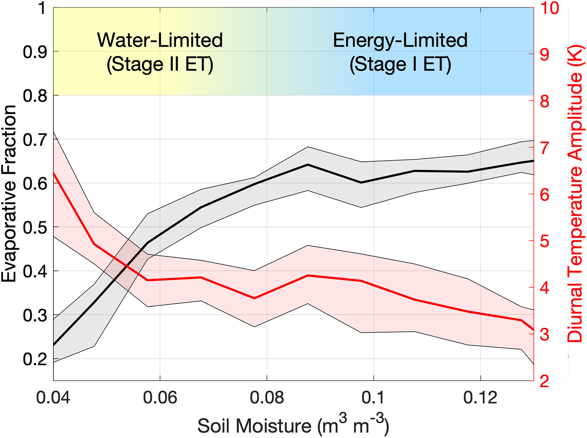

**Figure 1.** Diurnal temperature amplitude serves as a viable observed proxy for partitioning among turbulent fluxes (evaporative fraction is the ratio of latent heat flux to the sum of latent and sensible heat fluxes). Observed relationship between soil moisture and evaporative fraction in a dry tropical forest in Zambia at ZM-Mon FLUXNET site is shown (Kutsch et al., 2009). Also shown is the diurnal temperature amplitude relation to the soil moisture state. Water- and-energy limited evaporative regimes are shown schematically where the transition between regimes occurs at a threshold soil moisture value (where a reasonable range of thresholds is denoted by the mixed yellow-blue region). The bold line is the median value conditioned on soil moisture while the shaded area includes 25th and 75th percentiles.

The variability of the surface energy budget summarizes the land surface response to environmental forcing. It can be characterized by any number of specific metrics, such as the temporal variance of the evaporative fraction. We will broadly refer to this surface energy variability as the “energy flux variance.” The energy flux variance combines the variance of multiple forcings with how sensitive the land surface energy balance is to those forcings. Given the relationship known a priori in Figure 1, it should also be a strong function of how often the location is in the water-limited or energy-limited regimes. The energy flux variance can be captured and directly observed using the diurnal temperature range (Bateni & Entekhabi, 2012; Panwar et al., 2019).

One can further isolate land surface responsiveness to the environment by considering the intra-seasonal component of the energy flux variance. This short-term variability can largely partition the direct response of the surface to weather variability for two reasons. First, the time evolution of underlying mechanisms driving the behavior can be isolated and observed on these intra-seasonal timescales, such as during interstorm periods (Eagleson, 1978; Feldman et al., 2019, 2020). Since the mechanisms to be identified at intra-seasonal scales are intrinsic properties of the land surface, the patterns may explain land surface responses across timescales, allowing inferences to be drawn about long-term land surface changes in response to climate change (Paschalis et al., 2015). This idea has been previously demonstrated by Eagleson (1978) where mechanisms identified with interstorm and weather behavior can predict longer-term climate behavior. Second, the energy flux variance used in the context of assessing land surface response is confounded by the seasonal cycle. Seasonal cycles tend to be the strongest source of variability in many geophysical variables where the forcing-land surface response relation can largely be inflated by and mostly a function of the seasonal cycle (Tuttle & Salvucci, 2017). As such, a large energy flux variance (of raw time series) may be only due to a disproportionately strong seasonal forcing rather than a large land surface response relative to other regions.

There are major differences between models in how forcings are translated into energy flux responses, and thus differences in modeled land surface responsiveness to forcing (Dong & Crow, 2018; Lei et al., 2018; Short Gianotti, Rigden, et al., 2019). This ultimately results in divergence of future projections of the land and atmosphere states (Berg et al., 2015; Berg & Sheffield, 2018; Guo et al., 2006). Land surface model outputs and observation-driven reanalysis data will have prescribed linkages between energy fluxes and their environment which may both contribute to these model differences as well as confound any analysis attempting to gain fundamental insights into natural land surface responsiveness from these models (Dong et al., 2020). As such, in this study we use only observations for two main reasons. First, the use of models would return model parameterized responses and reinforce the conceptual frameworks underlying them. Second, the observation-only results would be a comprehensive test of models because the land surface response to climate forcing variability is an emergent behavior in models due to the interactions of several parameterizations (Dong & Crow, 2018). While the lack of observation data hindered evaluating this land surface behavior previously (Koster, Suarez, & Schubert, 2006), there are now decade-long records of satellite observations of land surface properties and meteorological forcings, which are free of imposed land surface linkages common in models (Trigo et al., 2011).

In this study, we ask: are regions with the largest climate forcing variability necessarily the regions with the largest land surface variability? Where geographically do land surfaces show the largest responsiveness to forcing and why? Here, we isolate the fundamental connection of land surface and its perturbations using satellite observations of an energy flux proxy. The mechanisms connecting the forcings to the land surface flux behavior are identified. We then demonstrate that these mechanisms observed at these short timescales explain land surface variability across intra-seasonal to interannual timescales.

## 2 Methodology

### 2.1 Study Region

Africa is chosen for several reasons. It hosts a diversity of climates and biomes with climatic gradients from bare soil desert to humid rainforest ecosystems. It also has an array of known sources of climatic variability across timescales, such as the Madden Julian Oscillation, West African Monsoon, and Quasi-Biennial Oscillation (Nicholson & Entekhabi, 1986; Zaitchik, 2017). Additionally, Africa's land surface is well-observed by the Spinning Enhanced Visible and Infrared Imager (SEVIRI) at 15 min intervals over a 16-year data record (Trigo et al., 2011). Furthermore, the threshold volumetric soil moisture (*θ**) metric was estimated previously in this region with SEVIRI (Feldman et al., 2019). Spatial maps will display other regions such as the Arabian and Iberian Peninsulas when possible.

### 2.2 Datasets

Land surface temperature (LST) fields are obtained from the Spinning Enhanced Visible and Infrared Imager (SEVIRI) on-board EUMETSAT's space agency's Meteosat Second Generation geostationary satellite series at a 3-km resolution from January 2004 to December 2019 (Göttsche et al., 2016; Trigo et al., 2011). The diurnal temperature amplitude (dT) is computed daily based on differences of LST at 1:30 p.m. and 6:00 a.m. local solar time similarly to Feldman et al. (2019). Cloud cover reduces the ability to observe surface features in infrared and optical bands. Therefore, SEVIRI land surface temperatures are conservatively filtered under cloud cover conditions. Pixels with LST measurements on less than 10% of days are not considered in the analysis, which mainly removes wet tropical forests from consideration.

SEVIRI is chosen instead of a reanalysis product or low Earth orbit satellite that have longer records for several reasons. (a) It provides pure observations of land surface temperature that are not a function of prescribed model parameterizations. As such, the data set is useful for identifying driving mechanisms of surface variability without model assumptions and serves as an independent test of emergent model behavior. (b) In sampling every 15 min, SEVIRI provides the diurnal temperature cycle, which carries more information about the surface energy balance than a single daily LST measurement. (c) It directly samples the land surface temperature, which is a state variable describing the surface energy balance more than air temperature. Ultimately, the 16-year record is of sufficient length for the following analysis in identifying intra-seasonal variability of the land surface and driving mechanisms. Potentially, some uncertainty arises when estimating the interannual land surface variability based on the standard deviation of 16 annual averages at a given location (Section 2.6).

Solar radiation and precipitation are evaluated as climate variability forcings over the same study period. Daily downward surface solar radiation (Rs) observations are obtained from SEVIRI (Carrer et al., 2011, 2019). Daily rainfall data is obtained from Climate Hazards Infrared Precipitation with Stations (CHIRPS) at a 0.25° resolution (Funk et al., 2015). In this manuscript, we will refer to fluxes of water and energy into the land surface as environmental forcings of the land surface acknowledging the meteorological to climatic timescales over which they act.

We evaluate the full record of available Soil Moisture Active Passive (SMAP) satellite soil moisture data from April 2015 to March 2020. Its use for the study is detailed in Section 2.4. Surface soil moisture from the SMAP mission is measured every 2–3 days at an approximately 33 km resolution. It is posted on a 9 km Equal Area Scalable Earth-2 (EASE2) grid scale, as obtained from SMAP L1 brightness temperatures (Chaubell et al., 2016; Feldman et al., 2021; Konings et al., 2017). Though theoretical considerations suggest SMAP measures soil moisture in the upper ∼5 cm layer, it has been shown to hold covariation information on the deeper subsurface (Short Gianotti, Salvucci, et al., 2019). Furthermore, its value in developing robust land-atmosphere coupling metrics as well as high information content compared to other soil moisture datasets has been demonstrated (Dong & Crow, 2018, 2019; Kumar et al., 2018).

All datasets are linearly rescaled to the EASE-2 9 km grid scale. All SEVIRI and SMAP data set processing occurred as in Feldman et al. (2019) and Feldman et al., (2020) and thus the reader is referred to those references for more algorithmic and uncertainty details. Only the interannual variability analysis is completed at a 0.25° resolution, the CHIRPS gridded resolution.

### 2.3 Energy Flux Variance Metric

We use the intraseasonal dT variance to estimate the surface responsiveness to forcing (SRF). Several mechanisms are then identified using the approaches in the following subsections. We note that SRF and mechanisms are computed as mean state metrics. These metrics have an associated variance where their variability is due in part to climatic anomalies.

We use the diurnal temperature amplitude (dT) because it is a holistic representation of surface energy balance variability in integrating the surface state via temperature and turbulent energy fluxes at the surface. This is because it represents the rate of change of the land surface state and is thus a function of the temperature state. dT is also directly correlated with energy fluxes; surface temperature diurnal variations contain information about energy fluxes in representing the degree of warming from morning to afternoon (Bateni & Entekhabi, 2012; Panwar et al., 2019). dT is higher when there is less soil moisture available for evaporative cooling and thus more energy used for sensible heating of the land surface (Idso et al., 1975). dT's positive relationship with sensible heat flux and negative relationship with latent heat flux, beyond that of afternoon temperature, have been demonstrated previously across reanalysis as well as field and regional satellite observations (Amano & Salvucci, 1999; Betts et al., 2014; Feldman et al., 2019, 2020). dT's relationship to evaporative fraction is demonstrated in Figure 1 at a flux tower site in a savanna in Africa (Kutsch et al., 2009). However, the dT relationship with energy fluxes has not been established globally and the extent of limitations is unknown. One issue is that the relationship between dT and energy fluxes is obscured in some locations because dT may also be sensitive to advection. This is a limitation in its use as an energy flux in estimation of *θ** and time spent in the water-limited regime (Feldman et al., 2019). Nevertheless, it is a benefit in determining SRF because advection is an additional forcing on the land surface energy balance and state that we wish to detect. Ultimately, dT is a holistic metric of multiple components of the surface energy balance and as such has been previously used to detect surface variability and change (Braganza et al., 2004).

We avoid use of evaporation to estimate SRF for a few reasons. First, many large spatial scale evaporation products inherently include prescribed model assumptions, which would confound an analysis attempting to elicit the natural relationship between the environment and land surface (Koster et al., 2015). Furthermore, evaporation variance is an incomplete metric of land surface state variability because it decreases to zero in arid locations, despite continued sensible heat flux and temperature variability. This is because evaporation effectively has a lower bound and is driven by soil moisture which also has a lower bound (Koster, Suarez, & Schubert, 2006). As a result, the evaporation variance reduces to zero with its mean while other components of the land surface energy balance remain active. Thus, evaporation variance spatial relationships alone may not sufficiently describe surface responsiveness and may negatively bias responsiveness in dry regions.

SEVIRI temperatures integrate both bare soil and vegetation and thus dT represents energy flux information from the aggregate landscape. Therefore, it experiences a limitation of representing mostly vegetation temperature in more vegetated regions. Further details about dT's measurement uncertainty can be found in Feldman et al. (2019).

### 2.4 Soil Moisture Interpretation

Daily-scale soil moisture observations serve two purposes in this study. (a) They are used as a land surface state variable to estimate *θ** values and to estimate time spent in the two regimes averaged over longer climate timescales (see Section 2.5). (b) The soil moisture time series is also used to capture weather forcing effects through net precipitation and drying. In particular, soil moisture rate of change between overpasses quantifies atmospheric weather forcing through incoming rainfall and atmospheric dryness assisting in surface water loss. Both usages assist in identifying mechanisms of surface responsiveness (see Section 2.7).

### 2.5 Computation of Time Spent Water-Limited

The time spent in the water-limited regime is computed using the marginal probability density function of soil moisture (*f*(*θ*)) estimated from 5 years of SMAP soil moisture as well as from previous estimates of *θ** derived using these SEVIRI and SMAP datasets in the same domain (Figure 2a, Feldman et al., 2019). The percentage of time spent water-limited is defined using the cumulative distribution function of soil moisture as (Figure 2b). Similar approaches have been carried out previously (Akbar et al., 2018). The estimated values of these metrics are considered the mean state for a given pixel, acknowledging these metrics' variability based on previous work (Denissen et al., 2020; Haghighi et al., 2018). Note that data loss from cloud cover flags results in disproportionate data loss under wetter conditions. Therefore, a source of uncertainty is less characterization of the energy limited regime which can bias estimates of *θ**, climate sensitivities in the energy-limited regime, and time spent in the water-limited regime. In woody vegetated regions, SMAP soil moisture is additionally more uncertain which increases uncertainty of parameter estimates.

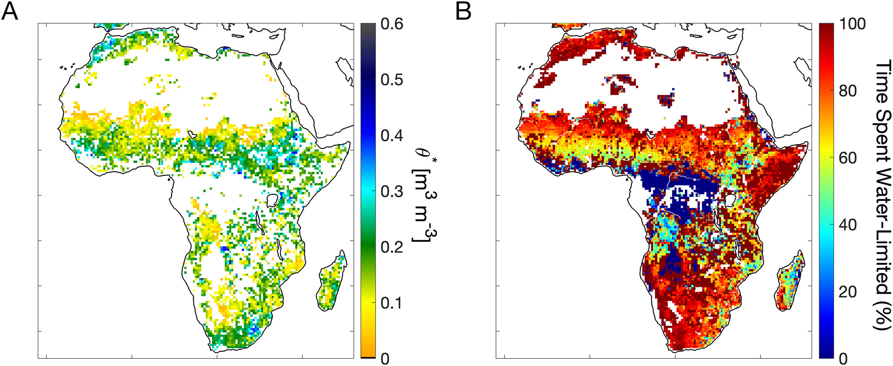

**Figure 2.** (a) *θ**, the soil moisture value that partitions the water-limited and energy-limited regimes. (b) Percentage of time spent in the water-limited regime. Reproduced from Feldman et al. (2019).

*θ** estimates from Feldman et al. (2019) are used in this study and a brief description of the estimation procedure is provided here. Soil moisture and dT pairs (posted at 9 km) are pooled within half degree pixels to provide adequate sample size. Only timesteps during soil moisture drydowns are used to isolate the temporal drying transition between evaporative regimes, remove effects of seasonality that would confound the dT-soil moisture relationship, and remove confounding effects of rainy-day evaporation physics. Note that while the seasonal cycle is partially isolated here, the soil moisture magnitude and thus the soil moisture state is retained for *θ** definition. Three different linear models are fit to the data: water-limited regime only model (with an overall negative dT-soil moisture slope), energy-limited regime only model (with an overall zero dT-soil moisture slope), and a combined water and energy limited regime model with a soil moisture breakpoint estimated (*θ**) that divides the two regimes. Akaike Information Criteria as well as a 10-fold cross validation approach are used to select from the three models (Akaike, 1974). Several more rigorous criteria are implemented on the combined model to ensure a *θ** value is not selected by chance: *θ** can only be selected if at least 5% of the data pairs are in both regimes as well as dT rates of change per unit soil moisture loss in the water-limited regime must be both positive and greater than increments in the energy-limited regime.

We do not anticipate any confounding factors with use of *θ** from the previous study. It is advantageous because *θ** and the time spend in the water limited regime are computed with the same SMAP soil moisture data set and thus provide compatible *θ** and soil moisture distributions to compute the time spent in the water-limited regime. It should be noted that dT-soil moisture slopes are estimated simultaneously with *θ**. There is thus a slight model dependence between the slopes and soil moisture transitions estimated in Feldman et al. (2019) where more negative dT-soil moisture slopes co-occur with lower *θ** values. However, the dT-soil moisture slopes used in this study control for dT-solar radiation sensitivities within a multiple regression (Section 2.7). Therefore, the original model dependence between dT-soil moisture slopes and *θ** values is subdued here.

### 2.6 Intraseasonal and Interannual Variability

In order to determine the intra-seasonal variability of dT that is only due to variations of approximately less than 90 day periods, a high pass filter is used. We primarily assess the variance component of periods less than 90 days because they isolate the direct effect of weather forcing on the land surface. Timescales beyond roughly 3 months begin to have influences of seasonal behavior. Alterations to the choice of 90 days do not influence our findings. This process removes strong seasonal amplitudes and climatic feedbacks that are not indicative of a surface response to a forcing. Specifically, the seasonal cycle of forcings can be stronger in some regions than others due to planetary physics and the general atmospheric circulation. As such, the dT variability may be inherently larger in these regions because of the greater forcing variability of seasonal climatology rather than due to the land surface's intrinsic responsiveness. For this reason, interpreting the total energy flux variance (using the unfiltered time series that includes seasonal effects) as an SRF metric can be misleading. Conversely, intraseasonal flux variability normalizes out the spatial differences in seasonality and more directly captures surface responsiveness to weather variations. In Africa, this isolates effects of intraseasonal weather systems on the land surface, with influences up to timescales of the Madden Julian Oscillation.

A moving average window is fit to the dT time series and is then subsequently subtracted from this dT time series. The variance of the resulting high frequency dT time series is computed. The full dT variance is computed for comparison. A frequency domain approach is used for two purposes. First, it is used to properly select the moving window length. The moving window length should be short enough to remove strong seasonal power in the spectra and long enough to include all intraseasonal variability. Since the frequency domain approach does not produce a time series, the time domain high pass filter approach is used henceforth because it produces a time series that we use to identify driving mechanisms (see Section 2.7). Second, we compute the dT variance of periods below 90 days, between 90 and 365 days, and above 365 days to evaluate the spatial pattern of longer-term variability being removed from the dT time series. Due to irregular sampling of the dT time series, we use the Lomb-Scargle power spectral density approach (VanderPlas, 2017). We find that a 50-day moving average window in the time domain adequately includes periods of less than 90–100 days, while filtering out seasonal and interannual modes of variability (Figure S1 in Supporting Information S1). We note that the results qualitatively remain the same when choosing moving average windows between 30 and 90 days. The intra-seasonal dT variance spatial patterns from the time and frequency domain approaches are consistent (Figure S2 in Supporting Information S1).

We refer to the intra-seasonal dT variance as the surface responsiveness to forcing (SRF). SRF detection using dT intra-seasonal variance presents several advantages. (a) Intraseasonal dT variability isolates and summarizes the direct response of the land surface energy balance and fluxes to the environment. (b) It combines both the land surface sensitivity (a potential metric) with the forcing variability. (c) It considers variability from all forcings such as from rainfall, advection, and incoming radiation. (d) In using purely observed energy flux signatures in dT, it is free of model-prescribed relationships between energy fluxes and forcings.

Responsiveness, via SRF, is defined here as an integrated measure of the existing state of the weather variability and how sensitive the surface is across the typical range of conditions observed at a location. Both describe the climate state at a location and are required for changes in forcings to influence the land surface. Here, “responsiveness” is distinguished from sensitivity. Sensitivity is typically denoted as the slope of land surface response versus forcing, which is only the potential for change via strength of coupling. Sensitivity changes with different climate states (changing slope with soil moisture in Figure 1), while the responsiveness metric, SRF, effectively takes a weighted average of sensitivities under the conditions most common at a location. The consequence is that a region can have a high potential landscape sensitivity to forcing, but a low responsiveness if not existing in those sensitive states and/or in having little weather variability to perturb the surface.

The interannual variability of dT, precipitation, and solar radiation are computed by averaging the values within the year and computing the standard deviation across the years. dT interannual variability is compared to precipitation and solar radiation interannual variability to assess the effect of climate variability forcing on the land surface. SEVIRI radiances are routinely compared with a reference instrument that has well-known calibration characteristics as part of the Global Space-based Inter-Calibration System (GSICS, Hewison, 2013). This exercise suggests the split-window channels used in the estimation of LST are stable over the years with no evidence of sensor drift.

### 2.7 Analysis of Mechanisms

We begin with a thought experiment to motivate our search for underlying mechanisms driving the variance of energy fluxes. Consider that taking the variance of a simple linear regression model results in the variance of the dependent variable proportional to the variance of the independent variable (i.e., var(*Y*) ∼ (dY/dX)2var(*X*), where *Y* is the surface energy flux and *X* is the forcing). Linearity is applicable here, at least conditional on the forcing, because of the approximately piecewise linear behavior that water and energy availability have on energy fluxes (Feldman et al., 2019; Vargas Zeppetello et al., 2019). Therefore, the variance of the forcing (i.e., var(*X*)) as well as the sensitivity of energy flux to the forcing (i.e., dY/dX) can directly influence the land surface variability and response (see Section 2.6, Dirmeyer, 2011). Given non-linear dependence of surface fluxes on moisture availability (Figure 1), one can expect water and energy-limited regimes would impart different sensitivities of the land surface to forcing. Precipitation and radiation forcings may have different, approximately linear effects on energy fluxes in both regimes. In the case of a given forcing, there would be two separate linear models for the water and energy-limited regimes.

With this reasoning, potential mechanisms driving dT variance and SRF include the variance of the forcings in each regime, the sensitivity of dT to forcing in each regime, differences in forcing variances between the two regimes, and differences in dT sensitivity to forcing between the two regimes. These mechanisms are empirically based and can be detected with observations alone. Physically describing why these mechanisms hold can be evaluated in analytical frameworks coupling the surface water and energy balances as in Vargas Zeppetello, Battisti, & Baker et al., 2020. However, this would require water and energy balance models and assumptions and is ultimately beyond the scope of this study. Finally, note that we are evaluating the mean state mechanisms that persist at a given location. This acknowledges a variance associated with each metric estimated here. Given climatic anomalies, the mechanisms quantified here are expected to vary.

We evaluate the effect of these aforementioned mechanisms with dT, solar radiation, and soil moisture using 5 years of data from April 2015 to March 2020. A multiple regression is conducted to isolate individual effects of external forcings on dT:

**Equation 1.**

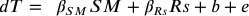

*β* represents dT's sensitivity to the respective forcing, *b* is the *y*-intercept, and *e* represents the residuals. While other independent variables can be input into the regression, we chose those that represent forcings external to the land surface system. Soil moisture variations are used to capture external moisture forcings where *β**SM* here represents the change in dT due to time rate of change in moisture addition from rainfall as well as moisture loss, in part, from evaporation. For each location, this regression in Equation 1 is computed in both the water and energy-limited regimes (portions of the time series below and above *θ**, respectively). Variances of each forcing are similarly computed in each regime. Note that slopes and variances computed in the energy-limited regime are more uncertain due to lower sample size from cloud cover contamination. Equation 1 regression was repeated using all deseasonalized variables (computed as in as in Section 2.6) and resulted in the same qualitative findings. This test showed that the state-based patterns also resemble the intraseasonal linkages between the variables and are not only due to seasonal relationships.

For this analysis of mechanisms, all time series are averaged to 3-day intervals to mitigate loss of dT data from cloud cover contamination. This results in double the data pairs at the cost of a 1–3-day temporal mismatch in dT, soil moisture, and solar radiation. Tests of results using only simultaneously available pairs shows no change in the spatial pattern of water-limited regime behavior, but increased uncertainty. The energy-limited regime is less well observed due to loss of wet day samples and thus there is a bias toward water-limited regime behavior. Therefore, we retain the 3-day averages noting the caveat of a 1–3-day mismatch in timing of samples. Data are also spatially pooled to a 0.5° resolution to increase sample size. Thus, one 0.5° pixel includes data from ∼36, 9 km pixels.

## 3 Results and Discussion

### 3.1 Land Surface Energy Flux Intraseasonal Variability

The dT intraseasonal variance spatial pattern is shown in Figure 3. Of note is that the spatial patterns of the variances do not monotonically follow climatology-driven latitudinal patterns such as total annual rainfall or solar radiation. Therefore, an influence of the land surface and geography on these patterns is present.

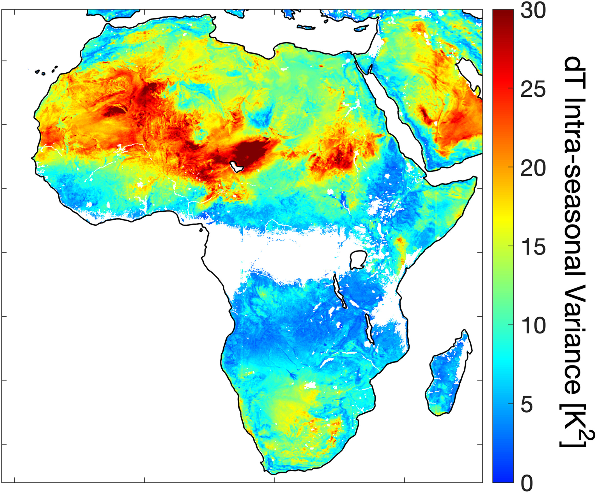

**Figure 3.** dT intra-seasonal variance describing surface responsiveness to forcing (SRF) based on harmonics with periods less than 90 days. This metric is computed based on the observed variance of energy fluxes, as represented by dT, in the study period 2004–2019.

SRF is controlled by mean moisture availability, as shown by mean annual precipitation (Figure 4a). However, what are the pathways through which moisture and other forcings influence SRF? Mean annual precipitation alone is inadequate for describing basic mechanisms and pathways that drive energy fluxes and SRF. For example, mean annual precipitation is unable to sufficiently identify the transition between water and energy-limited regimes. Rather, a more detailed decomposition of the moisture and climate state is required to understand the mechanistic drivers of SRF. Given recent availability of global soil moisture, SRF drivers can now be investigated in the context of the soil moisture state relative to water and energy-limited regimes.

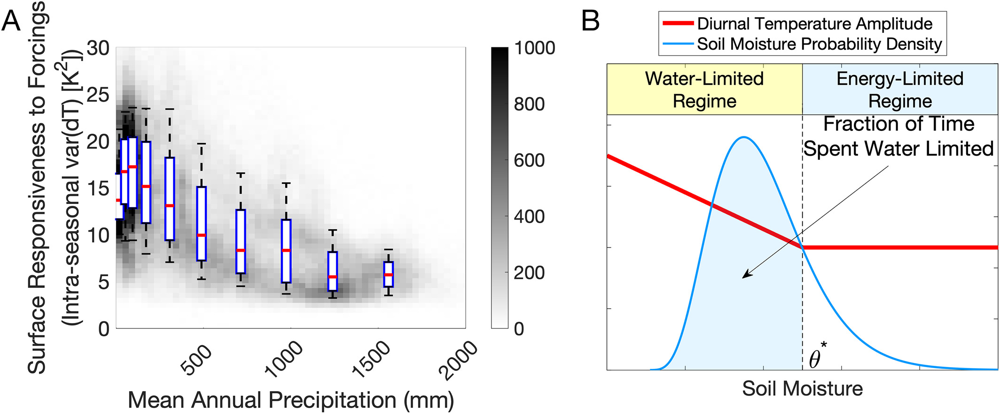

**Figure 4.** Though surface responsiveness to forcing (SRF) appears controlled by mean annual precipitation, time spent in the water-limited regime (soil moisture marginal probability distribution position relative to the evaporation regimes transition threshold) provides mechanistic explanations for the SRF spatial pattern. (a) Surface responsiveness to forcing (SRF; intraseasonal dT variance) relationship with mean annual precipitation. Boxplot shows interquartile range and whiskers at 10th and 90th percentiles. (b) Conceptual computation of the fraction of time spent in the water-limited evaporative regime.

The percentage of time spent in the water-limited regime is a more direct metric to mechanistically evaluate SRF spatial patterns because it accounts for the soil moisture distribution, which integrates the effects of mean climate as well as variability. It also integrates factors that dictate the transition between water and energy limitation (Figure 4b). Given that the surface energy balance is non-linearly related to the surface soil moisture state (Figure 1), we can expect SRF to be driven differently by forcings between the water and energy-limited regimes. This time spent in either regime will depend on the regional weather. Weather events can transition the land surface state between evaporation regimes depending on the evolution of soil moisture during the rapid wetting of storms and consequent interstorm drying. Furthermore, mean precipitation does not strictly control whether a given landscape spends more time in the water-limited regime; while drier regions tend to spend more time in the water-limited evaporative regime on average, the soil moisture transition point (*θ**) between regimes is controlled by nonmoisture availability related factors like edaphic factors, vegetation type, and local wind variability (Feldman et al., 2019; Haghighi et al., 2018). Thus, an arid location can still spend a relatively low amount of time water-limited if it has a relatively low *θ** value. Therefore, knowledge of the moisture state and variability relative to the moisture transition point (*θ**) is required to understand SRF.

SRF tends to be highest in regions spending around 90% of the time in the water-limited regime (Figure 5). This tends to occur in semi-arid grass and shrublands across the Sahel and Southern Africa. However, we emphasize that there are isolated humid regions that show large SRF owing to proportionally larger time spent in the water-limited regime because of a higher *θ** threshold. This occurs, for example, in regions of tropical West Africa and isolated portions of the Miombo Woodlands south of the Congo Basin. Such anomalous *θ** are expected given the wide array of climatic conditions that can shift *θ** beyond moisture availability (Denissen et al., 2020; Feldman et al., 2019; Haghighi et al., 2018). Nevertheless, the observed increase in energy flux variance in more water-limited regions is consistent with expectations from an idealized land surface model (Vargas Zeppetello, Battisti, & Baker et al., 2020). SRF progressively increases with time spent water-limited and slightly decreases above ∼90% time spent water-limited. Some large dT variances occur in regions of the Sahara Desert, which may be related to high flux variability due to transiently filled endorheic basins (Wang et al., 2018).

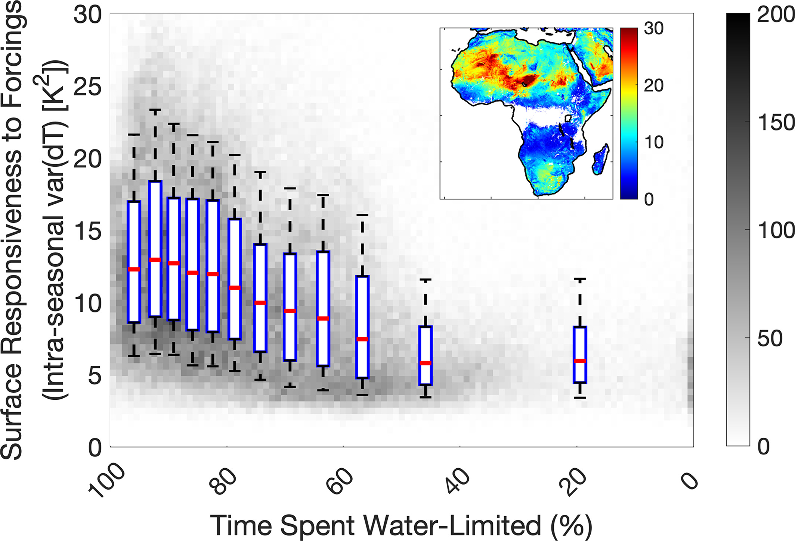

**Figure 5.** Surface responsiveness to forcing increases with time spent in the water-limited evaporative regime. Surface responsiveness to forcing (SRF) relationship with the fraction of time spent in the water-limited regime. Inset shows dT intraseasonal variance from Figure 3. Boxplot shows interquartile range and whiskers at 10th and 90th percentile, respectively. The plot is repeated for the total dT variance in Figure S3 in Supporting Information S1.

The SRF metric mainly describes the one directional impact of the environment on the land surface. For land-atmosphere interactions to occur, the flux magnitude becomes a key factor and thus surface latent energy exchanges would need to be stronger in addition to high land surface responsiveness (Koster et al., 2004, 2006a). Latent energy exchanges are likely weaker in the regions of strongest SRF because evaporative fraction tends to be lower when more time is spent water-limited (Figure 1). This may describe why strong soil moisture-precipitation feedbacks were previously found to occur in transitional regions which spend less time water-limited (50%–60%) because there is a balance of strong SRF as well as higher EF magnitude (Koster et al., 2004).

The total and intraseasonal dT variances show differing spatial patterns, especially with respect to locations where each metric is highest (Figure 3 and Figure S3 in Supporting Information S1). The total dT variance instead peaks in regions spending between 60% and 70% of the time spent water limited, which are mainly transitional regions (Figure S3 in Supporting Information S1). This is consistent with previous findings for summertime energy fluxes and temperature, which show highest total variances (variance of the unfiltered time series) in transitional regions (Koster et al., 2015; Vargas Zeppetello, Tétreault-Pinard, et al., 2020). The difference between total and intraseasonal dT variances occurs here because decomposing the time series into the intra-seasonal component removes strong seasonality such as in the Sahel (Figure S2 in Supporting Information S1, Lebel & Ali, 2009). This large seasonal component of the dT variance is likely driven by a disproportionately large seasonal moisture forcing variance rather than a large surface responsiveness to forcing in corresponding to the patterns of the seasonal soil moisture forcing (Figure S3 in Supporting Information S1). This is evidence that forcing patterns specific to seasonality may be overwhelming the unfiltered dT variance spatial pattern rather than characteristics of surface responsiveness (Figures S3b and S3d in Supporting Information S1). This justifies normalizing the dT variance to intra-seasonal timescales to describe SRF more closely. Ultimately, the intra-seasonal moisture forcings have weaker spatial gradients than that of their seasonal forcing and thus do not appear to overwhelm the desired land surface responsiveness signal in the dT intraseasonal variance (Figure S3e in Supporting Information S1).

The high pass filter producing the intra-seasonal dT variance also removes greater than 1-year harmonics that are due to the quasi-biennial oscillation and El Niño Southern Oscillation in Southern and Eastern Africa (Nicholson & Entekhabi, 1986; Nicholson & Kim, 1997). The remaining intra-seasonal dT variance is inherently smaller due to removal of power from large amplitude seasonal and interannual harmonics from the signal. This less than 90-day variability is nevertheless still substantial and occurs due primarily to mesoscale convective systems, linked to the Madden Julian Oscillation (MJO, Zaitchik, 2017).

Our analyses of mechanisms and observed longer-term interannual behavior in the following sections explain why the surface responsiveness to the environment is described by the spatial pattern of the intra-seasonal dT variance.

### 3.2 Driving and Reinforcing Mechanisms of Energy Flux Intraseasonal Variability

#### 3.2.1 Observed Mechanisms

Figure 5 raises the question: which factors can force and reinforce SRF that ultimately describe the SRF spatial pattern? Using our observation-only approach, we find that the SRF spatial pattern is driven by a primary and two secondary mechanisms. The primary mechanism that forces the SRF spatial pattern is that there is, by definition, greater sensitivity of dT to soil moisture (and thus precipitation forcing) in the water-limited than the energy-limited regime at a given location. Two secondary factors that reinforce this spatial pattern include: (a) increasing sensitivity of dT to forcing in regions that spend more time water-limited and (b) reductions in the variance of forcings (especially moisture) at the dry extreme in spending more time water-limited. While other driving mechanisms may exist, we find that these mechanisms together are sufficient to describe the spatial SRF pattern to a first order. These respective mechanisms are explained in more detail hereafter.

SRF mainly increases in regions where the moisture distribution spends more time in the water-limited regime because of the greater land surface sensitivity to soil moisture in this regime. As per the common visualization of the evaporation-soil moisture relationship (Figure 1), this regime contains more energy flux sensitivity to rainfall forcing than in the energy-limited regime (Figure 6b, Feldman et al., 2019). dT sensitivity to solar radiation is also higher in the water-limited regime indicating that both radiation and rainfall forcing (via soil moisture) play a role in this mechanism (Figure S4b in Supporting Information S1). These relationships were previously observed over short weather timescales: intermittent drying after storms results in more rapid dT increases in the water-limited regime than in the energy-limited regime (Feldman et al., 2019).

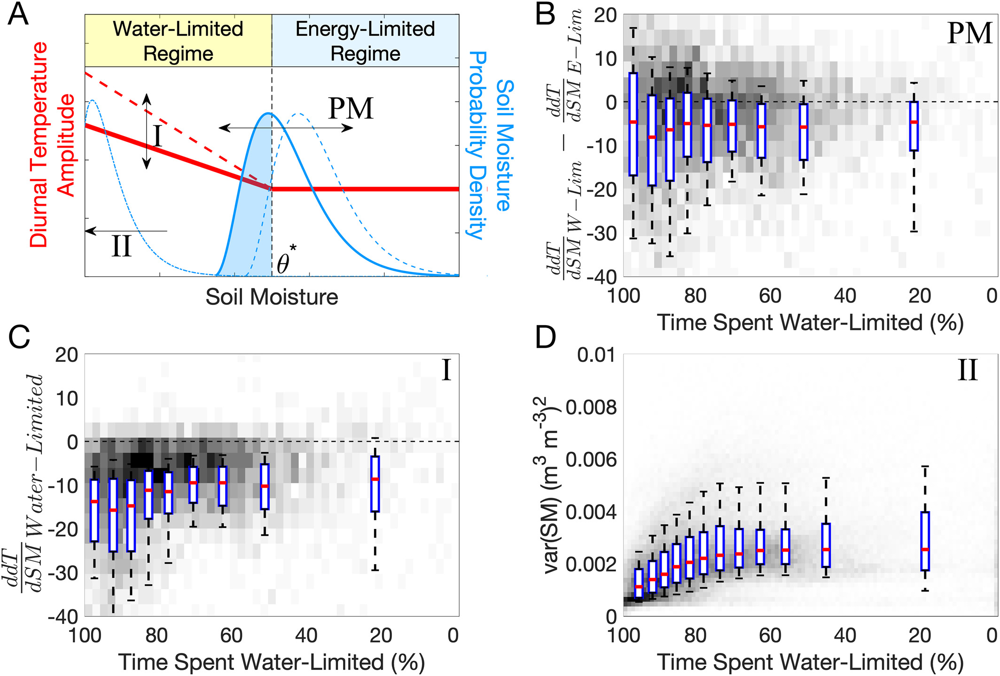

**Figure 6.** Identified mechanisms driving surface responsiveness to forcing (SRF). (a) Conceptual diagram of three mechanisms driving intra-seasonal dT variance patterns. (b) The primary mechanism (PM) is demonstrated with the shifting soil moisture probability density functions between the two regimes where there are differences of energy flux sensitivity to soil moisture in the water-limited (W-Lim) and energy-limited (E-Lim) regimes. Negative values indicate more sensitivity in the water-limited regime. Reinforcing mechanisms are depicted with labeled roman numerals corresponding to observations shown in the respective (c) and (d) panels. (c) Energy flux sensitivity to soil moisture in the water-limited regime (reinforcing mechanism I). (d) Soil moisture variance (intraseasonal component representative of precipitation forcing variability) with respect to time spent water-limited (reinforcing mechanism II). An equivalent figure for incoming surface solar radiation forcing is shown in Figure S4 in Supporting Information S1.

Locations that spend more time water-limited also appear to progressively have higher dT sensitivity to weather forcing as characterized by the spatial gradient of increasing slope magnitude of dT with soil moisture (and thus rainfall forcing; Figure 6c) as well as with incoming surface solar radiation (Figure S4c in Supporting Information S1). These spatial patterns of dT sensitivities also hold at sub-seasonal timescales as determined from tests using deseasonalized variables in Equation 1 with an even stronger spatial gradient of sensitivities (not shown). Therefore, in the regions that spend more time water-limited, weather forcing will translate into amplified surface energy balance response. This effect is characterized in land surface models and models driven with observations, but the modeled coupling strength appears to peak in wetter regions than identified with observations here (Dirmeyer, 2011; Miralles et al., 2012; Schwingshackl et al., 2017). We speculate about the origin of the dT sensitivity spatial pattern here. The high dT sensitivity to weather forcing observed here tends to occur in dryland regions that have a greater bare soil fraction as well as vegetation that is tightly coupled to surface water availability (Madani et al., 2020). Progressively greater plant coverage reduces sensitivity to surface environmental changes compared to bare soil because plants dampen effects of water stress via stomata and rooting systems. Additionally, semi-arid vegetation is more responsive to surface perturbations than in wetter regions (Feldman et al., 2018; Haverd et al., 2017), due potentially to lower stomatal resistance and shallower rooting systems on average (Jackson et al., 1996; Konings & Gentine, 2017; Leenaars et al., 2018). Therefore, surfaces with more vegetation cover will have a dampened energy flux response to changing surface resource availability (De Kauwe et al., 2013; Gallego-Elvira et al., 2016). Ultimately, we find this sensitivity mechanism reinforces the SRF spatial pattern and it presents a benchmark for land surface models which may overestimate this coupling (Berg & Sheffield, 2018; Lei et al., 2018).

The variances of weather forcings (as observed here in moisture and radiation) progressively decrease in regions spending more time in the water limited regime (Figure 6d and Figure S4d in Supporting Information S1). The effect of this mechanism can be seen in regions spending above approximately 90% of time spent water-limited where reductions in surface forcing variance may progressively drive a decrease in SRF (Figure 5). Volumetric soil moisture effectively has a lower bound near zero. With increasing aridity and less soil moisture perturbations, soil moisture variations become small. The variance of radiation additionally decreases with more cloud free days under these arid conditions. In this case, the impacts of rapid variance reduction dominate over those of the aforementioned two mechanisms, leading to a decrease in SRF (Figure 5).

Potentially, the existence of a hypersensitive regime at very low soil moisture values could be an additional factor that reinforces the mechanisms here, as identified in previous studies (Akbar et al., 2018; Benson & Dirmeyer, 2021; Dirmeyer et al., 2021; Seneviratne et al., 2010). We did not find evidence for more sensitive dT to soil moisture at very dry soil moisture values here, especially after testing for differences in dT-soil moisture slopes at high and low soil moisture bins within the water-limited regime (not shown). We expect that such a breakpoint dividing a very arid surface state is more apparent in EF space (Akbar et al., 2018). Previous studies identifying a breakpoint of a hypersensitive regime using temperature information do not explicitly partition between a wilting point threshold and *θ** and should be the subject of future work. Nevertheless, we expect that a hypersensitive state is present within the water-limited regime estimated here and contributes to amplified sensitivity in the water-limited regime.

The mechanisms above are discussed in terms of their mean state and their impacts on the mean SRF. However, we acknowledge that these mechanisms and SRF have an associated variance due to climatic anomalies. As such, we discuss here considerations that influence the SRF variance, which are primarily the climate induced variation of all the metrics that control the identified mechanisms here. This includes, but is not limited to, variability of the time spent in water-limited regime (as controlled by variations in both *θ** and the soil moisture distribution), of the energy flux sensitivity to forcing in each regime, and of the forcings. For example, the time spent in the water-limited regime has a median interannual standard deviation of 4% across Africa, considering only soil moisture mean and variance changes in holding *θ** constant. *θ** shifts can also contribute to the variance of time spent in the water-limited regime (Denissen et al., 2020; Feldman et al., 2019; Haghighi et al., 2018). Several sources have shown that *θ** can typically shift by around 0.02 m3/m3 due to anomalous climatic conditions (Denissen et al., 2020; Feldman et al., 2019). Ultimately, we expect that such factors drive a spatial median 3 *K*2 of SRF interannual variability estimated here.

While moisture forcing (estimated via soil moisture changes here) appears to mainly drive the SRF patterns, solar radiation forcing reinforces the SRF spatial pattern similarly to and partitioned from the soil moisture-determined reinforcing mechanisms (see Equation 1). Namely, dT is more sensitive to solar radiation in the water-limited than in the energy-limited regime at a given location (Figure S4b in Supporting Information S1). dT is also progressively more sensitive to solar radiation forcing variability in regions spending more time in the water-limited regime (Fig S4b in Supporting Information S1). This contributes to the SRF increasing pattern with more time spent in the water-limited regime (Figure 5). Additionally, solar radiation variance reduces with time spent in the water-limited regime, similarly to soil moisture (Figure S4c in Supporting Information S1). These results may appear counterintuitive, as one might expect more solar radiation sensitivity in the energy-limited regime. However, given the classical soil moisture-centric definition of the evaporative regimes (Seneviratne et al., 2010), there are not explicit definitions of radiation sensitivity in either of the regimes and energy-limitation is only defined based on the requirement of less evaporative sensitivity to soil moisture. Even if the regimes were defined with a more rigorous definition, “energy-limitation” only suggests that the energy balance should be more sensitive to incoming radiation than other factors within the energy-limited regime at a location; this definition ultimately neither restricts differences in solar radiation sensitivities between the energy and water-limited regimes nor restricts spatial gradients in solar radiation sensitivities. Nevertheless, larger energy flux sensitivities to radiation in the water-limited regime can occur because incoming energy is increasingly partitioned into sensible heat flux with lower moisture availability. Conversely, wet surfaces can buffer the effects of radiation on the energy balance in the energy-limited regime. Solar radiation ultimately appears to reinforce the effects of soil moisture, but potentially having less of an effect than water availability with less consistent sensitivity differences between regimes (Figure S4b in Supporting Information S1).

In summary, the necessary conditions for a landscape to be responsive to forcing extend beyond having greater weather forcing. A nonnegligible forcing variability is required in conjunction with time spent in the water-limited evaporative regime. In this drier regime, energy fluxes are more sensitive to forcing at a given location (Figure 1). Furthermore, regions that spend more time water-limited also have a greater energy flux sensitivity to atmospheric forcing (Figure 6c and S4c in Supporting Information S1). Therefore, the land surface and its energy balance, beyond the forcing variability, strongly dictate the degree to which a surface forcing impacts the land surface across space and time. We expect that these mechanisms are general and also apply to terrestrial carbon uptake given that the water and energy fluxes, observed via dT, are coupled to carbon fluxes at the land surface (Short Gianotti, Rigden, et al., 2019).

#### 3.2.2 Model Demonstration

We encode the main mechanisms in Section 3.2.1 to demonstrate how each identified mechanism contributes relatively to the surface responsiveness spatial patterns. The model is intended to demonstrate the effect of a forcing on dT intra-seasonal variations and is not used in the data analysis. Quantitative evaluation of model parameters that best fit the data is not our goal.

The main component of the model is the observed piecewise linear model relationship between dT and soil moisture (Figure 1). In addition to the primary mechanism of the shifting soil moisture mean state, we only evaluate the effects of moisture forcing and its reinforcing mechanisms. The observed effects of solar radiation would reinforce the patterns of the model (Figure S4 in Supporting Information S1), but are not required to create the observed SRF pattern. Therefore, the combined effects of moisture forcing (soil moisture intraseasonal changes) and soil moisture state (i.e., time spent in water-limited regime) as integrated in soil moisture time series are assessed here.

The following describes the soil moisture time series generation for each iteration. To assess a range of rainfall scenarios, precipitation time series realizations are generated randomly in a Monte Carlo framework. The daily probability of rainfall is drawn (0.1–0.3 in a uniform distribution) that applies to the entire precipitation time series. Each day is determined as a wet or dry day randomly based on this rainfall probability. The rainfall intensity on each wet day is determined randomly by modeling intensity as an exponential probability density function (where this exponential distribution's mean is drawn between 5 and 20 mm drawn from a uniform distribution for the entire time series). Precipitation is then translated into soil moisture in an antecedent precipitation approach where soil moisture increases are based on a water balance equation. Soil moisture decreases are based on a randomly drawn e-folding decay rate of soil moisture (5–20 days drawn from a uniform distribution for the full time series) that summarizes losses to evaporation, drainage, and runoff (McColl et al., 2017). The e-folding decay emulates initially fast loss due to runoff and greater rates of energy-limited evaporation that slow to lower rates of water-limited loss. Nevertheless, a limitation is that soil moisture loss rates are not explicitly linked to whether the surface state exists in the water or energy-limited regime. Therefore, we anticipate that such simplifications could bias the simulated time spent in the water-limited regime. Overall, this results in a soil moisture time series like that shown in Figure 7a.

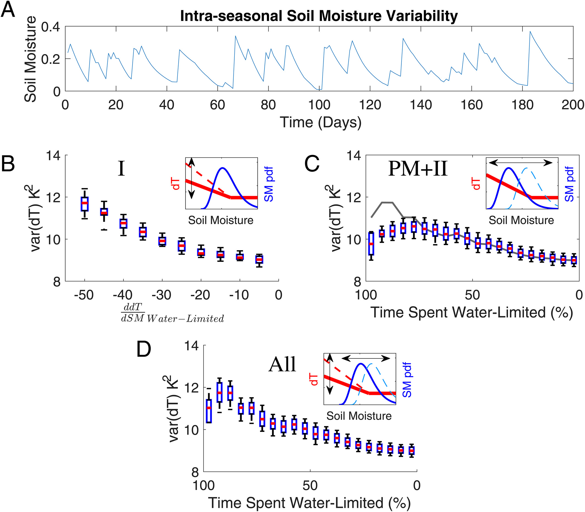

**Figure 7.** Demonstration-model of land surface responsiveness to a forcing (SRF; intra-seasonal dT variance). The three mechanisms identified in Figure 6 can together reproduce the observed SRF spatial pattern. (a) Example simulated intra-seasonal soil moisture variability input. (b) Isolated effect of reinforcing mechanism I or the spatial effect of changing mean dT sensitivity to soil moisture, holding time spent in water-limited regime constant. (c) Combined effect of the primary mechanism (PM) and reinforcing mechanism II. The PM of different dT sensitivity in both regimes is captured by shifting soil moisture probability density (and thus time spent in water-limited regime), holding mean dT sensitivity to soil moisture constant. Shifting the soil moisture distribution inherently includes effects of the soil moisture variance decreasing at high time spent water-limited (Mechanism II in Figure 6). Note that the median behavior from D is shown for comparison as a gray line, the difference from which is due to Mechanism I. (d) Combined effects of all three mechanisms where mechanism I is included by using its relationship with time spent water-limited as observed in Figure 6C.

Soil moisture is translated into dT using a piecewise linear model (Figure 4b). Random normal noise is added on the order of that observed to account for unobserved factors that are assumed uncorrelated with dT and soil moisture. Specifically, after soil moisture is translated to dT in the linear model, noise is drawn from a standard normal distribution and added to dT. A noise standard deviation of 3K is chosen which, combined with variability due to soil moisture, approximately replicates the range of magnitudes of observed intra-seasonal dT variance (Figure 5). To randomize the percentage of time spent in the water-limited regime between 0% and 100%, the mean of each soil moisture time series generated is shifted in 10 equal intervals (with mean shifts of ±0.02–0.1 m3 m−3) to account for the range of time spent in the water-limited regime observed in the study region. This is equivalent to shifting and randomizing the *θ** transition point. The shape of the dT-soil moisture model (Figure 1) is additionally altered to test the effects of the identified reinforcing mechanisms. Spatial variations in slope values resembling those from Figure 6c are used in the analysis. Overall, the analysis includes 5,000 iterations: 500 soil moisture time series are generated based on rainfall generation to capture a range of intra-seasonal weather variability and each soil moisture time series' mean value is altered 10 times to account for the range of climates experienced via shifting time spent in the water-limited regime.

We find that the three mechanisms in 3.2.1 together are sufficient to explain the pattern of SRF responsiveness as a function of time spent in water-limited regime (Figure 7d). SRF progressively increases with more time spent water-limited due to the additive effects of the primary mechanism as well as reinforcing mechanism I (Figures 7b and 7c). Mechanism I mainly influences the SRF pattern in regions spending more time in the water-limited regime and has little influence elsewhere (Figure 7c gray line). As expected, progressive decreases in variance of forcings overcome the effects of the other two mechanisms and reduce SRF at high time spent water-limited (Figure 7d). Note that shifting the soil moisture distribution includes the mechanism of the soil moisture variance decaying at high and low values (Figure 7b).

The model only conceptually shows how these mechanisms interact and does not provide emergent behavior that strictly states SRF peaks around 90% of the time spent water-limited. We tested conditions for which SRF would peak in regions spending less time water-limited. In one case, if the forcing variance decays faster with time spent water-limited, the peak SRF would shift to less time water-limited. Considering observed conditions (Figures 5 and 6), the forcing would need to decay twice as much as that observed to reflect patterns of the total dT variance in Figure S3 in Supporting Information S1 (not shown). These tests were not exhaustive and are limited based on the simplicity of the model. Nevertheless, this model demonstrates that the observed mechanisms force greater SRF with more time spent water-limited. Investigation of interannual behavior in the next section shows further evidence to suspect greater SRF in regions spending more time water-limited.

### 3.3 Implications for Interannual Climate Variability and Change

We return to the overarching motivating question and ask: Do regions with larger interannual variability in climate forcing coincide with regions with greater landscape responsiveness? We discuss whether the landscape responsiveness identified from intra-seasonal variability has implications for longer time scale variability and change.

#### 3.3.1 Surface Responsiveness on Interannual Timescales

We have so far identified the mechanisms underlying the landscape responsiveness through the evolving marginal distribution of surface soil moisture based on weather forcing and its interaction with the threshold soil moisture marking the transition between evaporation regimes. We have also evaluated other reinforcing mechanisms due to precipitation and solar radiation forcings. We show here that the landscape responsiveness is mediated by these factors at not only short (weather) timescales, but also longer (climate) timescales.

Here, we address the implications for longer term (interannual) variability and change. We examine the relationship between observed interannual variability in climate forcing variability (precipitation and solar radiation) and interannual energy flux variance (dT) response. We analyze how the time spent in the water-limited regime modulates the scaling between the climate forcing and surface response interannual variabilities. This has implications for the regional surface impacts of global climate change.

The SEVIRI records span 16 years between 2004 and 2019. The interannual standard deviation of mean annual precipitation is shown over these same years (Figure 8a). Rainfall is the principal source of climate forcing variability for the study region (Guan et al., 2015; Madani et al., 2017), though we investigate solar radiation forcing variability as well. The landscape (dT) interannual variability response for the period of record is also shown (Figure 8b). Note that some localized anomalies exist due to a relatively short record, where a single extreme year in the past decade can bias estimation of the interannual variability over climatic timescales. However, we anticipate that this does not impact the overall conclusions. We investigate whether the identified SRF pattern based on intraseasonal (weather) responses explains how the interannual climate forcing variability translates to landscape variability.

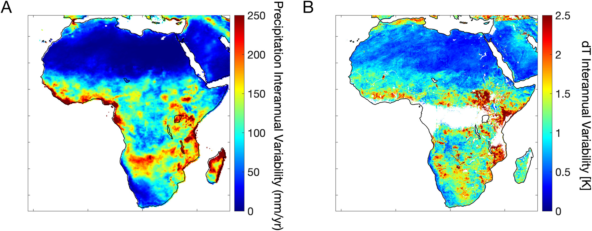

**Figure 8.** (a) Interannual variability of precipitation forcing and (b) Interannual variability of diurnal temperature amplitude (i.e., surface response).

While interannual variability of forcing drives increases of the land surface interannual variability, we find that the land surface effects as summarized in the time spent within the water-limited regime amplify the land surface response to forcing. Figure 9 shows the landscape interannual energy flux variability (dT interannual variance) as a function of both the climate forcing (precipitation interannual variance) and the hypothesized modulating factor captured by the intra-seasonal mean time spent in the water-limited evaporation regime. An effect of both factors on landscape variability is evident. The dependencies are even more evident when the landscape response is plotted versus the climate forcing for groups of regions with different percentage time spent in the water-limited evaporation regime (Figure 10). Here, precipitation and solar radiation interannual variability effects on dT are simultaneously controlled for one another in a multiple regression (as in Equation 1, but replacing soil moisture with precipitation interannual variability). Indeed, more interannual precipitation variability leads to more interannual land surface energy flux variability. However, in conditioning on time spent on the water-limited regime, interannual precipitation variability has a greater influence on land surface interannual variability when more time is spent in the water-limited regime (Figure 10a). The slopes of the response-forcing relations are shown in the inset of Figure 10 where the magnitude of the slope changes with the mediating factor.

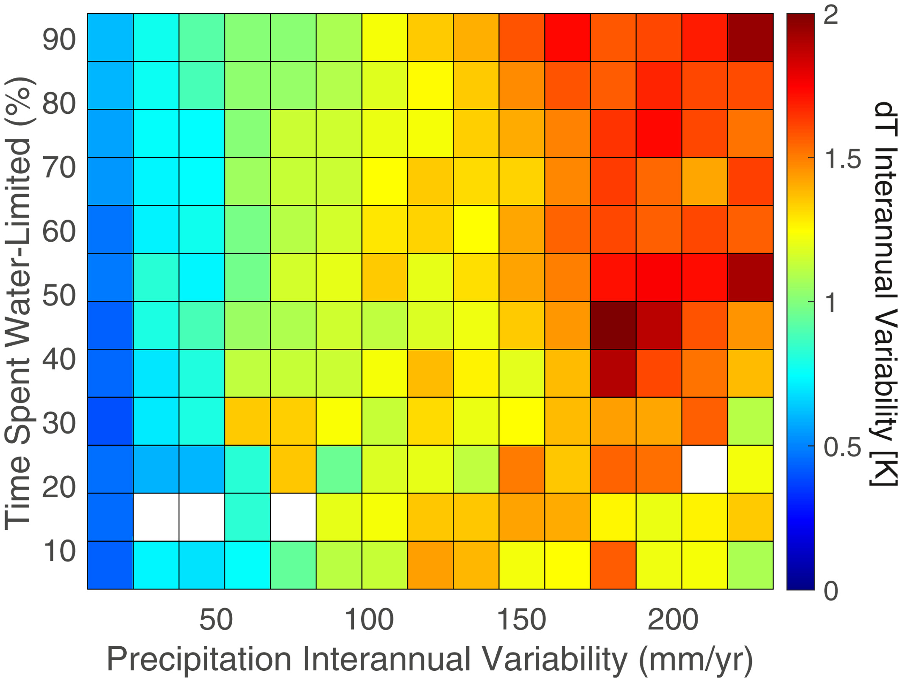

**Figure 9.** The impact of climate forcing variability on interannual land surface variability is amplified with more time spent in the water-limited regime. Land surface interannual variability with respect to precipitation interannual variability and time spent in the water-limited regime for diurnal temperature amplitude. Bins that have no values have less than five pixels contributing to the dT interannual variability average. Data frequency reduces with less time spent water limited. Results are shown for Africa.

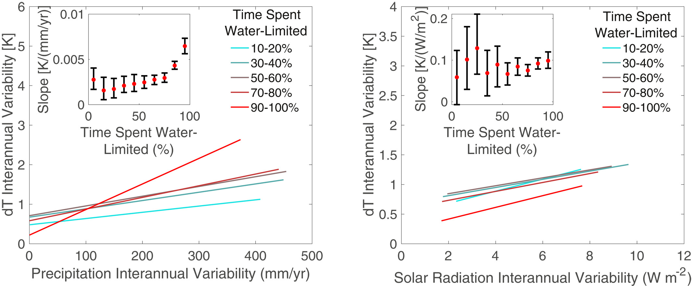

**Figure 10.** Land surface interannual variability response to (a) precipitation interannual variability and (b) solar radiation variability conditioned on time spent in the water-limited regime. Line color corresponds to time spent in the water-limited regime indicated by the respective symbol color in the inset. Only every other time spent water-limited bin is plotted for visualization. Inset slope values represent land surface sensitivity to rainfall interannual variability (slope of colored lines), varying time spent water-limited. Slope 99% confidence intervals are shown.

Solar radiation variability may contribute less to dT interannual responsiveness along gradients of time spent water limited. There is only a slight tendency to show increased solar radiation effects on dT variability with more time water-limited (Figure 10b and Figure S5 in Supporting Information S1). Nevertheless, given that relative effects of precipitation and solar radiation are similar with potentially more dT interannual variability sensitivity to precipitation (not shown), the precipitation variability effects in Figure 10a will imprint on the overall impacts to dT interannual variability. It is unclear why the differential solar radiation impacts to the land surface across time spent water-limited at shorter timescales do not translate more to interannual scales here (Figure S4 in Supporting Information S1). Previous experiments also found radiation plays a smaller role than moisture availability in evaluating climatic change of surface fluxes (Roderick et al., 2014; Short Gianotti et al., 2020).

Considering our original question, the greatest land surface variability does not strictly occur in regions with the greatest precipitation variability as it may for solar radiation variability. Instead, greater land surface variability will occur in regions both spending more time in the water-limited regime as well as having more interannual rainfall forcing variability (Figure 9). Overall, land surface variability due to climate forcing will be amplified when the surface spends more time in the water-limited regime. This is because regions spending more time in the water-limited regime have greater intrinsic surface responsiveness as determined based on intra-seasonal timescales of weather in Sections 3.1 and 3.2. As such, these results show that identified mechanisms driving land surface variability over interstorm (weather) timescales are fundamental and broadly apply to longer timescales, at least in the case of moisture forcing. Using the demonstration model, the mechanisms forced with seasonal and interannual rainfall result in the same spatial relationship with time spent water-limited as that shown for intraseasonal scales summarized in SRF (Figure S6 in Supporting Information S1). Therefore, SRF shows patterns of land surface responsiveness that are relevant to a broad range of timescales and likely describe hotspots that will experience amplified responses to climate change.

#### 3.3.2 Implications for Vulnerability to Climate Change

In integrating sensitivities over the typical states that a landscape experiences, SRF describes which regions are most responsive to forcing in the current climate. It thus predicts which regions will shift the most under near-term climate change. The SRF metric and underlying mechanisms suggest that many semi-arid locations and isolated humid regions across Africa show enhanced vulnerability to change (Figures 3-5). These same locations appear to be undergoing amplified surface warming trends as seen in observations and model projections (Berg et al., 2015; IPCC, 2013). We assert that this amplified warming is likely the result of the land surface response mechanisms identified here (Section 3.2.1), not only due to forcings changing differentially in space. Since SRF is a feature that describes the current climate of a region, the responsiveness itself can change if the mean amount of time spent in the water-limited regime or the average forcing variability shifts.

Our surface responsiveness to climate change metric (SRF) based on evaporative behavior in different moisture regimes is a shorter timescale analogue of the Budyko framework, given that their climatic relationships emerge from similar land-atmosphere coupling principles (Budyko, 1974; Vargas Zeppetello et al., 2019). As such, climate change findings from the Budyko framework similarly point to water-limited locations having higher hydrologic cycle sensitivities to changing climate and vegetation conditions (Wang & Hejazi, 2011; Zhang et al., 2016, 2018). However, these Budyko findings often do not explain the underlying mechanisms for why these regions are more sensitive perhaps due to high empiricism and relationships holding over longer timescales. Though the framework used here is empirical as well, the intraseasonal evolution of the soil moisture distribution with respect to evaporative regimes provides explanations for how the responsiveness emerges.

Given the mechanistic link between SRF and the time spent in the water-limited regime, it is necessary to distinguish vulnerability of regions to climate change based on fraction of time spent in each of the two evaporation regimes rather than mean climatic classifications. The mean climate conditions only describe the mean soil moisture state. However, the time-spent in the water-limited regime depends on whether the soil moisture probability distribution is below *θ**. This means that soil moisture intraseasonal variance and *θ** must be known in addition to the soil moisture mean. Responsiveness is thus not simply a function of whether the surface is relatively dry compared to other regions. The idea that water-limitation surface definitions based on this two-regime behavior are more descriptive for climatic and ecological change rather than mean moisture conditions was demonstrated recently with global models (Berg & McColl, 2021). Consequently, a humid forest that has a relatively high θ* compared to its soil moisture distribution will spend more time water-limited and thus can experience large responsiveness to climatic changes, despite being relatively wet.

The aggregated effects of the identified mechanisms here are evident in climate change model projections. A major driver of the spatial patterns of this responsiveness is the energy flux sensitivity to forcing, or high strength of land-atmosphere coupling (Figure 6b). Land-atmosphere coupling is known to play a large role in temperature mean and variability projections (Seneviratne et al., 2006, 2013). The role of this specific mechanism in hydrologic change can be seen in CMIP5 projections where regions with the most temperature-precipitation coupling show the greatest warming by the end of the century (Berg et al., 2015). These sensitivities are also expected to increase (Dirmeyer et al., 2013). Additionally, the primary mechanism identified here (non-linear effect of soil moisture on the land surface) also appears to be the cause of accelerated rates of temperature change in regions of China that have transitioned into a drier, more interactive regime (Zhang et al., 2020).

We do not explicitly consider abrupt shifts between alternative land surface states such as between bare soil and patchy vegetation states or between grassland and savanna (Eagleson & Segarra, 1985; Lenton et al., 2008; Rietkerk, 2004; Staver et al., 2011). Increasing inertia under perturbations has been statistically detected in various ecosystems across the globe, which predicts that they are nearing an abrupt shift to an alternative equilibrium state once a tipping point is reached (Dakos et al., 2008; Liu et al., 2019). Our investigation is more relevant to detecting landscape responses to more immediate, continuous shifts and does not explicitly consider such abrupt shifts. However, the *θ** moisture transition can behave as a pseudo-tipping point where decreasing mean soil moisture can shift a land surface into spending more time in the water limited regime on average. With strong land-atmosphere coupling and in the presence of positive feedbacks, the shift can be reinforced. Over longer timescales, this can result in persisting drier and hotter conditions (Zhang et al., 2020). Indeed, SRF is greater where more time is spent below *θ**, and especially increases when a region spends progressively more than half of its time in the water-limited regime (Figure 5). Additionally, *θ** can shift with land use changes, creating more or less SRF. For example, deforestation and replacement with savanna would alter intrinsic properties of the vegetation and soil that describe *θ**.

## 4 Conclusions

Here, we investigate the degree to which regions are responsive to weather and climate forcing. The spatial pattern of intrinsic land surface responsiveness to forcing (SRF) is quantified using intraseasonal variability of energy fluxes from remote sensing observations only. The mechanisms that link environmental forcing and land surface response and describe the SRF pattern are identified based on these intra-seasonal (weather) processes. Specifically, SRF is described by how much time the landscape spends in the water-limited regime, providing a more mechanistic explanation than that offered by mean climate factors such as precipitation accumulation. This amount of time defines the distribution of soil moisture state relative to its threshold value marking the transition between evaporation regimes. This attribute is nonetheless fundamental to understanding land surface variability from intra-seasonal to interannual timescales. The consequence is that while land surface variability directly scales with climate forcing variability, regions spending more time in the water limited regime will experience greater scaling and thus greater surface responsiveness to forcing across timescales.

We evaluate SRF through the time spent in the water-limited evaporation regime to assist in identifying mechanisms driving surface responsiveness. The primary mechanism that drives SRF is that the energy flux sensitivity to moisture forcing is greater in the water-limited than in the energy-limited evaporative regime. A reinforcing mechanism was found where regions spending more time in the water-limited regime tend to have turbulent energy fluxes that are more sensitive to forcing. Furthermore, decreases in forcing variance acts to counter the enhanced responsiveness at the dry extreme. In using a simple model that integrates these mechanisms, the spatial pattern of SRF is reproduced to a first-order, giving credence to these main driving mechanisms identified here. Thus, forcing variability is not the primary variable explaining these surface responsiveness patterns. This finding emphasizes the strong control of the land surface on modulating forcing variability.

Regions that span the transition between the two evaporation regimes (water- and energy-limited) and spend more time in the water-limited regime (typically ∼90%) are most responsive to forcing. These regions are expected to undergo disproportionately larger land surface shifts with changes in rainfall and incoming radiation. While these regions of peak SRF tend to be semi-arid, we emphasize that isolated humid regions also show large SRF because time spent water-limited does not strictly require arid conditions; it also requires that the soil moisture distribution spend time below the water to energy-limited regime transition point, which is itself a function of factors beyond water availability. As such, explaining spatial patterns of SRF with time spent in the water-limited regime provides a more complete assessment than that provided by mean water availability.

Because these mechanisms are fundamental and intrinsic to a region, they drive behavior across timescales. Although the fundamental SRF is derived here from intra-seasonal processes to isolate from confounding seasonal variability, the identified mechanisms explaining how the interannual variability in climate forcing manifest in landscape response to interannual variability. We show that here using long-term satellite records of energy fluxes and forcings. We find that the relationship between the interannual forcing and response is dependent on the intrinsic mechanisms that are established with intraseasonal processes. Ultimately, this work gives observational credence to the Eagleson (1978) hypothesis that landscape mechanisms that evolve over interstorms (weather's natural wetting and drying cycles) are fundamental to describing the long-term climate and its variability at a location.

Finally, the mechanisms and pathways of the forcing and landscape response analyzed here were performed with satellite observations only. Records from two satellites are used. Since one of the satellites is in geostationary orbit, the study domain was over a fixed disc (Africa). Africa served as a viable testbed as it includes a range of climates and ecosystems. In the future, the approach can be expanded to include more diverse conditions globally as well as longer records as they become available. Greater land surface temperature sampling under cloud cover contamination from potentially merging thermal infrared data with microwave observations can improve characterization of the energy limited regime ultimately leading to better estimates of several parameters assessed here (including SRF, energy flux sensitivity to moisture and radiation, and *θ**). Finally, the observation-only approach shown here can serve as a test of models that are used in climate change impacts assessments.

## Data Availability Statement

SMAP L1C brightness temperature used to retrieve soil moisture are available from the National Snow and Ice Data Center (NSIDC, https://nsidc.org/data/SPL1CTB_E). The MT-DCA soil moisture data set retrieved from SMAP is freely available at https://doi.org/10.5281/zenodo.5579549. EUMETSAT LSA SAF data are available from https://landsaf.ipma.pt/en/. This work used eddy covariance data acquired and shared by the FLUXNET community (https://fluxnet.org). CHIRPS data are available from https://data.chc.ucsb.edu/products/CHIRPS-2.0/.
